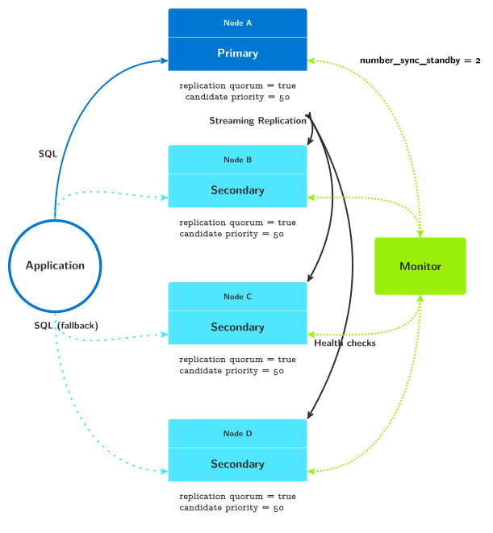
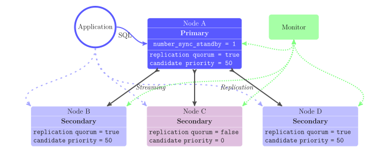

.. _multi_node_architecture:

Multi-node Architectures
========================

Pg_auto_failover allows you to have more than one standby node, and offers
advanced control over your production architecture characteristics.

Architectures with two standby nodes
------------------------------------

When adding your second standby node with default settings, you get the
following architecture:

.. figure:: ./tikz/arch-multi-standby.svg
   :alt: pg_auto_failover architecture with two standby nodes

   pg_auto_failover architecture with two standby nodes

In this case, three nodes get set up with the same characteristics, achieving
HA for both the Postgres service and the production dataset. An important
setting for this architecture is ``number_sync_standbys``.

The replication setting ``number_sync_standbys`` sets how many standby nodes
the primary should wait for when committing a transaction. In order to have
a good availability in your system, pg_auto_failover requires
``number_sync_standbys + 1`` standby nodes participating in the replication
quorum: this allows any standby node to fail without impact on the system's
ability to respect the replication quorum.

When only two nodes are registered in a group on the monitor we have a
primary and a single secondary node. Then ``number_sync_standbys`` can only
be set to zero. When adding a second standby node to a pg_auto_failover
group, then the monitor automatically increments ``number_sync_standbys`` to
one, as we see in the diagram above.

When ``number_sync_standbys`` is set to zero then pg_auto_failover
implements the *Business Continuity* setup as seen in
:ref:`architecture_basics`: synchronous replication is then used as a way to
guarantee that failover can be implemented without data loss.

In more details:

 1. With ``number_sync_standbys`` set to one, this architecture always
    maintains two copies of the dataset: one on the current primary node
    (node A in the previous diagram), and one on the standby that
    acknowledges the transaction first (either node B or node C in the
    diagram).

    When one of the standby nodes is unavailable, the second copy of the
    dataset can still be maintained thanks to the remaining standby.

    When both the standby nodes are unavailable, then it's no longer
    possible to guarantee the replication quorum, and thus writes on the
    primary are blocked. The Postgres primary node waits until at least one
    standby node acknowledges the transactions locally committed, thus
    degrading your Postgres service to read-only.

 0. It is possible to manually set ``number_sync_standbys`` to zero when
    having registered two standby nodes to the monitor, overriding the
    default behavior.

    In that case, when the second standby node becomes unhealthy at the same
    time as the first standby node, the primary node is assigned the state
    :ref:`wait_primary`. In that state, synchronous replication is disabled
    on the primary by setting ``synchronous_standby_names`` to an empty
    string. Writes are allowed on the primary, even though there's no extra
    copy of the production dataset available at this time.

    Setting ``number_sync_standbys`` to zero allows data to be written even
    when both standby nodes are down. In this case, a single copy of the
    production data set is kept and, if the primary was then to fail, some
    data will be lost. How much depends on your backup and recovery
    mechanisms.

.. _architecture_setup:

Replication Settings and Postgres Architectures
-----------------------------------------------

The entire flexibility of pg_auto_failover can be leveraged with the
following three replication settings:

  - Number of sync stanbys
  - Replication quorum
  - Candidate priority

Number Sync Standbys
^^^^^^^^^^^^^^^^^^^^

This parameter is used by Postgres in the `synchronous_standby_names`__
parameter: ``number_sync_standby`` is the number of synchronous standbys for
whose replies transactions must wait.

__ https://www.postgresql.org/docs/current/runtime-config-replication.html#GUC-SYNCHRONOUS-STANDBY-NAMES

This parameter can be set at the *formation* level in pg_auto_failover, meaning
that it applies to the current primary, and "follows" a failover to apply to
any new primary that might replace the current one.

To set this parameter to the value ``<n>``, use the following command::

  pg_autoctl set formation number-sync-standbys <n>

The default value in pg_auto_failover is zero. When set to zero, the
Postgres parameter ``synchronous_standby_names`` can be set to either
``'*'`` or to ``''``:

- ``synchronous_standby_names = '*'`` means that any standby may
  participate in the replication quorum for transactions with
  ``synchronous_commit`` set to ``on`` or higher values.

  pg_autofailover uses ``synchronous_standby_names = '*'`` when there's at
  least one standby that is known to be healthy.

- ``synchronous_standby_names = ''`` (empty string) disables synchrous
  commit and makes all your commits asynchronous, meaning that transaction
  commits will not wait for replication. In other words, a single copy of
  your production data is maintained when ``synchronous_standby_names`` is
  set that way.

  pg_autofailover uses ``synchronous_standby_names = ''`` only when
  number_sync_standbys is set to zero and there's no standby node known
  healthy by the monitor.

In order to set ``number_sync_standbys`` to a non-zero value,
pg_auto_failover requires that at least ``number_sync_standbys + 1`` standby
nodes be registered in the system.

When the first standby node is added to the pg_auto_failover monitor, the
only acceptable value for ``number_sync_standbys`` is zero. When a second
standby is added that participates in the replication quorum, then
``number_sync_standbys`` is automatically set to one.

The command ``pg_autoctl set formation number-sync-standbys`` can be used to
change the value of this parameter in a formation, even when all the nodes
are already running in production. The pg_auto_failover monitor then sets a
transition for the primary to update its local value of
``synchronous_standby_names``.

Replication Quorum
^^^^^^^^^^^^^^^^^^

The replication quorum setting is a boolean and defaults to ``true``, and can
be set per-node. Pg_auto_failover includes a given node in
``synchronous_standby_names`` only when the replication quorum parameter has
been set to true. This means that asynchronous replication will be used for
nodes where ``replication-quorum`` is set to ``false``.

It is possible to force asynchronous replication globally by setting
replication quorum to false on all the nodes in a formation. Remember that
failovers will happen, and thus to set your replication settings on the
current primary node too when needed: it is going to be a standby later.

To set this parameter to either true or false, use one of the following
commands::

  pg_autoctl set node replication-quorum true
  pg_autoctl set node replication-quorum false

.. _candidate_priority:

Candidate Priority
^^^^^^^^^^^^^^^^^^

The candidate priority setting is an integer that can be set to any value
between 0 (zero) and 100 (one hundred). The default value is 50. When the
pg_auto_failover monitor decides to orchestrate a failover, it uses each
node's candidate priority to pick the new primary node.

When setting the candidate priority of a node down to zero, this node will
never be selected to be promoted as the new primary when a failover is
orchestrated by the monitor. The monitor will instead wait until another
node registered is healthy and in a position to be promoted.

To set this parameter to the value ``<n>``, use the following command::

  pg_autoctl set node candidate-priority <n>

When nodes have the same candidate priority, the monitor then picks the
standby with the most advanced LSN position published to the monitor. When
more than one node has published the same LSN position, a random one is
chosen.

When the candidate for failover has not published the most advanced LSN
position in the WAL, pg_auto_failover orchestrates an intermediate step in the
failover mechanism. The candidate fetches the missing WAL bytes from one of the
standby with the most advanced LSN position prior to being promoted. Postgres
allows this operation thanks to cascading replication: any standby can be the
upstream node for another standby.

It is required at all times that at least two nodes have a non-zero candidate
priority in any pg_auto_failover formation. Otherwise no failover is possible.

Auditing replication settings
^^^^^^^^^^^^^^^^^^^^^^^^^^^^^

The command ``pg_autoctl get formation settings`` (also known as
``pg_autoctl show settings``) can be used to obtain a summary of all the
replication settings currently in effect in a formation. Still using the
first diagram on this page, we get the following summary::

  $ pg_autoctl get formation settings
    Context |    Name |                   Setting | Value
  ----------+---------+---------------------------+-------------------------------------------------------------
  formation | default |      number_sync_standbys | 1
    primary |  node_A | synchronous_standby_names | 'ANY 1 (pgautofailover_standby_3, pgautofailover_standby_2)'
       node |  node_A |        replication quorum | true
       node |  node_B |        replication quorum | true
       node |  node_C |        replication quorum | true
       node |  node_A |        candidate priority | 50
       node |  node_B |        candidate priority | 50
       node |  node_C |        candidate priority | 50

We can see that the ``number_sync_standbys`` has been used to compute the
current value of the `synchronous_standby_names`__ setting on the primary.

__ https://www.postgresql.org/docs/current/runtime-config-replication.html#GUC-SYNCHRONOUS-STANDBY-NAMES

Because all the nodes in that example have the same default candidate
priority (50), then pg_auto_failover is using the form ``ANY 1`` with the
list of standby nodes that are currently participating in the replication
quorum.

The entries in the `synchronous_standby_names` list are meant to match the
`application_name` connection setting used in the `primary_conninfo`, and
the format used by pg_auto_failover there is the format string
`"pgautofailover_standby_%d"` where `%d` is replaced by the node id. This
allows keeping the same connection string to the primary when the node name
is changed (using the command ``pg_autoctl set metadata --name``).

Here we can see the node id of each registered Postgres node with the
following command::

  $ pg_autoctl show state
    Name |  Node |      Host:Port |       LSN | Reachable |       Current State |      Assigned State
  -------+-------+----------------+-----------+-----------+---------------------+--------------------
  node_A |     1 | localhost:5001 | 0/7002310 |       yes |             primary |             primary
  node_B |     2 | localhost:5002 | 0/7002310 |       yes |           secondary |           secondary
  node_C |     3 | localhost:5003 | 0/7002310 |       yes |           secondary |           secondary

When setting pg_auto_failover with per formation `number_sync_standby` and
then per node replication quorum and candidate priority replication
settings, those properties are then used to compute the
``synchronous_standby_names`` value on the primary node. This value is
automatically maintained on the primary by pg_auto_failover, and is updated
either when replication settings are changed or when a failover happens.

The other situation when the pg_auto_failover replication settings are used
is a candidate election when a failover happens and there is more than two
nodes registered in a group. Then the node with the highest candidate
priority is selected, as detailed above in the :ref:`candidate_priority`
section.

Sample architectures with three standby nodes
---------------------------------------------

When setting the three parameters above, it's possible to design very
different Postgres architectures for your production needs.

   pg_auto_failover architecture with three standby nodes

In this case, the system is set up with three standby nodes all set the same
way, with default parameters. The default parameters support setting
``number_sync_standbys = 2``. This means that Postgres will maintain three
copies of the production data set at all times.

On the other hand, if two standby nodes were to fail at the same time,
despite the fact that two copies of the data are still maintained, the
Postgres service would be degraded to read-only.

With this architecture diagram, here's the summary that we obtain::

  $ pg_autoctl show settings
    Context |    Name |                   Setting | Value
  ----------+---------+---------------------------+---------------------------------------------------------------------------------------
  formation | default |      number_sync_standbys | 2
    primary |  node_A | synchronous_standby_names | 'ANY 2 (pgautofailover_standby_2, pgautofailover_standby_4, pgautofailover_standby_3)'
       node |  node_A |        replication quorum | true
       node |  node_B |        replication quorum | true
       node |  node_C |        replication quorum | true
       node |  node_D |        replication quorum | true
       node |  node_A |        candidate priority | 50
       node |  node_B |        candidate priority | 50
       node |  node_C |        candidate priority | 50
       node |  node_D |        candidate priority | 50

Sample architecture with three standby nodes, one async
-------------------------------------------------------

   pg_auto_failover architecture with three standby nodes, one async

In this case, the system is set up with two standby nodes participating in the
replication quorum, allowing for ``number_sync_standbys = 1``. The system
always maintains at least two copies of the data set, one on the primary,
another on either node B or node D. Whenever we lose one of those nodes, we can
hold to the guarantee of having two copies of the data set.

Additionally, we have the standby server C which has been set up to not
participate in the replication quorum. Node C will not be found in the
``synchronous_standby_names`` list of nodes. Also, node C is set up to
never be a candidate for failover, with ``candidate-priority = 0``.

This architecture would fit a situation with nodes A, B, and D are deployed
in the same data center or availability zone and node C in another one.
Those three nodes are set up to support the main production traffic and
implement high availability of both the Postgres service and the data set.

Node C might be set up for Business Continuity in case the first data center
is lost, or maybe for reporting needs on another application domain.

With this architecture diagram, here's the summary that we obtain::

  pg_autoctl show settings
    Context |    Name |                   Setting | Value
  ----------+---------+---------------------------+-------------------------------------------------------------
  formation | default |      number_sync_standbys | 1
    primary |  node_A | synchronous_standby_names | 'ANY 1 (pgautofailover_standby_4, pgautofailover_standby_2)'
       node |  node_A |        replication quorum | true
       node |  node_B |        replication quorum | true
       node |  node_C |        replication quorum | false
       node |  node_D |        replication quorum | true
       node |  node_A |        candidate priority | 50
       node |  node_B |        candidate priority | 50
       node |  node_C |        candidate priority | 0
       node |  node_D |        candidate priority | 50
