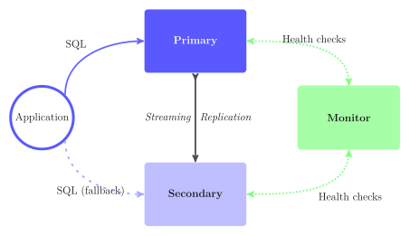
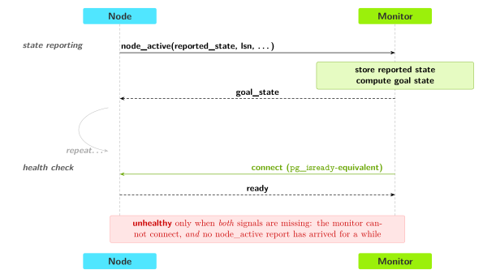

.. _architecture_basics:

Architecture Basics
===================

pg_auto_failover is designed as a simple and robust way to manage automated
Postgres failover in production. On-top of robust operations,
pg_auto_failover setup is flexible and allows either *Business Continuity*
or *High Availability* configurations. pg_auto_failover design includes
configuration changes in a live system without downtime.

pg_auto_failover is designed to be able to handle a single PostgreSQL
service using three nodes. In this setting, the system is resilient to
losing any **one** of **three** nodes.

   pg_auto_failover Architecture for a standalone PostgreSQL service

It is important to understand that when using only two Postgres nodes then
pg_auto_failover is optimized for *Business Continuity*. In the event of
losing a single node, pg_auto_failover is capable of continuing the
PostgreSQL service, and prevents any data loss when doing so, thanks to
PostgreSQL *Synchronous Replication*.

That said, there is a trade-off involved in this architecture. The business
continuity bias relaxes replication guarantees for *asynchronous
replication* in the event of a standby node failure. This allows the
PostgreSQL service to accept writes when there's a single server available,
and opens the service for potential data loss if the primary server were
also to fail.

High Availability
------------------

pg_auto_failover treats "High Availability" as two related but distinct
guarantees, rather than one. Most of what follows on this page -- the
Monitor, the keeper, synchronous replication, node recovery -- is in service
of the first of the two; :ref:`archiving_architecture` and the pages it
links to are in service of the second:

- **Service Availability**: the Postgres *service* itself stays reachable
  and able to accept reads and writes, with as little downtime as
  possible when a node is lost.
- **Disaster Recovery**: the *data* survives even in scenarios Service
  Availability alone can't help with -- an operator mistake, a bad
  deployment, or every node that ever held the data being lost at once.

Most Postgres setups reach for two separate, independently-operated
products for these -- an HA tool for the first, a backup tool for the
second. pg_auto_failover treats them as one system instead; see
:ref:`ha_dr_backups` for the full comparison.

Service Availability (failover)
^^^^^^^^^^^^^^^^^^^^^^^^^^^^^^^^^

This is what the rest of this page, and :ref:`failover_state_machine` /
:ref:`fault_tolerance` in detail, describe: a primary and one or more
secondary nodes, a Monitor orchestrating automated failover when the
primary is lost, and synchronous replication (`Synchronous vs.
asynchronous replication`_ below) guaranteeing no committed write is lost
in the process. This is the guarantee that answers "the primary just
died -- who serves the next query?".

Service Availability can be setup to obtain Business Continuity in the face
of production incidents with a basic setup of two Postgres nodes, and
Postgres High Availability starting with a setup of three Postgres nodes.

Given integrated archiving support, a trade-off or *budget* architecture can
be easily deployed with two Postgres nodes and an archiver to obtain an HA
setup that complies with many production needs.

Disaster Recovery
^^^^^^^^^^^^^^^^^^

Service Availability only makes sense for a database system when there is a
compliant setup for durability, or data safety. When using PostgreSQL, that
means a proper archiving implementation that allows *Point in Time Recovery*
operations.

With PITR it's possible to mitigate data loss operations such as a missing
WHERE clause in a DELETE or a DROP TABLE done in production instead of the
development environment, also known as human errors.

Disaster Recovery is handled by a physically distinct kind of node, the
**archiver**, added on top of any of the architectures on this page: it
continuously captures WAL from the group's current primary and periodically
produces base backups.

See :ref:`archiving_and_disaster_recovery` for where an archiver fits
alongside the architectures below, :ref:`archiving_architecture` for exactly
how WAL capture and base-backup generation work, and
:ref:`archiving_fault_tolerance` for how this changes what a total loss of
the rest of the formation actually means.

The pg_auto_failover Monitor
----------------------------

Each PostgreSQL node in pg_auto_failover runs a Keeper process which informs a
central Monitor node about notable local changes. Some changes require the
Monitor to orchestrate a correction across the cluster:

  - New nodes

    At initialization time, it's necessary to prepare the configuration of
    each node for PostgreSQL streaming replication, and get the cluster to
    converge to the nominal state with both a primary and a secondary node
    in each group. The monitor determines each new node's role

  - Node failure

    The monitor orchestrates a failover when it detects an unhealthy node.
    The design of pg_auto_failover allows the monitor to shut down service to a
    previously designated primary node without causing a "split-brain"
    situation.

The monitor is the authoritative node that manages global state and makes
changes in the cluster by issuing commands to the nodes' keeper processes. A
pg_auto_failover monitor node failure has limited impact on the system. While it
prevents reacting to other nodes' failures, it does not affect replication.
The PostgreSQL streaming replication setup installed by pg_auto_failover does not
depend on having the monitor up and running.

pg_auto_failover Glossary
-------------------------

pg_auto_failover handles a single PostgreSQL service with the following concepts:

Monitor
^^^^^^^

The pg_auto_failover monitor is a service that keeps track of one or several
*formations* containing *groups* of *nodes*.

The monitor is implemented as a PostgreSQL extension, so when you run the
command ``pg_autoctl create monitor`` a PostgreSQL instance is initialized,
configured with the extension, and started. The monitor service embeds a
PostgreSQL instance.

Formation
^^^^^^^^^

A formation is a logical set of PostgreSQL services that are managed
together.

It is possible to operate many formations with a single monitor instance.
Each formation has a group of Postgres nodes and the FSM orchestration
implemented by the monitor applies separately to each group.

.. _group:

Group
^^^^^

A group of two PostgreSQL nodes work together to provide a single PostgreSQL
service in a Highly Available fashion. A group consists of a PostgreSQL
primary server and a secondary server setup with Hot Standby synchronous
replication. Note that pg_auto_failover can orchestrate the whole setting-up
of the replication for you.

In pg_auto_failover versions up to 1.3, a single Postgres group can contain
only two Postgres nodes. Starting with pg_auto_failover 1.4, there's no
limit to the number of Postgres nodes in a single group. Note that each
Postgres instance that belongs to the same group serves the same dataset in
its data directory (PGDATA).

.. note::

   The notion of a formation that contains multiple groups in
   pg_auto_failover is useful when setting up and managing a whole Citus
   formation, where the coordinator nodes belong to group zero of the
   formation, and each Citus worker node becomes its own group and may
   have Postgres standby nodes.

Keeper
^^^^^^

The pg_auto_failover *keeper* is an agent that must be running on the same
server where your PostgreSQL nodes are running. The keeper controls the
local PostgreSQL instance (using both the ``pg_ctl`` command-line tool and
SQL queries), and communicates with the monitor:

  - it sends updated data about the local node, such as the WAL delta in
    between servers, measured via PostgreSQL statistics views.

  - it receives state assignments from the monitor.

Also the keeper maintains local state that includes the most recent
communication established with the monitor and the other PostgreSQL node of
its group, enabling it to detect :ref:`network_partitions`.

.. note::

   In pg_auto_failover versions up to and including 1.3, the *keeper* process
   started with ``pg_autoctl run`` manages a separate Postgres instance,
   running as its own process tree.

   Starting in pg_auto_failover version 1.4, the *keeper* process (started with
   ``pg_autoctl run``) runs the Postgres instance as a sub-process of the main
   ``pg_autoctl`` process, allowing tighter control over the Postgres
   execution. Running the sub-process also makes the solution work better both
   in container environments (because it's now a single process tree) and with
   systemd, because it uses a specific cgroup per service unit.

Node
^^^^

A node is a server (virtual or physical) that runs PostgreSQL instances
and a keeper service. At any given time, any node might be a primary or a
secondary Postgres instance. The whole point of pg_auto_failover is to
decide this state.

As a result, refrain from naming your nodes with the role you intend for them.
Their roles can change. If they didn't, your system wouldn't need
pg_auto_failover!

Archiver
^^^^^^^^

An archiver is a server (virtual or physical) that runs PostgreSQL archiving
storage for one or many formations. The archiver hosts any number of
*archiving nodes* and schedules *base backups* in order to be able to
implement Postgres `Point in Time Recovery`__ which is the foundations for
implementing Disaster Recovery.

__ https://www.postgresql.org/docs/current/continuous-archiving.html

Archiving Node
^^^^^^^^^^^^^^

A process managed in an archiver instance that reports to the monitor as a
node in a group and that runs ``pg_receivewal``. An archiving node as no
PGDATA, it can participate in the replication quorum but can not be a
failover candidate: its ``candidate_priority`` is always zero.

State
^^^^^

A state is the representation of the per-instance and per-group situation.
The monitor and the keeper implement a Finite State Machine to drive
operations in the PostgreSQL groups; allowing pg_auto_failover to implement
High Availability with the goal of zero data loss.

The keeper main loop enforces the current expected state of the local
PostgreSQL instance, and reports the current state and some more information
to the monitor. The monitor uses this set of information and its own
health-check information to drive the State Machine and assign a goal state
to the keeper.

The keeper implements the transitions between a current state and a
monitor-assigned goal state.

Client-side HA
--------------

Implementing client-side High Availability is included in PostgreSQL's
driver `libpq` from version 10 onward. Using this driver, it is possible to
specify multiple host names or IP addresses in the same connection string::

  $ psql -d "postgresql://host1,host2/dbname?target_session_attrs=read-write"
  $ psql -d "postgresql://host1:port2,host2:port2/dbname?target_session_attrs=read-write"
  $ psql -d "host=host1,host2 port=port1,port2 target_session_attrs=read-write"

When using either of the syntax above, the `psql` application attempts to
connect to `host1`, and when successfully connected, checks the
*target_session_attrs* as per the PostgreSQL documentation of it:

  If this parameter is set to read-write, only a connection in which
  read-write transactions are accepted by default is considered acceptable.
  The query SHOW transaction_read_only will be sent upon any successful
  connection; if it returns on, the connection will be closed. If multiple
  hosts were specified in the connection string, any remaining servers will
  be tried just as if the connection attempt had failed. The default value
  of this parameter, any, regards all connections as acceptable.

When the connection attempt to `host1` fails, or when the
*target_session_attrs* can not be verified, then the ``psql`` application
attempts to connect to `host2`.

The behavior is implemented in the connection library `libpq`, so any
application using it can benefit from this implementation, not just ``psql``.

When using pg_auto_failover, configure your application connection string to use the
primary and the secondary server host names, and set
``target_session_attrs=read-write`` too, so that your application
automatically connects to the current primary, even after a failover
occurred.

Monitoring protocol
-------------------

The monitor interacts with the data nodes in 2 ways:

  - Data nodes periodically connect and run `SELECT
    pgautofailover.node_active(...)` to communicate their current state and obtain
    their goal state.

  - The monitor periodically connects to all the data nodes to see if they
    are healthy, doing the equivalent of ``pg_isready``.

When a data node calls `node_active`, the state of the node is stored in the
`pgautofailover.node` table and the state machines of both nodes are progressed.
The state machines are described later in this readme. The monitor typically
only moves one state forward and waits for the node(s) to converge except in
failure states.

If a node is not communicating to the monitor, it will either cause a
failover (if node is a primary), disabling synchronous replication (if node
is a secondary), or cause the state machine to pause until the node comes
back (other cases). In most cases, the latter is harmless, though in some
cases it may cause downtime to last longer, e.g. if a standby goes down
during a failover.

To simplify operations, a node is only considered unhealthy if the monitor
cannot connect *and* it hasn't reported its state through `node_active` for
a while. This allows, for example, PostgreSQL to be restarted without
causing a health check failure.

   The two protocols between a node's keeper and the monitor

Synchronous vs. asynchronous replication
----------------------------------------

By default, pg_auto_failover uses synchronous replication, which means all
writes block until at least one standby node has reported receiving them. To
handle cases in which the standby fails, the primary switches between two
states called `wait_primary` and `primary` based on the health of standby
nodes, and based on the replication setting ``number_sync_standby``.

When in the `wait_primary` state, synchronous replication is disabled by
automatically setting ``synchronous_standby_names = ''`` to allow writes to
proceed. However doing so also disables failover, since the standby might get
arbitrarily far behind. If the standby is responding to health checks and
within 1 WAL segment of the primary (by default), synchronous replication is
enabled again on the primary by setting ``synchronous_standby_names = '*'``
which may cause a short latency spike since writes will then block until the
standby has caught up.

When using several standby nodes with replication quorum enabled, the actual
setting for ``synchronous_standby_names`` is set to a list of those standby
nodes that are set to participate to the replication quorum.

If you wish to disable synchronous replication, you need to add the
following to ``postgresql.conf``::

 synchronous_commit = 'local'

This ensures that writes return as soon as they are committed on the primary --
under all circumstances. In that case, failover might lead to some data loss,
but failover is not initiated if the secondary is more than 10 WAL segments (by
default) behind on the primary. During a manual failover, the standby will
continue accepting writes from the old primary. The standby will stop accepting
writes only if it's fully caught up (most common), the primary fails, or it
does not receive writes for 2 minutes.

.. topic:: A note about performance

  In some cases the performance impact on write latency when setting
  synchronous replication makes the application fail to deliver expected
  performance. If testing or production feedback shows this to be the case, it
  is beneficial to switch to using asynchronous replication.

  The way to use asynchronous replication in pg_auto_failover is to change the
  ``synchronous_commit`` setting. This setting can be set per transaction, per
  session, or per user. It does not have to be set globally on your Postgres
  instance.

  One way to benefit from that would be::

    alter role fast_and_loose set synchronous_commit to local;

  That way performance-critical parts of the application don't have to wait for
  the standby nodes. Only use this when you can also lower your data durability
  guarantees.

Node recovery
-------------

When bringing a node back after a failover, the keeper (``pg_autoctl run``) can
simply be restarted. It will also restart postgres if needed and obtain its
goal state from the monitor. If the failed node was a primary and was demoted,
it will learn this from the monitor. Once the node reports, it is allowed to
come back as a standby by running ``pg_rewind``. If it is too far behind, the
node performs a new ``pg_basebackup``.

Whether ``pg_rewind`` is even the right call isn't decided from a bare
timeline-number comparison. The node walks the upstream's real timeline
history to distinguish "still catching up" from "genuinely diverged onto a
dead branch" — the latter can happen when a standby was written to, or
promoted, outside of ``pg_autoctl``'s control. Every node also periodically
publishes its own known timeline lineage to the monitor
(``pgautofailover.node_timeline_history``), so that a failover election can
reason about forks centrally and exclude a diverged candidate rather than
block on it. The monitor uses this same lineage data proactively too: a
node currently acting as a healthy secondary is checked against the
group's reference lineage on every report, and gets pushed into
``catchingup`` — where the rewind actually happens — as soon as a genuine
divergence is found, rather than waiting for the node to go through some
other, unrelated transition first. See :ref:`timeline_forks` for the full
scenario, and :ref:`pg_autoctl_show_timeline` /
:ref:`pg_autoctl_accept_timeline` for the commands that surface and, when
needed, resolve this.
