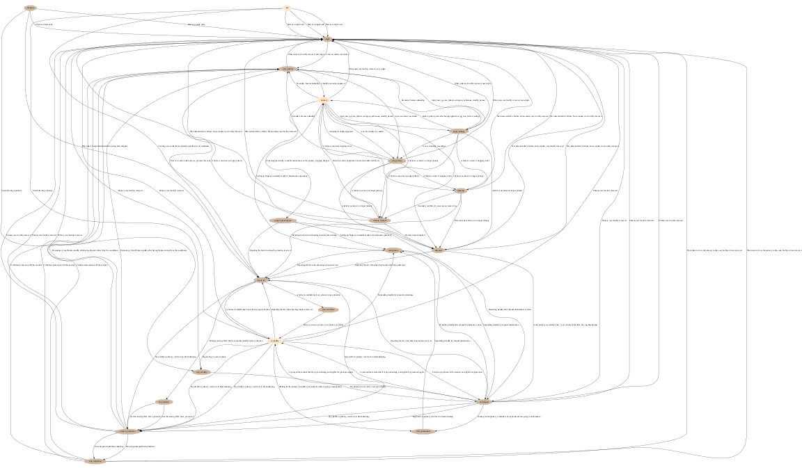
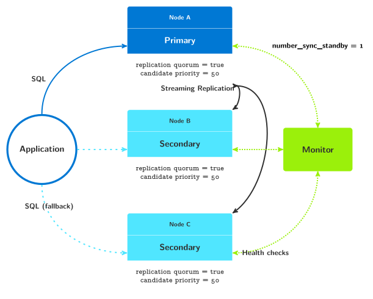

pg_auto_failover Architecture
=============================

pg_auto_failover is designed to handle a single PostgreSQL service using three
nodes, and is resilient to losing any **one** of **three** nodes.

Note that a single Monitor can handle many PostgreSQL services, so that in
practice if you want to handle N PostgreSQL services, you need at minimum
2 * N + 1 servers (not 3 * N).

pg_auto_failover considers that a PostgreSQL service is Highly-Available when the
following two guarantees are respected, in this order:

  1. Data loss is prevented in any situation that include the failure of a
     single node in the system.

  2. In case of service downtime, service is back available as soon as
     possible, taking care of rule 1 first.

It is important to understand that pg_auto_failover is optimized for *Business
Continuity*. In the event of losing a single node, then pg_auto_failover is capable
of continuing the PostgreSQL service, and prevents any data loss when doing
so, thanks to PostgreSQL *Synchronous Replication*.

That said, pg_auto_failover design trade-off towards business continuity involves
relaxing replication guarantees to *asynchronous replication* in the event
of a standby node failure. This allows the PostgreSQL service to accept
writes when there's a single server available, and this opens the service
for potential data loss if now the primary server were to be failing too.

.. figure:: ./tikz/arch-single-standby.svg
   :alt: pg_auto_failover Architecture for a standalone PostgreSQL service

   pg_auto_failover Architecture for a standalone PostgreSQL service

The pg_auto_failover Monitor
----------------------------

Each PostgreSQL node in pg_auto_failover runs a Keeper process which informs a
central Monitor node about notable local changes. Some changes require the
Monitor to orchestrate a correction across the cluster:

  - New nodes

    At initialization time, it's necessary to prepare the configuration of
    each node for PostgreSQL streaming replication, and get the cluster to
    converge to the nominal state with both a primary and a secondary node
    in each group. The monitor determines each new node's role

  - Node failure

    The monitor orchestrates a failover when it detects an unhealthy node.
    The design of pg_auto_failover allows the monitor to shut down service to a
    previously designated primary node without causing a "split-brain"
    situation.

The monitor is the authoritative node that manages global state and makes
changes in the cluster by issuing commands to the nodes' keeper processes. A
pg_auto_failover monitor node failure has limited impact on the system. While it
prevents reacting to other nodes' failures, it does not affect replication.
The PostgreSQL streaming replication setup installed by pg_auto_failover does not
depend on having the monitor up and running.

pg_auto_failover Glossary
-------------------------

pg_auto_failover handles a single PostgreSQL service with the following concepts:

  - the pg_auto_failover MONITOR is a service that keeps track of one or several
    *formations* containing *groups* of two *nodes* each.

    The monitor is implemented as a PostgreSQL extension, so when you run
    the command ``pg_autoctl create monitor`` a PostgreSQL instance is
    initialized, configured with the extension, and started. The monitor
    service is embedded into a PostgreSQL service.

  - a FORMATION is a logical set of PostgreSQL services.

  - a GROUP of two PostgreSQL NODES work together to provide a single
    PostgreSQL service in a Highly Available fashion. A GROUP consists of a
    PostgreSQL primary server and a secondary server setup with Hot Standby
    synchronous replication. Note that pg_auto_failover can orchestrate the whole
    setting-up of the replication for you.

  - the pg_auto_failover KEEPER is an agent that must be running on the same server
    where your PostgreSQL nodes are running. The KEEPER controls the local
    PostgreSQL instance (using both the ``pg_ctl`` command line tool and SQL
    queries), and communicates with the MONITOR:

      - it sends updated data about the local node, such as the WAL delta in
        between servers, measured via PostgreSQL statistics views,

      - it receives state assignments from the monitor.

    Also the KEEPER maintains a local state that includes the most recent
    communication established with the MONITOR and the other PostgreSQL node
    of its group, enabling it to detect network partitions. More on that
    later.

  - a NODE is a server (virtual or physical) that runs a PostgreSQL
    instances and a KEEPER service.

  - a STATE is the representation of the per-instance and per-group
    situation. The monitor and the keeper implement a Finite State Machine
    to drive operations in the PostgreSQL groups and implement High
    Availability without data loss.

    The KEEPER main loop enforce the current expected state of the local
    PostgreSQL instance, and reports the current state and some more
    information to the MONITOR. The MONITOR uses this set of information and
    its own health-check information to drive the State Machine and assign a
    GOAL STATE to the KEEPER.

    The KEEPER implements the transitions between a current state and a
    MONITOR assigned goal state.

Client-side HA
--------------

Implementing client-side High Availability is included in PostgreSQL's
driver `libpq` from version 10 onward. Using this driver, it is possible to
specify multiple host names or IP addresses in the same connection string::

  $ psql -d "postgresql://host1,host2/dbname?target_session_attrs=read-write"
  $ psql -d "postgresql://host1:port2,host2:port2/dbname?target_session_attrs=read-write"
  $ psql -d "host=host1,host2 port=port1,port2 target_session_attrs=read-write"

When using either of the syntax above, the `psql` application attempts to
connect to `host1`, and when successfully connected, checks the
*target_session_attrs* as per the PostgreSQL documentation of it:

  If this parameter is set to read-write, only a connection in which
  read-write transactions are accepted by default is considered acceptable.
  The query SHOW transaction_read_only will be sent upon any successful
  connection; if it returns on, the connection will be closed. If multiple
  hosts were specified in the connection string, any remaining servers will
  be tried just as if the connection attempt had failed. The default value
  of this parameter, any, regards all connections as acceptable.

When the connection attempt to `host1` fails, or when the
*target_session_attrs* can not be verified, then the ``psql`` application
attempts to connect to `host2`.

The behavior is implemented in the connection library `libpq`, so any
application using it can benefit from this implementation, not just ``psql``.

When using pg_auto_failover, configure your application connection string to use the
primary and the secondary server host names, and set
``target_session_attrs=read-write`` too, so that your application
automatically connects to the current primary, even after a failover
occurred.

Monitoring protocol
-------------------

The monitor interacts with the data nodes in 2 ways:

  - Data nodes periodically connect and run `SELECT
    pgautofailover.node_active(...)` to communicate their current state and obtain
    their goal state.

  - The monitor periodically connects to all the data nodes to see if they
    are healthy, doing the equivalent of ``pg_isready``.

When a data node calls `node_active`, the state of the node is stored in the
`pgautofailover.node` table and the state machines of both nodes are progressed.
The state machines are described later in this readme. The monitor typically
only moves one state forward and waits for the node(s) to converge except in
failure states.

If a node is not communicating to the monitor, it will either cause a
failover (if node is a primary), disabling synchronous replication (if node
is a secondary), or cause the state machine to pause until the node comes
back (other cases). In most cases, the latter is harmless, though in some
cases it may cause downtime to last longer, e.g. if a standby goes down
during a failover.

To simplify operations, a node is only considered unhealthy if the monitor
cannot connect *and* it hasn't reported its state through `node_active` for
a while. This allows, for example, PostgreSQL to be restarted without
causing a health check failure.

Synchronous vs. asynchronous replication
----------------------------------------

By default, pg_auto_failover uses synchronous replication, which means all writes
block until the standby has accepted them. To handle cases in which the
standby fails, the primary switches between two states called `wait_primary`
and `primary` based on the health of the standby.

In `wait_primary`, synchronous replication is disabled by automatically
setting ``synchronous_standby_names = ''`` to allow writes to proceed, but
failover is also disabled since the standby might get arbitrarily far
behind. If the standby is responding to health checks and within 1 WAL
segment of the primary (configurable), synchronous replication is re-enabled
on the primary by setting ``synchronous_standby_names = '*'`` which may
cause a short latency spike since writes will then block until the standby
has caught up.

If you wish to disable synchronous replication, you need to add the
following to ``postgresql.conf``::

 synchronous_commit = 'local'

This ensures that writes return as soon as they are committed on the primary
under all circumstances. In that case, failover might lead to some data loss,
but failover is not initiated if the secondary is more than 10 WAL segments
(configurable) behind on the primary. During a manual failover, the standby
will continue accepting writes from the old primary and will stop only if
it's fully caught up (most common), the primary fails, or it does not
receive writes for 2 minutes.

Node recovery
-------------

When bringing back a node after a failover, the keeper (``pg_autoctl run``) can
simply be restarted. It will also restart postgres if needed and obtain its
goal state from the monitor. If the failed node was a primary and was
demoted, it will learn this from the monitor. Once the node reports, it is
allowed to come back as a standby by running ``pg_rewind``. If it is too far
behind the node performs a new ``pg_basebackup``.

pg_auto_failover State Machine
------------------------------

The following diagram shows the pg_auto_failover State Machine. It's missing
links to the ``single`` state, which can always been reached when removing
all the other nodes.

.. figure:: ./tikz/arch-single-standby.svg
   :alt: pg_auto_failover Finite State Machine diagram

   pg_auto_failover Finite State Machine diagram

Failover logic
--------------

This section needs to be expanded further, but below is the failover state
machine for each node that is implemented by the monitor:

.. figure:: ./fsm/node-state-machine.png
   :scale: 30%
   :alt: Node state machine

   Node state machine

Since the state machines of the data nodes always move in tandem, a pair
(group) of data nodes also implicitly has the following state machine:

.. figure:: ./fsm/group-state-machine.png
   :scale: 40%
   :alt: Group state machine

   Group state machine

.. raw:: latex

    \newpage

.. _state_machine_diagram:

pg_auto_failover keeper's State Machine
---------------------------------------

When built in TEST mode, it is then possible to use the following command to
get a visual representation of the Keeper's Finite State Machine::

  $ PG_AUTOCTL_DEBUG=1 pg_autoctl do fsm gv | dot -Tsvg > fsm.svg

The `dot` program is part of the Graphviz suite and produces the following
output:

   Keeper State Machine

Multi-nodes architecture
========================

pg_auto_failover also allows to have more than one standby node, and
implements the following three parameters to control the behavior of the
system in case of a failover:

  - number_sync_stanbys
  - candidate priority
  - replication quorum

   pg_auto_failover architecture with two standby nodes

It is possible to also have more than two standby nodes managed
automatically by pg_auto_failover, as seen in the next two diagrams:

.. figure:: ./tikz/arch-three-standby.svg
   :alt: pg_auto_failover architecture with three standby nodes

   pg_auto_failover architecture with three standby nodes

And another one:

.. figure:: ./tikz/arch-three-standby-one-async.svg
   :alt: pg_auto_failover architecture with three standby nodes, one async

   pg_auto_failover architecture with three standby nodes, one asyn
