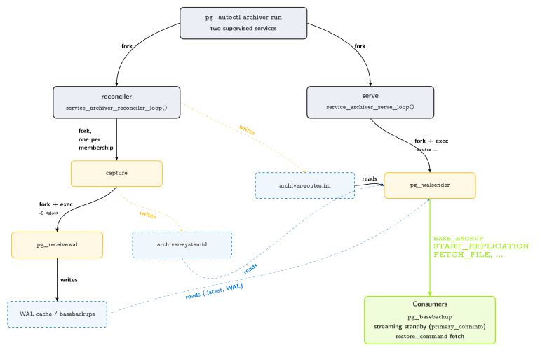

.. _archiving_architecture:

Archiving in Detail
=====================

:ref:`archiving_and_disaster_recovery` introduces the archiver at a glance,
and :ref:`archiving_operations` walks through the day-to-day commands for
registering one and attaching a base-backup policy. This page goes one
level deeper: what actually moves over the network and onto disk while an
archiver is running, and what processes are involved -- the level of
detail worth having before sizing storage, deciding where an archiver
should sit on your network, or reasoning about how a single archiver
covers a whole topology (every group of a Citus formation, or several
independent formations at once).

Data flow
---------

An archiver does three things, and none of them ever route through the
monitor -- WAL and base backups always flow directly between the archiver
and whichever node it's talking to, with the monitor only ever seeing
small status reports (what's been captured, what's been backed up, how
much disk is left), never the data itself:

1. **It streams WAL continuously** from whichever node is currently the
   primary, over an ordinary PostgreSQL physical replication connection --
   the same kind of connection a standby uses, protected by its own
   dedicated replication slot so that nothing already captured is ever
   lost, even across a connection that drops and stays down for a while.
   If the primary changes, the archiver notices and reconnects to the new
   one on its own; no operator action is needed. An archiver attached to
   several groups (see `Process model`_ below) runs one of these streams
   per group, entirely independently -- one group's primary changing, or
   its stream stalling, has no effect on any other group's.
2. **It produces base backups on a schedule**, either as a real
   ``pg_basebackup`` taken directly from a live node, or entirely on its
   own: replaying already-captured WAL against a local copy of the last
   base backup until that copy reaches a consistent, promotable state,
   and backing up that instead. The second mode never touches the
   primary or any standby at all -- useful when you want frequent base
   backups without adding load to production.
3. **It hands both back out** on request: a real ``pg_basebackup``
   command, a real standby's own ``primary_conninfo``, or this project's
   own restore tooling can all connect to an archiver directly and get
   what they ask for, with no special client needed -- see `What you can
   point at an archiver`_ below.

Storage
-------

Everything an archiver holds lives under one local directory -- the path
given as ``--pgdata`` when the archiver was created. Despite the flag's
name, this is never a real Postgres data directory (there is no
``initdb``, nothing ever starts Postgres against it directly); it's a
cache root.

A single archiver can be attached to more than one (formation, group) at
once -- every group of a Citus formation, or several independent
formations altogether (see `Process model`_ below). Each such membership
gets its own subdirectory, one level under the archiver's own root, named
after the formation and group it belongs to, so that two memberships'
WAL and base backups never collide even though they share one archiver
identity and one root directory::

  /var/lib/pgaf/archiver1/
  ├── archiver-routes.ini
  ├── default/
  │   └── 0/
  │       ├── 000000010000000000000041
  │       ├── 000000010000000000000042
  │       ├── 000000010000000000000043.partial
  │       ├── archiver-position
  │       └── basebackups/
  │           ├── basebackup-20260803T020000Z/
  │           ├── basebackup-20260804T020000Z/
  │           └── basebackup-20260805T020000Z/
  └── billing/
      └── 0/
          ├── 000000010000000000000012
          ├── archiver-position
          └── basebackups/
              └── basebackup-20260805T030000Z/

- WAL segments sit directly under their own ``<formation>/<group>/``
  subdirectory, named exactly the way Postgres itself names them. The
  most recently-started one carries a ``.partial`` suffix until it's
  complete -- archiving doesn't wait for a segment to fill up before it
  counts: whatever has already been flushed into that ``.partial`` file
  is captured too.
- Each retained base backup is its own subdirectory under that
  membership's own ``basebackups/``, in the same layout an ordinary
  ``pg_basebackup`` run by hand would produce. You could point
  ``postgres -D`` straight at one of them and it would start -- that's
  exactly what disaster recovery relies on.
- Each membership has its own ``archiver-position`` file, tracking that
  group's own captured LSN. ``archiver-routes.ini`` sits at the archiver's
  own root instead, one section per membership -- see `Keeping the
  routes file current`_ below for exactly when and why it gets rewritten.
  All of these are small internal bookkeeping files -- coordinates and
  status, never a copy of any actual data. Safe to ignore day to day, and
  not something that needs backing up itself -- all of them are
  regenerated automatically.

A single-membership archiver (the common case: one formation, one group)
looks the same, just with only one ``<formation>/<group>/`` subdirectory
under its root.

Sizing disk for one membership comes down to two mostly-independent
numbers:

- **Base backups**: roughly the policy's ``maxcount`` times the size of
  one backup, since retention prunes anything beyond that count (or
  older than ``maxage``, whichever comes first) right after each new one
  lands. See :ref:`archiving_operations` for how to set these.
- **WAL**: however much WAL has accumulated since your *oldest
  still-retained* base backup -- once a base backup is pruned, the WAL
  segments only it still needed are pruned right along with it. A longer
  retention window keeps more history recoverable, at the cost of more
  WAL kept around to cover it.

An archiver attached to several groups needs the sum of this across every
membership -- each has its own base-backup policy and its own WAL
retention, sized independently.

Network exposure
-----------------

An archiver listens on a TCP port (``6543`` by default) speaking a subset
of the PostgreSQL replication protocol, authenticated the same trust-based
way every node's own replication connections already are in a
pg_auto_failover cluster (there is no password or TLS on this connection
in the current release). Treat it the same way you'd treat any other
node's own replication port: reachable from wherever you expect to run
``pg_basebackup``, point a standby's ``primary_conninfo`` at it, or run a
restore from, and firewalled off from everywhere else.

Process model
--------------

Once started (``pg_autoctl archiver run``, or ``pg_autoctl node run``
against a ``kind = archiver`` node specification), an archiver supervises
exactly two long-running processes: ``serve``, and a ``reconciler`` that
in turn keeps one WAL-capture child running per (formation, group)
membership this archiver currently holds -- added and removed on its own
as the archiver is attached to or detached from a formation, no restart
of the archiver itself required. They hand off small files (`Storage`_
above) and nothing else:

runs pg_walsender, which reads the WAL cache and routes file and serves pg_basebackup, streaming standbys, and restore_command fetches

   Two supervised top-level processes per archiver; the reconciler forks
   one WAL-capture child per membership underneath it

::

  pg_autoctl archiver run
  ├── reconciler  -- keeps the set of running captures in sync with the
  │   │              monitor's own membership list for this archiver
  │   ├── capture (default/0)   -- one per membership, reports its own
  │   │   └── pg_receivewal        progress to the monitor independently
  │   └── capture (billing/0)
  │       └── pg_receivewal
  └── serve       -- keeps the archiver reachable over the network,
      └── pg_walsender --port 6543 --routes archiver-routes.ini
                       (serves every membership through the one process)

If any child stops unexpectedly, its supervisor notices on its next tick
and restarts it -- an archiver recovering from a crashed
``pg_receivewal`` or ``pg_walsender`` needs no operator action, the same
way a keeper recovers a crashed Postgres. A crash of the reconciler
itself is likewise just restarted by the top-level supervisor; on
restart it re-discovers its current memberships from the monitor and
resumes capturing all of them -- a replication slot keeps the WAL a
capture needs regardless of how many times its own consumer reconnects,
so this costs nothing.

Keeping the routes file current
^^^^^^^^^^^^^^^^^^^^^^^^^^^^^^^^

``pg_walsender`` never queries the monitor itself, on purpose: an
archiver exists to keep serving already-captured data even when the
monitor it would otherwise depend on is unreachable, and staying free of
that dependency also keeps ``pg_walsender`` a small, standalone binary
with nothing to mock or stand up just to test it. ``archiver-routes.ini``
is the decoupling point -- ``serve`` is the one process that actually
talks to the monitor, resolving each membership's current WAL-cache
directory and latest complete base backup and writing them here; every
``pg_walsender`` connection just reads this one local file straight off
disk, fresh, with no monitor round trip on its own hot path. One section
per membership::

  [default/0]
  walcache = /var/lib/pgaf/archiver1/default/0
  position = 0/0
  basebackup = /var/lib/pgaf/archiver1/default/0/basebackups/basebackup-20260806T132954Z
  timeline = 1
  systemid = 7670908901798703128

The file is always rewritten as a whole -- one full pass over every
membership this archiver currently holds, written to a temporary file
and atomically renamed into place -- never patched in place. A
connection arriving mid-refresh always sees either the complete previous
version or the complete new one, never a torn write; nothing here needs
a lock. ``serve`` triggers a rewrite:

- once at startup, before ``pg_walsender`` is even started;
- every 30 seconds, as a periodic catch-all -- covers anything not
  otherwise signaled, such as a membership having just been attached;
- immediately, the moment a base backup finishes and is reported
  complete -- the process that just produced it signals ``serve``
  directly, rather than leaving a freshly-completed backup unservable
  for up to that 30-second window; and
- on ``SIGHUP``, the same reload signal every other pg_autoctl process
  already understands.

Each membership generates its own base backups independently (its own
schedule, its own retention), so more than one can genuinely be in
progress at once on a multi-membership archiver -- there's no archiver-
wide lock serializing them.

More or fewer standby nodes
^^^^^^^^^^^^^^^^^^^^^^^^^^^^

A membership's own capture process doesn't change shape based on how many
standby nodes are in its group. WAL capture always talks to whichever
node is currently primary, never to a standby directly, so a two-node
group and a five-node group look identical from the archiver's side. The
only place standby count matters at all is when a base backup is sourced
live: with more healthy standbys available, there are more candidates to
pick from before falling back to the primary -- everything else about
the archiver is unaffected.

Several formations
^^^^^^^^^^^^^^^^^^^

One archiver can be attached to several formations at once -- each with
its own group of two or three standby nodes, say -- with no need to run a
separate archiver process per formation (see :ref:`archiving_operations`
for the repeated ``--formation`` this takes at creation time). Each
formation attached this way is one more membership, which shows up as one
more ``capture`` child under the reconciler and one more section in
``archiver-routes.ini``; nothing about the archiver's own identity, port,
or ``--pgdata`` root changes:

::

  pg_autoctl archiver run
  ├── reconciler
  │   ├── capture (default/0) -> pg_receivewal
  │   └── capture (billing/0) -> pg_receivewal
  └── serve -> pg_walsender          (serves both memberships)

Each membership's own capture is entirely independent -- separate storage
subdirectory, separate WAL stream, separate base-backup schedule, no
shared state with any other membership. Losing one (its capture process
crashing, say) has no effect on the others; the reconciler restarts just
that one. Running one archiver per formation instead, on separate hosts,
is still a perfectly reasonable choice -- for isolating blast radius, or
spreading load across machines -- just no longer a requirement.

A Citus formation
^^^^^^^^^^^^^^^^^^

A Citus formation is really several node groups under one name: the
coordinator's own group, plus one group per worker. Attaching an archiver
to a Citus formation attaches it to every group that already exists in
that formation at the time -- the coordinator's and every worker's --
each becoming its own membership with its own capture process, exactly
like several independent formations would. A worker group added to the
formation *afterwards* is not picked up on its own: the reconciler only
ever starts capture for memberships the monitor already knows about, and
nothing today re-attaches an archiver to a formation automatically when
that formation grows a new group. Re-running the attach for that
formation covers the new group too (existing memberships are left alone),
and the reconciler picks it up on its own next periodic check, no
archiver restart required.

What you can point at an archiver
------------------------------------

An archiver's serving side understands enough of the real PostgreSQL
replication protocol that ordinary, unmodified tools can talk to it
directly -- nothing here needs a custom client. The commands below are
what those tools actually send; useful to know if you're connecting by
hand with ``psql "... replication=database"`` to check on an archiver, or
deciding what else could talk to one.

``IDENTIFY_SYSTEM``

  The first thing any of these tools asks: which system and timeline the
  archiver is tracking, and how far it's captured so far.

``BASE_BACKUP``

  Streams the archiver's most recent base backup, in the same plain tar
  format a real ``pg_basebackup --format=plain`` produces. Point a real,
  unmodified ``pg_basebackup`` at an archiver and it works exactly as it
  would against a live node -- this is what ``pg_autoctl create postgres
  --from-archiver`` uses to bootstrap a brand new node straight from an
  archiver's cache instead of a live primary or secondary.

``START_REPLICATION``

  Streams WAL from a given position onward, the same way a live primary
  would. This is what lets a real standby's own ``primary_conninfo``
  point at an archiver instead of a live node, and what a multi-standby
  failover election falls back on to fetch WAL a promoted candidate is
  still missing, straight from the archiver's own cache, when no live
  node has it anymore.

``TIMELINE_HISTORY``

  Returns the timeline history for a given timeline -- needed by any
  streaming client following a timeline change, such as after a
  failover.

``CREATE_REPLICATION_SLOT`` / ``READ_REPLICATION_SLOT``

  Basic physical replication slot support, for tools that expect to
  manage their own slot against whatever they're streaming from.

Fetching a single WAL file

  A small side channel used by this project's own ``restore_command``
  tooling: ask for one file by name, get its exact bytes back. This is
  what makes an archiver usable as a ``restore_command`` target on its
  own, without needing a full streaming connection just to recover one
  missing segment.

See also
--------

- :ref:`archiving_and_disaster_recovery` -- what an archiver is and
  where it fits among the other architectures
- :ref:`archiving_operations` -- registering an archiver, attaching a
  base-backup policy, rebuilding a node from one
- :ref:`archiving_fault_tolerance` -- what changes about fault tolerance
  once an archiver is in the picture
- :ref:`failover_state_machine` -- the ``archiving`` state's own
  transitions
