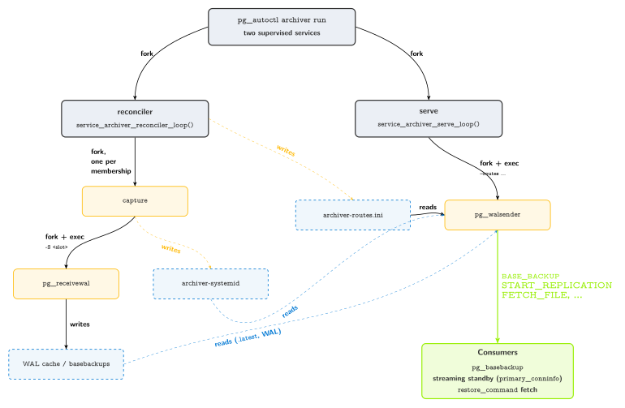

.. _archiving_architecture:

Archiving in Detail
=====================

:ref:`archiving_and_disaster_recovery` introduces the archiver at a glance,
and :ref:`archiving_operations` walks through the day-to-day commands for
registering one and attaching a base-backup policy. This page goes one
level deeper: what actually moves over the network and onto disk while an
archiver is running, and what processes are involved -- the level of
detail worth having before sizing storage, deciding where an archiver
should sit on your network, or reasoning about how a single archiver
covers a whole topology (every group of a Citus formation, or several
independent formations at once).

Data flow
---------

An archiver does three things, and none of them ever route through the
monitor -- WAL and base backups always flow directly between the archiver
and whichever node it's talking to, with the monitor only ever seeing
small status reports (what's been captured, what's been backed up, how
much disk is left), never the data itself:

1. **It streams WAL continuously** from whichever node is currently the
   primary, over an ordinary PostgreSQL physical replication connection --
   the same kind of connection a standby uses, protected by its own
   dedicated replication slot so that nothing already captured is ever
   lost, even across a connection that drops and stays down for a while.
   If the primary changes, the archiver notices and reconnects to the new
   one on its own; no operator action is needed. An archiver attached to
   several groups (see `Process model`_ below) runs one of these streams
   per group, entirely independently -- one group's primary changing, or
   its stream stalling, has no effect on any other group's.
2. **It produces base backups on a schedule**, either as a real
   ``pg_basebackup`` taken directly from a live node, or entirely on its
   own: replaying already-captured WAL against a local copy of the last
   base backup until that copy reaches a consistent, promotable state,
   and backing up that instead. The second mode never touches the
   primary or any standby at all -- useful when you want frequent base
   backups without adding load to production.
3. **It hands both back out** on request: a real ``pg_basebackup``
   command, a real standby's own ``primary_conninfo``, or this project's
   own restore tooling can all connect to an archiver directly and get
   what they ask for, with no special client needed -- see `Archiving:
   client & server`_ below.

Only the PostgreSQL protocol, between nodes
--------------------------------------------

Every connection an archiver makes or accepts speaks the real PostgreSQL
replication/``libpq`` wire protocol -- there is no custom protocol of this
project's own anywhere between nodes, on either side of an archiver:

- **Archiver → primary** (WAL capture, `Data flow`_ point 1 above): an
  ordinary physical replication connection, the same ``START_REPLICATION``
  exchange any standby's own walreceiver uses.
- **Archiver → primary/standby** (base backup generation, point 2 above,
  ``source: live``): an ordinary ``BASE_BACKUP`` command over an ordinary
  replication connection, the same one a real ``pg_basebackup`` run by
  hand would issue.
- **Client → archiver** (serving both back out, point 3 above): ``pg_
  walsender`` (`Archiving: client & server`_ below) implements the server
  side of that same replication protocol -- ``IDENTIFY_SYSTEM``,
  ``BASE_BACKUP``, ``START_REPLICATION``, ``TIMELINE_HISTORY`` -- closely
  enough that an unmodified ``pg_basebackup`` or a real standby's own
  ``primary_conninfo`` can point at it and get what they ask for with no
  special client, exactly as point 3 says.

Nothing about how pg_auto_failover nodes learn about each other, elect a
primary, or converge on a shared view of the cluster changes because of
this: that machinery is entirely separate (the monitor connection and its
own ``node_active()`` protocol), and an archiver plays no part in it.
"Only PostgreSQL protocol between nodes" describes the *data-plane*
connections above -- the ones that move WAL bytes and base backup bytes
-- not the monitor's own control-plane RPCs.

Why ``pg_receivewal``'s source is vendored
^^^^^^^^^^^^^^^^^^^^^^^^^^^^^^^^^^^^^^^^^^^

The archiver's own WAL-capture connection (first bullet above) is driven
by a copy of PostgreSQL's own ``pg_receivewal`` client
(``src/bin/pg_autoctl/vendor/pg_receivewal/``, vendored from
``REL_17_STABLE``), not the packaged system binary. The reason is
narrow: real ``pg_receivewal`` has no ``archive_command``-equivalent hook
-- no way to run code the instant a WAL segment closes, the way a real
Postgres server's own ``archive_command`` GUC does for archived segments.
Without one, noticing a newly-completed segment means polling the WAL
cache directory on a schedule, which does not scale with the number of
retained segments. Vendoring the client made adding that one hook
possible: a plain C function pointer, called from the *existing*
``stream_stop_callback`` extension point upstream ``pg_receivewal``
already exposes for exactly this "segment just finished" moment (see
``vendor/pg_receivewal/pg_receivewal_entry.h`` and that directory's own
``pg_receivewal.c`` header comment for the two small, clearly-marked
edits this took -- everything else, including ``receivelog.c`` and
``streamutil.c``, is byte-for-byte upstream, unmodified).

This is an internal implementation detail, not a protocol or file-format
fork: the vendored client still speaks the exact same replication
protocol, writes the exact same segment files (complete or
``.partial``), and honors the exact same replication-slot semantics as
the real ``pg_receivewal`` binary -- fully wire- and disk-compatible
with it, and with any other tool (a real standby, a monitoring script)
that expects to find an ordinary ``pg_receivewal``-produced WAL cache on
disk. Nothing downstream of the WAL cache directory can tell the
difference.

Storage
-------

Everything an archiver holds lives under one local directory -- the path
given as ``--pgdata`` when the archiver was created. Despite the flag's
name, this is never a real Postgres data directory (there is no
``initdb``, nothing ever starts Postgres against it directly); it's a
cache root.

A single archiver can be attached to more than one (formation, group) at
once -- every group of a Citus formation, or several independent
formations altogether (see `Process model`_ below). Each such membership
gets its own subdirectory, one level under the archiver's own root, named
after the formation and group it belongs to, so that two memberships'
WAL and base backups never collide even though they share one archiver
identity and one root directory::

  /var/lib/pgaf/archiver1/
  ├── archiver-routes.ini
  ├── default/
  │   └── 0/
  │       ├── 000000010000000000000041
  │       ├── 000000010000000000000042
  │       ├── 000000010000000000000043.partial
  │       ├── archiver-position
  │       ├── archiver-systemid
  │       └── basebackups/
  │           ├── .latest
  │           ├── basebackup-20260803T020000Z/
  │           ├── basebackup-20260804T020000Z/
  │           └── basebackup-20260805T020000Z/
  └── billing/
      └── 0/
          ├── 000000010000000000000012
          ├── archiver-position
          ├── archiver-systemid
          └── basebackups/
              ├── .latest
              └── basebackup-20260805T030000Z/

- WAL segments sit directly under their own ``<formation>/<group>/``
  subdirectory, named exactly the way Postgres itself names them. The
  most recently-started one carries a ``.partial`` suffix until it's
  complete -- archiving doesn't wait for a segment to fill up before it
  counts: whatever has already been flushed into that ``.partial`` file
  is captured too.
- Each retained base backup is its own subdirectory under that
  membership's own ``basebackups/``, in the same layout an ordinary
  ``pg_basebackup`` run by hand would produce. You could point
  ``postgres -D`` straight at one of them and it would start -- that's
  exactly what disaster recovery relies on. ``basebackups/.latest`` is a
  one-line pointer at the current one, written the instant it's known
  complete.
- Each membership has its own ``archiver-position`` file (its own
  captured LSN, used for this archiver's own reporting to the monitor)
  and ``archiver-systemid`` file (this group's Postgres system
  identifier, written once). ``archiver-routes.ini`` sits at the
  archiver's own root instead, one section per membership -- see
  `Keeping local files current`_ below for exactly when and why each of
  these gets written. All of these are small internal bookkeeping files
  -- coordinates and status, never a copy of any actual data. Safe to
  ignore day to day, and not something that needs backing up itself --
  each one is regenerated the next time its own triggering event happens
  (a new membership, a captured segment, a completed backup).

A single-membership archiver (the common case: one formation, one group)
looks the same, just with only one ``<formation>/<group>/`` subdirectory
under its root.

Sizing disk for one membership comes down to two mostly-independent
numbers:

- **Base backups**: roughly the policy's ``maxcount`` times the size of
  one backup, since retention prunes anything beyond that count (or
  older than ``maxage``, whichever comes first) right after each new one
  lands. See :ref:`archiving_operations` for how to set these.
- **WAL**: however much WAL has accumulated since your *oldest
  still-retained* base backup -- once a base backup is pruned, the WAL
  segments only it still needed are pruned right along with it. A longer
  retention window keeps more history recoverable, at the cost of more
  WAL kept around to cover it.

An archiver attached to several groups needs the sum of this across every
membership -- each has its own base-backup policy and its own WAL
retention, sized independently.

Network exposure
-----------------

Two distinct connections, two distinct authentication stories:

- **Outbound, archiver → primary** (the ``pg_receivewal`` connection
  `Data flow`_ above describes): goes through the exact same conninfo
  builder as any other node's own ``primary_conninfo``
  (``prepare_primary_conninfo()``), so it supports everything a real
  standby's connection to the primary does -- ``md5``/``password`` auth
  via ``pg_autoctl create archiver --replication-password``, and
  ``sslmode``/certificate-based auth via that same command's
  ``--ssl-self-signed``/``--ssl-mode``/``--ssl-ca-file``/``--server-cert``/
  ``--server-key`` flags (see :ref:`pg_autoctl_create_archiver`). An
  archiver created with none of those flags keeps a plain trust
  connection, same as before.
- **Inbound, client → archiver's own listener**: an archiver listens on a
  TCP port (``6543`` by default, see ``pg_autoctl create archiver --serve-port``) speaking a subset of the PostgreSQL
  replication protocol. It serves TLS the way PostgreSQL does (an
  ``SSLRequest`` answered ``S``, then the handshake) with the certificate
  ``pg_autoctl create archiver --ssl-self-signed`` (or ``--server-cert`` /
  ``--server-key``) provides, TLS 1.2 or newer, and it authenticates every
  connection against ``archiver-hba.conf`` in the archiver's data directory
  -- a small ``pg_hba.conf``-style file, read on every connection, where
  the first matching line wins and no match rejects (as does a missing or
  unreadable file). The default file, created on first start and never
  overwritten, admits the nodes of the cluster with the replication
  password, over TLS::

    # TYPE   ROUTE      USER                       ADDRESS       METHOD
    hostssl  all        pgautofailover_replicator  monitor       scram-sha-256
    hostssl  default/0  pitr_restore                192.0.2.0/24  scram-sha-256

  ``TYPE`` is ``host``, ``hostssl`` or ``hostnossl``; ``ROUTE`` is ``all``
  or ``<formation>/<group>``; ``USER`` is ``all`` or a role name;
  ``ADDRESS`` is ``all``, ``monitor``, an IP address, an ``IP/prefix``, a
  hostname, or a ``.domain.suffix``; ``METHOD`` is ``scram-sha-256``,
  ``trust`` or ``reject``.

  ``monitor`` stands for every node the monitor lists for the route.
  ``pg_walsender`` keeps a local copy of that list in the route's
  directory, stamped with a fingerprint the monitor computes in SQL
  (``pgautofailover.get_group_hosts_hash()``: md5 over the node count and
  sorted names). A copy older than a few seconds is validated at connect
  time -- one cheap query, and the list is only fetched again when the
  fingerprints differ -- and a peer missing from it forces one more
  validation (at most once a second). So a node that registers is admitted
  at its first connection, a node that is dropped is refused within
  seconds, and when the monitor is unreachable the local copy is used as
  it is.

  Hostnames in ``ADDRESS`` are resolved forward and every address of the
  answer is compared with the client's. A ``.domain.suffix`` rule matches
  when *any* of the client's reverse DNS names ends with the suffix and
  that name resolves back to the client -- PostgreSQL's forward-confirmed
  reverse DNS, but over every ``PTR`` answer instead of only the first one,
  which matters for hosts with several names and for Docker networks.

  With ``scram-sha-256`` the client proves knowledge of a password through
  a real SCRAM-SHA-256 exchange (so stock ``pg_basebackup``,
  ``pg_receivewal`` and a standby's ``primary_conninfo`` work unmodified,
  the password given the usual way, e.g. ``PGPASSWORD``), checked against
  the stored verifiers in ``archiver-passwd``. The archiver derives the
  verifier of the replication role from the ``--replication-password`` it
  was created with (without one, the default rule admits nobody and a
  warning says so). Verifiers for other roles, such as a Point-In-Time
  Recovery restore target that never registers with the monitor, are made
  with::

    $ PGPASSWORD=... pg_walsender scram-secret --user pitr_restore >> archiver-passwd

  and admitted by a line of their own in ``archiver-hba.conf``. The
  listener also caps concurrent connections (64) and drops a client that
  does not complete startup within 30 seconds.

Process model
--------------

Once started (``pg_autoctl run``, or ``pg_autoctl node run`` against a
``kind = archiver`` node specification), an archiver supervises
exactly two long-running processes: ``serve``, and a ``reconciler`` that
in turn keeps three children running per (formation, group) membership
this archiver currently holds -- a ``capture`` process (the FSM tick
reporting this membership's progress to the monitor), pg_receivewal's own
dedicated controller process, and a periodic WAL-cache scanner -- added
and removed together as the archiver is attached to or detached from a
formation, no restart of the archiver itself required. They hand off
small files and a local socket (`Storage`_ above) and nothing else:

al-ctl polls it and runs an in-process pg_receivewal against that target, notifying capture of each closed segment over a local socket; wal-scanner periodically walks the WAL cache directory and feeds the same socket as a correctness backstop; capture drains that socket every tick and reports the whole batch to the monitor in one round trip; capture also periodically forks a short-lived basebackup child that execs the real pg_basebackup) and also writes archiver-routes.ini, one section per membership; serve runs pg_walsender, which reads the routes file, the WAL cache/basebackups, and archiver-systemid directly, and serves pg_basebackup, streaming standbys, and restore_command fetches

   Two supervised top-level processes per archiver; the reconciler forks
   one capture process, one pg_receivewal controller, and one WAL-cache
   scanner per membership underneath it -- siblings, not parent/child
   (see below for why)

::

  pg_autoctl run
  ├── reconciler       -- keeps the set of running per-membership
  │   │                   processes in sync with the monitor's own
  │   │                   membership list for this archiver, and writes
  │   │                   archiver-routes.ini to match
  │   ├── capture (default/0)        -- the FSM tick: reports this
  │   │   │                             membership's progress to the
  │   │   │                             monitor, writes pgreceivewal.state
  │   │   │                             naming the current primary, drains
  │   │   │                             wal-notify.sock every tick and
  │   │   │                             bulk-reports whatever it collected,
  │   │   │                             and periodically forks a
  │   │   └── basebackup                short-lived basebackup child that
  │   │       └── pg_basebackup          execs the real binary, then exits
  │   ├── pgreceivewal-ctl (default/0)  -- polls pgreceivewal.state and
  │   │   └── pg_receivewal                runs an in-process pg_receivewal
  │   │                                    against it, notifying capture
  │   │                                    of each closed segment over
  │   │                                    wal-notify.sock
  │   ├── wal-scanner (default/0)  -- every ~30s, walks the WAL cache
  │   │                                directory and feeds any segment
  │   │                                the live path may have missed
  │   │                                through that same socket
  │   ├── capture (billing/0)
  │   │   └── basebackup
  │   │       └── pg_basebackup
  │   ├── pgreceivewal-ctl (billing/0)
  │   │   └── pg_receivewal
  │   └── wal-scanner (billing/0)
  └── serve            -- keeps the archiver reachable over the network,
      └── pg_walsender --port 6543 --pgdata /var/lib/pgaf/archiver1
                       (derives archiver-routes.ini's path from --pgdata;
                       serves every membership through the one process)

``capture``, pg_receivewal's own controller, and the WAL-cache scanner are
deliberately siblings, not parent/child: the top-level supervisor's own
central reap loop watches for *any* child of the process it started
exiting, and a pg_receivewal forked directly from inside ``capture`` used
to race that wildcard reap against ``capture``'s own targeted one. Giving
pg_receivewal its own dedicated controller process removes the race
structurally -- each side's ``waitpid()`` can only ever observe its own
one child -- the same reason ordinary Postgres runs under its own
dedicated ``postgres`` controller process rather than as a direct child of
``node-active``. The WAL-cache scanner is a sibling for a related but
distinct reason: it used to be an inline directory scan on ``capture``'s
own FSM tick, run every 60 ticks -- a full directory listing over a WAL
cache retaining thousands of segments is real wall-clock work, and paying
it inline meant every 60th tick was delayed behind it. As its own
process, the scan cadence is fully decoupled from the tick loop's own.

Reporting captured WAL to the monitor is a two-producer, one-consumer
design built around a single Unix domain socket per membership
(``wal-notify.sock``): pg_receivewal's own hook writes a line to it the
instant a segment closes (the fast, common-case path), and the WAL-cache
scanner writes the same shape of line for anything it finds on its own
periodic walk (the bounded correctness backstop for whatever the live
path might have missed -- nothing listening yet, a dropped connection).
From the listener's side the two are indistinguishable. ``capture``
drains whatever is queued once per tick and reports the whole batch to
the monitor in a single ``report_wal_received_bulk()`` call -- one round
trip regardless of how many segments were captured since the last tick --
rather than one round trip per segment. Each reported row also carries
this membership's own Postgres system identifier (``archiver-systemid``,
read locally rather than re-fetched per report), so WAL from a stale
cluster incarnation (a group re-bootstrapped from scratch after a
disaster, without its ``(formation, group)`` ever changing) can be told
apart from WAL captured under the current one.

If any child stops unexpectedly, its supervisor notices on its next tick
and restarts it -- an archiver recovering from a crashed
``pg_receivewal`` or ``pg_walsender`` needs no operator action, the same
way a keeper recovers a crashed Postgres. A crash of the reconciler
itself is likewise just restarted by the top-level supervisor; on
restart it re-discovers its current memberships from the monitor and
resumes capturing all of them -- a replication slot keeps the WAL a
capture needs regardless of how many times its own consumer reconnects,
so this costs nothing.

Keeping local files current
^^^^^^^^^^^^^^^^^^^^^^^^^^^^

``pg_walsender`` never queries the monitor itself, on purpose: an
archiver exists to keep serving already-captured data even when the
monitor it would otherwise depend on is unreachable, and staying free of
that dependency also keeps ``pg_walsender`` a small, standalone binary
with nothing to mock or stand up just to test it. Rather than one file
periodically refreshed from the monitor, every fact ``pg_walsender``
needs lives in its own small local file, written exactly once by
whichever process is the sole owner of that fact, at the moment the fact
becomes true -- there is nothing to periodically re-check or push an
update about, because nothing here is ever a stale copy of something
else: it's read straight off disk, fresh, on every connection.

``archiver-routes.ini`` maps each connection's dbname to the local
storage root of the membership it names -- nothing more. It's the one
piece of this that's genuinely dynamic, and the ``reconciler`` writes it
(one section per membership) exactly when this archiver's own set of
memberships changes -- a formation attached or detached -- the same
moment it starts or stops that membership's own capture child::

  [default/0]
  path = /var/lib/pgaf/archiver1/default/0

Everything else ``pg_walsender`` needs, it reads directly from under that
one path, at connection time:

- **Which base backup is current** (``BASE_BACKUP``): ``basebackups/
  .latest``, a one-line pointer to a backup's own label/subdirectory,
  written by the base-backup generation child the instant it knows a
  *live*-sourced backup is complete -- it's the sole process that ever
  knows this fact, so there's nothing to notify afterwards. Retention
  pruning clears the pointer if the backup it names is the one being
  removed. A *replay*-sourced backup never updates it (see
  :ref:`archiving_operations` for the ``live``/``replay`` policy
  distinction) -- ``pg_walsender`` also re-checks, fresh, that the
  backup's own recorded timeline still matches the WAL cache's current
  one before ever streaming it, rather than trusting that guarantee
  blindly.
- **This group's system identifier** (``IDENTIFY_SYSTEM``):
  ``archiver-systemid``, written once by the capture process the first
  time the monitor reports it (relayed from whatever the group's real
  primary already self-reported at ordinary node registration -- an
  archiving node has no real ``pg_control`` of its own to read this
  from). Never rewritten after that: a system identifier is set at
  ``initdb`` and never changes for a cluster's lifetime, so write-once is
  the actually-correct behavior here, not a simplification that trades
  away correctness.
- **Current WAL position and timeline**: read from ``archiver-position``,
  written roughly once a second by the capture process for its own
  monitor-reporting needs (the same value it reports as this node's own
  ``reportedLSN``) and reused here as a cache -- a full scan of the WAL
  cache directory on every connection would cost more the longer an
  archiver has been running and the more segments its retention policy
  keeps, so ``pg_walsender`` reads this file instead of repeating that
  scan itself. Only falls back to scanning the directory directly when
  the cache file isn't there yet (a connection arriving before the
  capture process's first tick).

Every write above uses the same write-to-temp-file-then-``rename()``
pattern this project uses everywhere it needs atomicity -- a connection
arriving mid-write always sees either the complete previous version or
the complete new one, never a torn one, and needs no lock to do so.

Each membership generates its own base backups independently (its own
schedule, its own retention), so more than one can genuinely be in
progress at once on a multi-membership archiver -- there's no archiver-
wide lock serializing them, and no shared file either: each writes only
into its own membership's own subdirectory.

More or fewer standby nodes
^^^^^^^^^^^^^^^^^^^^^^^^^^^^

A membership's own capture process doesn't change shape based on how many
standby nodes are in its group. WAL capture always talks to whichever
node is currently primary, never to a standby directly, so a two-node
group and a five-node group look identical from the archiver's side. The
only place standby count matters at all is when a base backup is sourced
live: with more healthy standbys available, there are more candidates to
pick from before falling back to the primary -- everything else about
the archiver is unaffected.

Several formations
^^^^^^^^^^^^^^^^^^^

One archiver can be attached to several formations at once -- each with
its own group of two or three standby nodes, say -- with no need to run a
separate archiver process per formation (see :ref:`archiving_operations`
for the repeated ``--formation`` this takes at creation time). Each
formation attached this way is one more membership, which shows up as one
more ``capture`` child under the reconciler and one more section in
``archiver-routes.ini``; nothing about the archiver's own identity, port,
or ``--pgdata`` root changes:

::

  pg_autoctl run
  ├── reconciler
  │   ├── capture (default/0) -> pg_receivewal, basebackup -> pg_basebackup
  │   └── capture (billing/0) -> pg_receivewal, basebackup -> pg_basebackup
  └── serve -> pg_walsender          (serves both memberships)

Each membership's own capture is entirely independent -- separate storage
subdirectory, separate WAL stream, separate base-backup schedule, no
shared state with any other membership. Losing one (its capture process
crashing, say) has no effect on the others; the reconciler restarts just
that one. Running one archiver per formation instead, on separate hosts,
is still a perfectly reasonable choice -- for isolating blast radius, or
spreading load across machines -- just no longer a requirement.

A Citus formation
^^^^^^^^^^^^^^^^^^

A Citus formation is really several node groups under one name: the
coordinator's own group, plus one group per worker. Attaching an archiver
to a Citus formation attaches it to every group that already exists in
that formation at the time -- the coordinator's and every worker's --
each becoming its own membership with its own capture process, exactly
like several independent formations would. A worker group added to the
formation *afterwards* is not picked up on its own: the reconciler only
ever starts capture for memberships the monitor already knows about, and
nothing today re-attaches an archiver to a formation automatically when
that formation grows a new group. Re-running the attach for that
formation covers the new group too (existing memberships are left alone),
and the reconciler picks it up on its own next periodic check, no
archiver restart required.

Archiving: client & server
------------------------------------

An archiver's serving side understands enough of the real PostgreSQL
replication protocol that ordinary, unmodified tools can talk to it
directly -- nothing here needs a custom client. The commands below are
what those tools actually send; useful to know if you're connecting by
hand with ``psql "... replication=database"`` to check on an archiver, or
deciding what else could talk to one.

``IDENTIFY_SYSTEM``

  The first thing any of these tools asks: which system and timeline the
  archiver is tracking, and how far it's captured so far.

``BASE_BACKUP``

  Streams the archiver's most recent base backup, in the same plain tar
  format a real ``pg_basebackup --format=plain`` produces. Point a real,
  unmodified ``pg_basebackup`` at an archiver and it works exactly as it
  would against a live node -- this is what ``pg_autoctl create postgres
  --from-archiver`` uses to bootstrap a brand new node straight from an
  archiver's cache instead of a live primary or secondary.

``START_REPLICATION``

  Streams WAL from a given position onward, the same way a live primary
  would. This is what lets a real standby's own ``primary_conninfo``
  point at an archiver instead of a live node, and what a multi-standby
  failover election falls back on to fetch WAL a promoted candidate is
  still missing, straight from the archiver's own cache, when no live
  node has it anymore.

``TIMELINE_HISTORY``

  Returns the timeline history for a given timeline -- needed by any
  streaming client following a timeline change, such as after a
  failover.

``CREATE_REPLICATION_SLOT`` / ``READ_REPLICATION_SLOT``

  Basic physical replication slot support, for tools that expect to
  manage their own slot against whatever they're streaming from.

``FETCH_FILE``

  A command of this project's own, sent like any other replication command
  on a normal, authenticated replication connection (it is not a separate
  channel): ask for one WAL segment or ``.history`` file by name, get its
  exact bytes back. Any other file name (the archiver's own configuration,
  paths with ``..``, dot-files) is refused. This is what makes an archiver
  usable as a ``restore_command`` target on its own, without needing a full
  streaming connection just to recover one missing segment.

  The client side of ``FETCH_FILE`` is not a separate ``pg_walsender``
  sub-command (``pg_walsender`` is a server binary, plus its
  ``scram-secret`` utility, nothing else): it is a small shared function,
  ``ws_fetch_file_client()`` (``src/bin/common/fetch_client.c``), called
  in-process by :ref:`pg_autoctl_restore_command`, which resolves the host,
  port, route and role on its own -- from this node's own pg_auto_failover
  configuration when it has one, or from a small cache file written once by
  ``pg_autoctl restore command --set-up`` otherwise::

    restore_command = 'pg_autoctl restore command %f %p'

archive_command confirmation
----------------------------

``archive_command`` never moves data here: the archiver's ``pg_receivewal``
already streams the WAL. New nodes are configured with ``archive_mode = on``
and ``archive_command = '<pg_autoctl> archive command --pgdata <PGDATA> %f'``
(``pg_autoctl create postgres --archive-confirm off`` writes
``archive_mode = off`` instead). Postgres only recycles a WAL segment once the
command succeeds, so a segment is never recycled before the archiver holds it.

The command calls ``pgautofailover.archive_confirmed()`` on the monitor with a
3 seconds connect timeout, without needing the ``pg_autoctl`` service to be
running. A group with no archiver is always confirmed, so a cluster without an
archiver never blocks WAL recycling. Timeline history, ``.backup`` and
``.partial`` files are not confirmed: they are informational and the
archiver's ``pg_receivewal`` captures timeline histories itself.

When the monitor cannot be reached, the command relies on
``$PGDATA/pg_autoctl.archive-confirm``, written after every successful
monitor answer. If the last known answer is that the group has no archiver the
command succeeds; if archivers exist, or nothing is cached, it fails and
Postgres retries.

This is a durability trade-off: when the archiver is down, ``archive_command``
fails and ``pg_wal`` grows on the primary until the archiver catches up.

``archive_mode`` requires a Postgres restart. Nodes created before an upgrade
get the setting written in ``postgresql-auto-failover.conf`` at the next
configuration rewrite, and ``pg_autoctl`` logs a warning when the running
Postgres has ``archive_mode = off`` while archive confirmation is enabled:
restart Postgres to enable WAL archive confirmation.

Operating notes
---------------

Serving. ``pg_autoctl create archiver --serve-port PORT`` chooses the TCP
port ``pg_walsender`` listens on (default ``6543``); the monitor stores it
and hands it to nodes (``get_archiver_node``). ``pg_walsender`` gives each
connection ``--auth-timeout`` seconds (default 30) to finish startup, TLS
and authentication, rejects oversize pre-authentication messages, and fails
closed on a malformed ``archiver-hba.conf``; ``--insecure`` is required to
run without a ``--pgdata`` (no authentication at all). See
:ref:`pg_walsender`.

Nodes list. ``pg_walsender`` never talks to the monitor. The archiver's
refresher process periodically copies the monitor's node list for each
route into a local ``archiver-nodes.list``, and the default HBA address
``monitor`` means "a host in that list", validated by a fingerprint at
connect time. When the monitor is down the last list keeps being used, so
already-registered nodes can keep taking base backups and fetching WAL.

Per-route files. Besides the WAL and ``basebackups/``, each route
directory holds ``archiver-walsegsize``, the WAL segment size of the group's
cluster, so that ``SHOW wal_segment_size`` and segment arithmetic are right
for clusters not using 16MB.

Base backups on demand. ``pg_autoctl archiver backup now`` triggers a
base backup immediately instead of waiting for the policy's ``frequency``.

Local WAL retention. The archiver's local WAL cache is pruned to what the
oldest retained base backup needs: segments older than the ``START WAL
LOCATION`` file of the oldest kept backup are removed as backups are
retired by the policy's ``maxcount`` / ``maxage``.

Replication quorum. An archiver marked replication-quorum eligible
(``pgautofailover.set_archiver_policy(formation, group, NULL, NULL, true)``)
is a member of the primary's synchronous commit quorum: its
``pg_receivewal`` connects with ``application_name``
``pgautofailover_standby_<nodeid>`` and flushes synchronously, so
``synchronous_standby_names`` can count it. It can then satisfy the quorum
when a secondary is down. Making a node a quorum member is done with
``pgautofailover.set_node_replication_quorum(formation, nodename, true)``
(the archiver's node name is ``archiver-<archiverid>-<group>``).

The monitor counts an archiver as a quorum standby of the group's primary
only while it is a quorum member, in the ``archiving`` state and not stale
(it keeps reporting to the monitor). While such an archiver exists the
primary stays ``primary`` -- keeping synchronous replication and accepting
writes -- when its last secondary is lost, or is put in maintenance. Only
when no quorum standby is left at all, no secondary and no archiver, does
the primary fall back to ``wait_primary``, as it does in a group without
archivers. A graceful stop of a secondary's ``pg_autoctl`` starts its
maintenance and behaves the same way. The archiver still has
``candidate-priority`` 0: it keeps the primary writable, it can never be
promoted. This is separate from ``archiver_quorum`` (the
number of archivers that must have captured a segment before
``wal_archived()`` reports it).

See also
--------

- :ref:`archiving_and_disaster_recovery` -- what an archiver is and
  where it fits among the other architectures
- :ref:`archiving_operations` -- registering an archiver, attaching a
  base-backup policy, rebuilding a node from one
- :ref:`archiving_fault_tolerance` -- what changes about fault tolerance
  once an archiver is in the picture
- :ref:`failover_state_machine` -- the ``archiving`` state's own
  transitions
