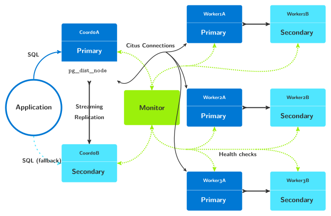

.. _citus_quickstart:

Citus Tutorial
==============

In this guide we’ll create a Citus cluster with a coordinator node and three
workers. Every node will have a secondary for failover. We’ll simulate
failure in the coordinator and worker nodes and see how the system continues
to function.

This tutorial uses `docker compose`__ in order to separate the architecture
design from some of the implementation details. This allows reasoning at
the architecture level within this tutorial, and better see which software
component needs to be deployed and run on which node.

__ https://docs.docker.com/compose/

The setup provided in this tutorial is good for replaying at home in the
lab. It is not intended to be production ready though. In particular, no
attention have been spent on volume management. After all, this is a
tutorial: the goal is to walk through the first steps of using
pg_auto_failover to provide HA to a Citus formation.

Pre-requisites
--------------

When using `docker compose` we describe a list of services, each service may
run on one or more nodes, and each service just runs a single isolated
process in a container.

Within the context of a tutorial, or even a development environment, this
matches very well to provisioning separate physical machines on-prem, or
Virtual Machines either on-prem on in a Cloud service.

The docker image used in this tutorial is named `pg_auto_failover:citus`. It
can be built locally when using the attached :download:`Dockerfile
<citus/Dockerfile>` found within the GitHub repository for pg_auto_failover.

To build the image, either use the provided Makefile and run ``make build``,
or run the docker build command directly:

::

   $ git clone https://github.com/citusdata/pg_auto_failover
   $ cd pg_auto_failover/docs/cluster

   $ docker build -t pg_auto_failover:citus -f Dockerfile ../..
   $ docker compose build

Our first Citus Cluster
-----------------------

To create a cluster we use the following docker compose definition:

.. literalinclude:: citus/docker-compose-scale.yml
   :language: yaml
   :emphasize-lines: 5,15,27
   :linenos:

To run the full Citus cluster with HA from this definition, we can use the
following command:

::

   $ docker compose up --scale coord=2 --scale worker=6

The command above starts the services up. The command also specifies a
``--scale`` option that is different for each service. We need:

 - one monitor node, and the default scale for a service is 1,

 - one primary Citus coordinator node and one secondary Cituscoordinator
   node, which is to say two coordinator nodes,

 - and three Citus worker nodes, each worker with both a primary Postgres
   node and a secondary Postgres node, so that's a scale of 6 here.

The default policy for the pg_auto_failover monitor is to assign a primary
and a secondary per auto failover :ref:`group`. In our case, every node
being provisioned with the same command, we benefit from that default policy::

  $ pg_autoctl create worker --ssl-self-signed --auth trust --pg-hba-lan --run

When provisioning a production cluster, it is often required to have a
better control over which node participates in which group, then using the
``--group N`` option in the ``pg_autoctl create worker`` command line.

Within a given group, the first node that registers is a primary, and the
other nodes are secondary nodes. The monitor takes care of that in a way
that we don't have to. In a High Availability setup, every node should be
ready to be promoted primary at any time, so knowing which node in a group
is assigned primary first is not very interesting.

While the cluster is being provisionned by docker compose, you can run the
following command and have a dynamic dashboard to follow what's happening.
The following command is like ``top`` for pg_auto_failover::

  $ docker compose exec monitor pg_autoctl watch

Because the ``pg_basebackup`` operation that is used to create the secondary
nodes takes some time when using Citus, because of the first CHECKPOINT
which is quite slow. So at first when inquiring about the cluster state you
might see the following output:

.. code-block:: bash

   $ docker compose exec monitor pg_autoctl show state
       Name |  Node |         Host:Port |       TLI: LSN |   Connection |      Reported State |      Assigned State
   ---------+-------+-------------------+----------------+--------------+---------------------+--------------------
    coord0a |   0/1 | cd52db444544:5432 |   1: 0/200C4A0 |   read-write |        wait_primary |        wait_primary
    coord0b |   0/2 | 66a31034f2e4:5432 |         1: 0/0 |       none ! |        wait_standby |          catchingup
   worker1a |   1/3 | dae7c062e2c1:5432 |   1: 0/2003B18 |   read-write |        wait_primary |        wait_primary
   worker1b |   1/4 | 397e6069b09b:5432 |         1: 0/0 |       none ! |        wait_standby |          catchingup
   worker2a |   2/5 | 5bf86f9ef784:5432 |   1: 0/2006AB0 |   read-write |        wait_primary |        wait_primary
   worker2b |   2/6 | 23498b801a61:5432 |         1: 0/0 |       none ! |        wait_standby |          catchingup
   worker3a |   3/7 | c23610380024:5432 |   1: 0/2003B18 |   read-write |        wait_primary |        wait_primary
   worker3b |   3/8 | 2ea8aac8a04a:5432 |         1: 0/0 |       none ! |        wait_standby |          catchingup

After a while though (typically around a minute or less), you can run that
same command again for stable result:

.. code-block:: bash

   $ docker compose exec monitor pg_autoctl show state

       Name |  Node |         Host:Port |       TLI: LSN |   Connection |      Reported State |      Assigned State
   ---------+-------+-------------------+----------------+--------------+---------------------+--------------------
    coord0a |   0/1 | cd52db444544:5432 |   1: 0/3127AD0 |   read-write |             primary |             primary
    coord0b |   0/2 | 66a31034f2e4:5432 |   1: 0/3127AD0 |    read-only |           secondary |           secondary
   worker1a |   1/3 | dae7c062e2c1:5432 |   1: 0/311B610 |   read-write |             primary |             primary
   worker1b |   1/4 | 397e6069b09b:5432 |   1: 0/311B610 |    read-only |           secondary |           secondary
   worker2a |   2/5 | 5bf86f9ef784:5432 |   1: 0/311B610 |   read-write |             primary |             primary
   worker2b |   2/6 | 23498b801a61:5432 |   1: 0/311B610 |    read-only |           secondary |           secondary
   worker3a |   3/7 | c23610380024:5432 |   1: 0/311B648 |   read-write |             primary |             primary
   worker3b |   3/8 | 2ea8aac8a04a:5432 |   1: 0/311B648 |    read-only |           secondary |           secondary

You can see from the above that the coordinator node has a primary and
secondary instance for high availability. When connecting to the
coordinator, clients should try connecting to whichever instance is running
and supports reads and writes.

We can review the available Postgres URIs with the
:ref:`pg_autoctl_show_uri` command::

  $ docker compose exec monitor pg_autoctl show uri
           Type |    Name | Connection String
   -------------+---------+-------------------------------
        monitor | monitor | postgres://autoctl_node@552dd89d5d63:5432/pg_auto_failover?sslmode=require
      formation | default | postgres://66a31034f2e4:5432,cd52db444544:5432/citus?target_session_attrs=read-write&sslmode=require

To check that Citus worker nodes have been registered to the coordinator, we
can run a psql session right from the coordinator container:

.. code-block:: bash

   $ docker compose exec coord psql -d citus -c 'select * from citus_get_active_worker_nodes();'
     node_name   | node_port
   --------------+-----------
    dae7c062e2c1 |      5432
    5bf86f9ef784 |      5432
    c23610380024 |      5432
   (3 rows)

We are now reaching the limits of using a simplified docker compose setup.
When using the ``--scale`` option, it is not possible to give a specific
hostname to each running node, and then we get a randomly generated string
instead or useful node names such as ``worker1a`` or ``worker3b``.

Create a Citus Cluster, take two
--------------------------------

In order to implement the following architecture, we need to introduce a
more complex docker compose file than in the previous section.

   pg_auto_failover architecture with a Citus formation

This time we create a cluster using the following docker compose definition:

.. literalinclude:: citus/docker-compose.yml
   :language: yaml
   :emphasize-lines: 3,15,40,44,48,52,56,60,64,68
   :linenos:

This definition is a little more involved than the previous one. We take
benefit from `YAML anchors and aliases`__ to define a *template* for our
coordinator nodes and worker nodes, and then apply that template to the
actual nodes.

__ https://yaml101.com/anchors-and-aliases/

Also this time we provision an application service (named "app") that sits
in the background and allow us to later connect to our current primary
coordinator. See :download:`Dockerfile.app <citus/Dockerfile.app>` for the
complete definition of this service.

We start this cluster with a simplified command line this time:

::

   $ docker compose up

And this time we get the following cluster as a result:

::

   $ docker compose exec monitor pg_autoctl show state
       Name |  Node |     Host:Port |       TLI: LSN |   Connection |      Reported State |      Assigned State
   ---------+-------+---------------+----------------+--------------+---------------------+--------------------
    coord0a |   0/3 |  coord0a:5432 |   1: 0/312B040 |   read-write |             primary |             primary
    coord0b |   0/4 |  coord0b:5432 |   1: 0/312B040 |    read-only |           secondary |           secondary
   worker1a |   1/1 | worker1a:5432 |   1: 0/311C550 |   read-write |             primary |             primary
   worker1b |   1/2 | worker1b:5432 |   1: 0/311C550 |    read-only |           secondary |           secondary
   worker2b |   2/7 | worker2b:5432 |   2: 0/5032698 |   read-write |             primary |             primary
   worker2a |   2/8 | worker2a:5432 |   2: 0/5032698 |    read-only |           secondary |           secondary
   worker3a |   3/5 | worker3a:5432 |   1: 0/311C870 |   read-write |             primary |             primary
   worker3b |   3/6 | worker3b:5432 |   1: 0/311C870 |    read-only |           secondary |           secondary

And then we have the following application connection string to use:

::

   $ docker compose exec monitor pg_autoctl show uri
           Type |    Name | Connection String
   -------------+---------+-------------------------------
        monitor | monitor | postgres://autoctl_node@f0135b83edcd:5432/pg_auto_failover?sslmode=require
      formation | default | postgres://coord0b:5432,coord0a:5432/citus?target_session_attrs=read-write&sslmode=require

And finally, the nodes being registered as Citus worker nodes also make more
sense:

::

   $ docker compose exec coord0a psql -d citus -c 'select * from citus_get_active_worker_nodes()'
    node_name | node_port
   -----------+-----------
    worker1a  |      5432
    worker3a  |      5432
    worker2b  |      5432
   (3 rows)

.. important::

   At this point, it is important to note that the Citus coordinator only
   knows about the primary nodes in each group. The High Availability
   mechanisms are all implemented in pg_auto_failover, which mostly uses the
   Citus API ``citus_update_node`` during worker node failovers.

Our first Citus worker failover
-------------------------------

We see that in the ``citus_get_active_worker_nodes()`` output we have
``worker1a``, ``worker2b``, and ``worker3a``. As mentioned before, that
should have no impact on the operations of the Citus cluster when nodes are
all dimensionned the same.

That said, some readers among you will prefer to have the *A* nodes as
primaries to get started with. So let's implement our first worker failover
then. With pg_auto_failover, this is as easy as doing:

::

   $ docker compose exec monitor pg_autoctl perform failover --group 2
   15:40:03 9246 INFO  Waiting 60 secs for a notification with state "primary" in formation "default" and group 2
   15:40:03 9246 INFO  Listening monitor notifications about state changes in formation "default" and group 2
   15:40:03 9246 INFO  Following table displays times when notifications are received
       Time |     Name |  Node |     Host:Port |       Current State |      Assigned State
   ---------+----------+-------+---------------+---------------------+--------------------
   22:58:42 | worker2b |   2/7 | worker2b:5432 |             primary |            draining
   22:58:42 | worker2a |   2/8 | worker2a:5432 |           secondary |   prepare_promotion
   22:58:42 | worker2a |   2/8 | worker2a:5432 |   prepare_promotion |   prepare_promotion
   22:58:42 | worker2a |   2/8 | worker2a:5432 |   prepare_promotion |        wait_primary
   22:58:42 | worker2b |   2/7 | worker2b:5432 |             primary |             demoted
   22:58:42 | worker2b |   2/7 | worker2b:5432 |            draining |             demoted
   22:58:42 | worker2b |   2/7 | worker2b:5432 |             demoted |             demoted
   22:58:43 | worker2a |   2/8 | worker2a:5432 |        wait_primary |        wait_primary
   22:58:44 | worker2b |   2/7 | worker2b:5432 |             demoted |          catchingup
   22:58:46 | worker2b |   2/7 | worker2b:5432 |          catchingup |          catchingup
   22:58:46 | worker2b |   2/7 | worker2b:5432 |          catchingup |           secondary
   22:58:46 | worker2b |   2/7 | worker2b:5432 |           secondary |           secondary
   22:58:46 | worker2a |   2/8 | worker2a:5432 |        wait_primary |             primary
   22:58:46 | worker2a |   2/8 | worker2a:5432 |             primary |             primary

So it took around 5 seconds to do a full worker failover in worker group 2.
Now we'll do the same on the group 1 to fix the other situation, and review
the resulting cluster state.

::

   $ docker compose exec monitor pg_autoctl show state
       Name |  Node |     Host:Port |       TLI: LSN |   Connection |      Reported State |      Assigned State
   ---------+-------+---------------+----------------+--------------+---------------------+--------------------
    coord0a |   0/3 |  coord0a:5432 |   1: 0/312ADA8 |   read-write |             primary |             primary
    coord0b |   0/4 |  coord0b:5432 |   1: 0/312ADA8 |    read-only |           secondary |           secondary
   worker1a |   1/1 | worker1a:5432 |   1: 0/311B610 |   read-write |             primary |             primary
   worker1b |   1/2 | worker1b:5432 |   1: 0/311B610 |    read-only |           secondary |           secondary
   worker2b |   2/7 | worker2b:5432 |   2: 0/50000D8 |    read-only |           secondary |           secondary
   worker2a |   2/8 | worker2a:5432 |   2: 0/50000D8 |   read-write |             primary |             primary
   worker3a |   3/5 | worker3a:5432 |   1: 0/311B648 |   read-write |             primary |             primary
   worker3b |   3/6 | worker3b:5432 |   1: 0/311B648 |    read-only |           secondary |           secondary

Which seen from the Citus coordinator, looks like the following:

::

   $ docker compose exec coord0a psql -d citus -c 'select * from citus_get_active_worker_nodes()'
    node_name | node_port
   -----------+-----------
    worker1a  |      5432
    worker3a  |      5432
    worker2a  |      5432
   (3 rows)

Distribute Data to Workers
--------------------------

Let's create a database schema with a single distributed table.

::

   $ docker compose exec app psql

.. code-block:: sql

  -- in psql

  CREATE TABLE companies
  (
    id         bigserial PRIMARY KEY,
    name       text NOT NULL,
    image_url  text,
    created_at timestamp without time zone NOT NULL,
    updated_at timestamp without time zone NOT NULL
  );

  SELECT create_distributed_table('companies', 'id');

Next download and ingest some sample data, still from within our psql session:

::

   \copy companies from program 'curl -o- https://examples.citusdata.com/mt_ref_arch/companies.csv' with csv
   # ( COPY 75 )

Handle Worker Failure
---------------------

Now we'll intentionally crash a worker's primary node and observe how the
pg_auto_failover monitor unregisters that node in the coordinator and
registers the secondary instead.

::

   # the pg_auto_failover keeper process will be unable to resurrect
   # the worker node if pg_control has been removed
   $ docker compose exec worker1a rm /tmp/pgaf/global/pg_control

   # shut it down
   $ docker compose exec worker1a /usr/lib/postgresql/14/bin/pg_ctl stop -D /tmp/pgaf

The keeper will attempt to start worker 1a three times and then report the
failure to the monitor, who promotes worker1b to replace worker1a. Citus
worker worker1a is unregistered with the coordinator node, and worker1b is
registered in its stead.

Asking the coordinator for active worker nodes now shows worker1b, worker2a,
and worker3a:

::

   $ docker compose exec app psql -c 'select * from master_get_active_worker_nodes();'

    node_name | node_port
   -----------+-----------
    worker3a  |      5432
    worker2a  |      5432
    worker1b  |      5432
   (3 rows)

Finally, verify that all rows of data are still present:

::

   $ docker compose exec app psql -c 'select count(*) from companies;'
    count
   -------
       75

Meanwhile, the keeper on worker 1a heals the node. It runs ``pg_basebackup``
to fetch the current PGDATA from worker1a. This restores, among other
things, a new copy of the file we removed. After streaming replication
completes, worker1b becomes a full-fledged primary and worker1a its
secondary.

::

   $ docker compose exec monitor pg_autoctl show state
       Name |  Node |     Host:Port |       TLI: LSN |   Connection |      Reported State |      Assigned State
   ---------+-------+---------------+----------------+--------------+---------------------+--------------------
    coord0a |   0/3 |  coord0a:5432 |   1: 0/3178B20 |   read-write |             primary |             primary
    coord0b |   0/4 |  coord0b:5432 |   1: 0/3178B20 |    read-only |           secondary |           secondary
   worker1a |   1/1 | worker1a:5432 |   2: 0/504C400 |    read-only |           secondary |           secondary
   worker1b |   1/2 | worker1b:5432 |   2: 0/504C400 |   read-write |             primary |             primary
   worker2b |   2/7 | worker2b:5432 |   2: 0/50FF048 |    read-only |           secondary |           secondary
   worker2a |   2/8 | worker2a:5432 |   2: 0/50FF048 |   read-write |             primary |             primary
   worker3a |   3/5 | worker3a:5432 |   1: 0/31CD8C0 |   read-write |             primary |             primary
   worker3b |   3/6 | worker3b:5432 |   1: 0/31CD8C0 |    read-only |           secondary |           secondary

Handle Coordinator Failure
--------------------------

Because our application connection string includes both coordinator hosts
with the option ``target_session_attrs=read-write``, the database client
will connect to whichever of these servers supports both reads and writes.

However if we use the same trick with the pg_control file to crash our
primary coordinator, we can watch how the monitor promotes the secondary.

::

   $ docker compose exec coord0a rm /tmp/pgaf/global/pg_control
   $ docker compose exec coord0a /usr/lib/postgresql/14/bin/pg_ctl stop -D /tmp/pgaf

After some time, coordinator A's keeper heals it, and the cluster converges
in this state:

::

   $ docker compose exec monitor pg_autoctl show state
       Name |  Node |     Host:Port |       TLI: LSN |   Connection |      Reported State |      Assigned State
   ---------+-------+---------------+----------------+--------------+---------------------+--------------------
    coord0a |   0/3 |  coord0a:5432 |   2: 0/50000D8 |    read-only |           secondary |           secondary
    coord0b |   0/4 |  coord0b:5432 |   2: 0/50000D8 |   read-write |             primary |             primary
   worker1a |   1/1 | worker1a:5432 |   2: 0/504C520 |    read-only |           secondary |           secondary
   worker1b |   1/2 | worker1b:5432 |   2: 0/504C520 |   read-write |             primary |             primary
   worker2b |   2/7 | worker2b:5432 |   2: 0/50FF130 |    read-only |           secondary |           secondary
   worker2a |   2/8 | worker2a:5432 |   2: 0/50FF130 |   read-write |             primary |             primary
   worker3a |   3/5 | worker3a:5432 |   1: 0/31CD8C0 |   read-write |             primary |             primary
   worker3b |   3/6 | worker3b:5432 |   1: 0/31CD8C0 |    read-only |           secondary |           secondary

We can check that the data is still available through the new coordinator
node too:

::

   $ docker compose exec app psql -c 'select count(*) from companies;'
    count
   -------
       75

Cleanup
-------

To dispose of the entire tutorial environment, just use the following command:

::

   $ docker compose down

Next steps
----------

As mentioned in the first section of this tutorial, the way we use
docker compose here is not meant to be production ready. It's useful to
understand and play with a distributed system such as Citus though, and
makes it simple to introduce faults and see how the pg_auto_failover High
Availability reacts to those faults.

One obvious missing element to better test the system is the lack of
persistent volumes in our docker compose based test rig. It is possible to
create external volumes and use them for each node in the docker compose
definition. This allows restarting nodes over the same data set.

See the command :ref:`pg_autoctl_do_tmux_compose_session` for more details
about how to run a docker compose test environment with docker compose,
including external volumes for each node.

Now is a good time to go read `Citus Documentation`__ too, so that you know
how to use this cluster you just created!

__ https://docs.citusdata.com/en/latest/
