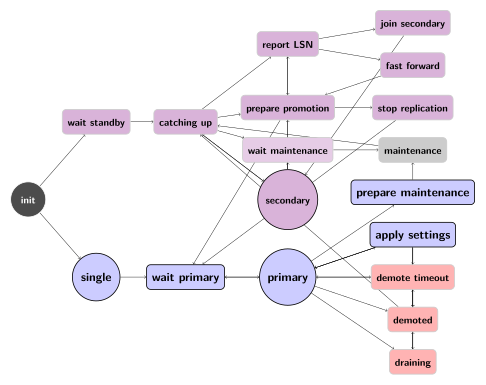
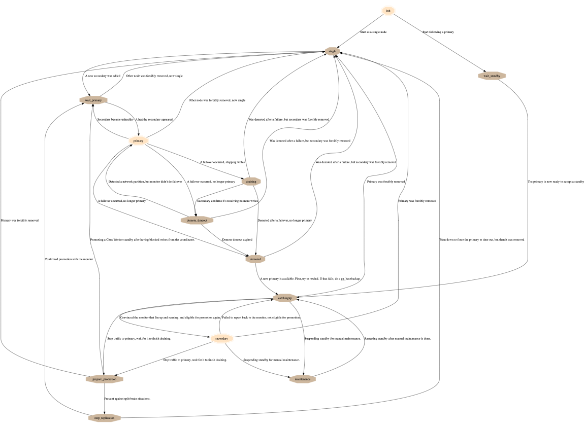

Failover State Machine
======================

Introduction
------------

pg_auto_failover uses a state machine for highly controlled execution. As keepers
inform the monitor about new events (or fail to contact it at all), the
monitor assigns each node both a current state and a goal state. A node's
current state is a strong guarantee of its capabilities. States themselves
do not cause any actions; actions happen during state transitions. The
assigned goal states inform keepers of what transitions to attempt.

Example of state transitions in a new cluster
---------------------------------------------

A good way to get acquainted with the states is by examining the
transitions of a cluster from birth to high availability.

After starting a monitor and running keeper init for the first data node
("node A"), the monitor registers the state of that node as "init" with
a goal state of "single." The init state means the monitor knows nothing
about the node other than its existence because the keeper is not yet
continuously running there to report node health.

Once the keeper runs and reports its health to the monitor, the
monitor assigns it the state "single," meaning it is just an ordinary
Postgres server with no failover. Because there are not yet other nodes
in the cluster, the monitor also assigns node A the goal state of
single -- there's nothing that node A's keeper needs to change.

As soon as a new node ("node B") is initialized, the monitor assigns
node A the goal state of "wait_primary." This means the node still has
no failover, but there's hope for a secondary to synchronize with it
soon. To accomplish the transition from single to wait_primary, node
A's keeper adds node B's hostname to pg_hba.conf to allow a hot standby
replication connection.

At the same time, node B transitions into wait_standby with the goal
initially of staying in wait_standby. It can do nothing but wait
until node A gives it access to connect. Once node A has transitioned
to wait_primary, the monitor assigns B the goal of "catchingup,"
which gives B's keeper the green light to make the transition
from wait_standby to catchingup. This transition involves running
pg_basebackup, editing recovery.conf and restarting PostgreSQL in Hot
Standby node.

Node B reports to the monitor when it's in hot standby mode and able
to connect to node A. The monitor then assigns node B the goal state
of "secondary" and A the goal of "primary." Postgres ships WAL logs
from node A and replays them on B. Finally B is caught up and tells the
monitor (specifically B reports its pg_stat_replication.sync_state and
WAL replay lag). At this glorious moment the monitor assigns A the state
primary (goal: primary) and B secondary (goal: secondary).

State reference
---------------

The following diagram shows the pg_auto_failover State Machine. It's missing
links to the ``single`` state, which can always been reached when removing
all the other nodes.

   pg_auto_failover Finite State Machine diagram

In the previous diagram we can see that we have a list of six states where
the application can connect to a read-write Postgres service: ``single``,
``wait_primary``, ``primary``, ``prepare_maintenance``, ``apply_settings``,
and ``join_primary``.

Init
^^^^

A node is assigned the "init" state when it is first registered with
the monitor. Nothing is known about the node at this point beyond its
existence.  If no other node has been registered with the monitor for
the same formation and group ID then this node is assigned a goal state
of "single." Otherwise the node has the goal state of "wait_standby."

Single
^^^^^^

There is only one node in the group. It behaves as a regular
PostgreSQL instance, with no high availability and no failover. If the
administrator removes a node the other node will revert to the single
state.

.. _wait_primary:

Wait_primary
^^^^^^^^^^^^

Applied to a node intended to be the primary but not yet in that
position.  The primary-to-be at this point knows the secondary's node
name or IP address, and has granted the node hot standby access in the
pg_hba.conf file.

The wait_primary state may be caused either by a new potential secondary
being registered with the monitor (good), or an existing secondary
becoming unhealthy (bad). In the latter case, during the transition from
primary to wait_primary, the primary node's keeper disables synchronous
replication on the node. It also cancels currently blocked queries.

Join_primary
^^^^^^^^^^^^

Applied to a primary node when another standby is joining the group. This
allows the primary node to apply necessary changes to its HBA setup before
allowing the new node joining the system to run the ``pg_basebackup``
command.

Primary
^^^^^^^

A healthy secondary node exists and has caught up with WAL
replication.  Specifically, the keeper reports the primary state
only when it has verified that the secondary is reported "sync" in
pg_stat_replication.sync_state, and with a WAL lag of 0.

The primary state is a strong assurance. It's the only state where we
know we can fail over when required.

During the transition from wait_primary to primary, the keeper also
enables synchronous replication. This means that after a failover the
secondary will be fully up to date.

Wait_standby
^^^^^^^^^^^^

Monitor decides this node is a standby. Node must wait until the primary
has authorized it to connect and setup hot standby replication.

Catchingup
^^^^^^^^^^

The monitor assigns catchingup to the standby node when the primary
is ready for a replication connection (pg_hba.conf has been properly
edited, connection role added, etc).

The standby node keeper runs pg_basebackup, connecting to the primary's
hostname and port. The keeper then edits recovery.conf and starts
PostgreSQL in hot standby node.

Secondary
^^^^^^^^^

A node with this state is acting as a hot standby for the primary, and
is up to date with the WAL log there. In particular, it is within 16MB
or 1 WAL segment of the primary.

Maintenance
^^^^^^^^^^^

The cluster administrator can manually move a secondary into the
maintenance state to gracefully take it offline. The primary will then
transition from state primary to wait_primary, during which time the
secondary will be online to accept writes. When the old primary reaches
the wait_primary state then the secondary is safe to take offline with
minimal consequences.

Prepare_maintenance
^^^^^^^^^^^^^^^^^^^

The cluster administrator can manually move a primary node into the
maintenance state to gracefully take it offline. The primary then
transitions to the prepare_maintenance state to make sure the secondary is
not missing any writes. In the prepare_maintenance state, the primary shuts
down.

Wait_maintenance
^^^^^^^^^^^^^^^^

The custer administrator can manually move a secondary into the maintenance
state to gracefully take it offline. Before reaching the maintenance state
though, we want to switch the primary node to asynchronous replication, in
order to avoid writes being blocked. In the state wait_maintenance the
standby waits until the primary has reached wait_primary.

Draining
^^^^^^^^

A state between primary and demoted where replication buffers finish
flushing. A draining node will not accept new client writes, but will
continue to send existing data to the secondary.

To implement that with Postgres we actually stop the service. When stopping,
Postgres ensures that the current replication buffers are flushed correctly
to synchronous standbys.

Demoted
^^^^^^^

The primary keeper or its database were unresponsive past a certain
threshold. The monitor assigns demoted state to the primary to avoid
a split-brain scenario where there might be two nodes that don't
communicate with each other and both accept client writes.

In that state the keeper stops PostgreSQL and prevents it from running.

Demote_timeout
^^^^^^^^^^^^^^

If the monitor assigns the primary a demoted goal state but the primary
keeper doesn't acknowledge transitioning to that state within a timeout
window, then the monitor assigns demote_timeout to the primary.

Most commonly may happen when the primary machine goes silent. The
keeper is not reporting to the monitor.

Stop_replication
^^^^^^^^^^^^^^^^

The stop_replication state is meant to ensure that the primary goes
to the demoted state before the standby goes to single and accepts
writes (in case the primary can’t contact the monitor anymore). Before
promoting the secondary node, the keeper stops PostgreSQL on the primary
to avoid split-brain situations.

For safety, when the primary fails to contact the monitor and fails
to see the pg_auto_failover connection in pg_stat_replication, then it goes to
the demoted state of its own accord.

Prepare_promotion
^^^^^^^^^^^^^^^^^

The prepare_promotion state is meant to prepare the standby server to being
promoted. This state allows synchronisation on the monitor, making sure that
the primary has stopped Postgres before promoting the secondary, hence
preventing split brain situations.

Report_LSN
^^^^^^^^^^

The report_lsn state is assigned to standby nodes when a failover is
orchestrated and there are several standby nodes. In order to pick the
furthest standby in the replication, pg_auto_failover first needs a fresh
report of the current LSN position reached on each standby node.

When a node reaches the report_lsn state, the replication stream is stopped, by
restarting Postgres without a ``primary_conninfo``. This allows the primary
node to detect :ref:`network_partitions`, i.e. when the primary can't connect
to the monitor and there's no standby listed in ``pg_stat_replication``.

Fast_forward
^^^^^^^^^^^^

The fast_forward state is assigned to the selected promotion candidate
during a failover when it won the election thanks to the candidate priority
settings, but the selected node is not the most advanced standby node as
reported in the report_lsn state.

Missing WAL bytes are fetched from one of the most advanced standby nodes by
using Postgres cascading replication features: it is possible to use any
standby node in the ``primary_conninfo``.

Dropped
^^^^^^^

The dropped state is assigned to a node when the ``pg_autoctl drop node``
command is used. This allows the node to implement specific local actions
before being entirely removed from the monitor database.

When a node reports reaching the dropped state, the monitor removes its
entry. If a node is not reporting anymore, maybe because it's completely
unavailable, then it's possible to run the ``pg_autoctl drop node --force``
command, and then the node entry is removed from the monitor.

Failover logic
--------------

This section needs to be expanded further, but below is the failover state
machine for each node that is implemented by the monitor:

.. figure:: ./fsm/node-state-machine.png
   :scale: 30%
   :alt: Node state machine

   Node state machine

Since the state machines of the data nodes always move in tandem, a pair
(group) of data nodes also implicitly has the following state machine:

.. figure:: ./fsm/group-state-machine.png
   :scale: 40%
   :alt: Group state machine

   Group state machine

.. raw:: latex

    \newpage

.. _state_machine_diagram:

pg_auto_failover keeper's State Machine
---------------------------------------

When built in TEST mode, it is then possible to use the following command to
get a visual representation of the Keeper's Finite State Machine::

  $ PG_AUTOCTL_DEBUG=1 pg_autoctl do fsm gv | dot -Tsvg > fsm.svg

The `dot` program is part of the Graphviz suite and produces the following
output:

   Keeper State Machine
