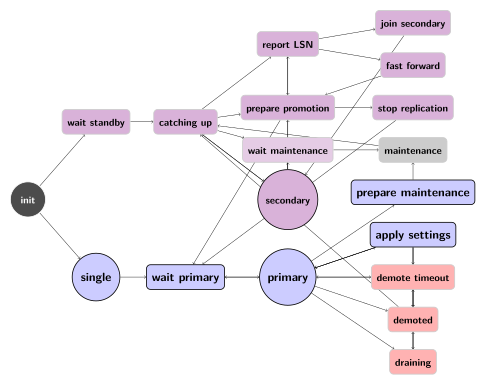

.. _failover_state_machine:

Failover State Machine
======================

Introduction
------------

pg_auto_failover uses a state machine for highly controlled execution. As keepers
inform the monitor about new events (or fail to contact it at all), the
monitor assigns each node both a current state and a goal state. A node's
current state is a strong guarantee of its capabilities. States themselves
do not cause any actions; actions happen during state transitions. The
assigned goal states inform keepers of what transitions to attempt.

Example of state transitions in a new cluster
---------------------------------------------

A good way to get acquainted with the states is by examining the
transitions of a cluster from birth to high availability.

After starting a monitor and running keeper init for the first data node
("node A"), the monitor registers the state of that node as "init" with
a goal state of "single." The init state means the monitor knows nothing
about the node other than its existence because the keeper is not yet
continuously running there to report node health.

Once the keeper runs and reports its health to the monitor, the
monitor assigns it the state "single," meaning it is just an ordinary
Postgres server with no failover. Because there are not yet other nodes
in the cluster, the monitor also assigns node A the goal state of
single -- there's nothing that node A's keeper needs to change.

As soon as a new node ("node B") is initialized, the monitor assigns
node A the goal state of "wait_primary." This means the node still has
no failover, but there's hope for a secondary to synchronize with it
soon. To accomplish the transition from single to wait_primary, node
A's keeper adds node B's hostname to pg_hba.conf to allow a hot standby
replication connection.

At the same time, node B transitions into wait_standby with the goal
initially of staying in wait_standby. It can do nothing but wait
until node A gives it access to connect. Once node A has transitioned
to wait_primary, the monitor assigns B the goal of "catchingup,"
which gives B's keeper the green light to make the transition
from wait_standby to catchingup. This transition involves running
pg_basebackup, editing recovery.conf and restarting PostgreSQL in Hot
Standby node.

Node B reports to the monitor when it's in hot standby mode and able
to connect to node A. The monitor then assigns node B the goal state
of "secondary" and A the goal of "primary." Postgres ships WAL logs
from node A and replays them on B. Finally B is caught up and tells the
monitor (specifically B reports its pg_stat_replication.sync_state and
WAL replay lag). At this glorious moment the monitor assigns A the state
primary (goal: primary) and B secondary (goal: secondary).

State reference
---------------

The following diagram shows the pg_auto_failover State Machine. It's missing
links to the ``single`` state, which can always been reached when removing
all the other nodes.

   pg_auto_failover Finite State Machine diagram

In the previous diagram we can see that we have a list of six states where
the application can connect to a read-write Postgres service: ``single``,
``wait_primary``, ``primary``, ``prepare_maintenance``, and ``apply_settings``.

Init
^^^^

A node is assigned the "init" state when it is first registered with
the monitor. Nothing is known about the node at this point beyond its
existence.  If no other node has been registered with the monitor for
the same formation and group ID then this node is assigned a goal state
of "single." Otherwise the node has the goal state of "wait_standby."

Single
^^^^^^

There is only one node in the group. It behaves as a regular
PostgreSQL instance, with no high availability and no failover. If the
administrator removes a node the other node will revert to the single
state.

.. _wait_primary:

Wait_primary
^^^^^^^^^^^^

Applied to a node intended to be the primary but not yet in that
position.  The primary-to-be at this point knows the secondary's node
name or IP address, and has granted the node hot standby access in the
pg_hba.conf file.

The wait_primary state may be caused either by a new potential secondary
being registered with the monitor (good), or an existing secondary
becoming unhealthy (bad). In the latter case, during the transition from
primary to wait_primary, the primary node's keeper disables synchronous
replication on the node. It also cancels currently blocked queries.

Join_primary
^^^^^^^^^^^^

Applied to a primary node when another standby is joining the group. This
allows the primary node to apply necessary changes to its HBA setup before
allowing the new node joining the system to run the ``pg_basebackup``
command.

.. important::

   This state has been deprecated, and is no longer assigned to nodes. Any
   time we would have used ``join_primary`` before, we now use ``primary``
   instead.

Primary
^^^^^^^

A healthy secondary node exists and has caught up with WAL
replication.  Specifically, the keeper reports the primary state
only when it has verified that the secondary is reported "sync" in
pg_stat_replication.sync_state, and with a WAL lag of 0.

The primary state is a strong assurance. It's the only state where we
know we can fail over when required.

During the transition from wait_primary to primary, the keeper also
enables synchronous replication. This means that after a failover the
secondary will be fully up to date.

Wait_standby
^^^^^^^^^^^^

Monitor decides this node is a standby. Node must wait until the primary
has authorized it to connect and setup hot standby replication.

Catchingup
^^^^^^^^^^

The monitor assigns catchingup to the standby node when the primary
is ready for a replication connection (pg_hba.conf has been properly
edited, connection role added, etc).

The standby node keeper runs pg_basebackup, connecting to the primary's
hostname and port. The keeper then edits recovery.conf and starts
PostgreSQL in hot standby node.

Secondary
^^^^^^^^^

A node with this state is acting as a hot standby for the primary, and
is up to date with the WAL log there. In particular, it is within 16MB
or 1 WAL segment of the primary.

Maintenance
^^^^^^^^^^^

The cluster administrator can manually move a secondary into the
maintenance state to gracefully take it offline. The primary will then
transition from state primary to wait_primary, during which time the
secondary will be online to accept writes. When the old primary reaches
the wait_primary state then the secondary is safe to take offline with
minimal consequences.

Prepare_maintenance
^^^^^^^^^^^^^^^^^^^

The cluster administrator can manually move a primary node into the
maintenance state to gracefully take it offline. The primary then
transitions to the prepare_maintenance state to make sure the secondary is
not missing any writes. In the prepare_maintenance state, the primary shuts
down.

Wait_maintenance
^^^^^^^^^^^^^^^^

The custer administrator can manually move a secondary into the maintenance
state to gracefully take it offline. Before reaching the maintenance state
though, we want to switch the primary node to asynchronous replication, in
order to avoid writes being blocked. In the state wait_maintenance the
standby waits until the primary has reached wait_primary.

Draining
^^^^^^^^

A state between primary and demoted where replication buffers finish
flushing. A draining node will not accept new client writes, but will
continue to send existing data to the secondary.

To implement that with Postgres we actually stop the service. When stopping,
Postgres ensures that the current replication buffers are flushed correctly
to synchronous standbys.

Demoted
^^^^^^^

The primary keeper or its database were unresponsive past a certain
threshold. The monitor assigns demoted state to the primary to avoid
a split-brain scenario where there might be two nodes that don't
communicate with each other and both accept client writes.

In that state the keeper stops PostgreSQL and prevents it from running.

Demote_timeout
^^^^^^^^^^^^^^

If the monitor assigns the primary a demoted goal state but the primary
keeper doesn't acknowledge transitioning to that state within a timeout
window, then the monitor assigns demote_timeout to the primary.

Most commonly may happen when the primary machine goes silent. The
keeper is not reporting to the monitor.

Stop_replication
^^^^^^^^^^^^^^^^

The stop_replication state is meant to ensure that the primary goes
to the demoted state before the standby goes to single and accepts
writes (in case the primary can’t contact the monitor anymore). Before
promoting the secondary node, the keeper stops PostgreSQL on the primary
to avoid split-brain situations.

For safety, when the primary fails to contact the monitor and fails
to see the pg_auto_failover connection in pg_stat_replication, then it goes to
the demoted state of its own accord.

Prepare_promotion
^^^^^^^^^^^^^^^^^

The prepare_promotion state is meant to prepare the standby server to being
promoted. This state allows synchronisation on the monitor, making sure that
the primary has stopped Postgres before promoting the secondary, hence
preventing split brain situations.

Report_LSN
^^^^^^^^^^

The report_lsn state is assigned to standby nodes when a failover is
orchestrated and there are several standby nodes. In order to pick the
furthest standby in the replication, pg_auto_failover first needs a fresh
report of the current LSN position reached on each standby node.

When a node reaches the report_lsn state, the replication stream is stopped, by
restarting Postgres without a ``primary_conninfo``. This allows the primary
node to detect :ref:`network_partitions`, i.e. when the primary can't connect
to the monitor and there's no standby listed in ``pg_stat_replication``.

If one or more quorum standbys (nodes counted by ``number_sync_standbys``)
are unreachable and never report their LSN, the monitor will not advance the
election.  The missing node may have acknowledged the last synchronous commit
before it disappeared, and promoting a lagging candidate would silently discard
those transactions.  This protection is controlled by the
``pgautofailover.guard_data_loss`` GUC (default ``true``).  When the missing
node cannot be recovered and the operator is willing to accept the potential
data loss, the election can be unblocked with
:ref:`pg_autoctl_perform_failover` ``--allow-data-loss``.  See
:ref:`perform_failover_allow_data_loss` for details.

Fast_forward
^^^^^^^^^^^^

The fast_forward state is assigned to the selected promotion candidate
during a failover when it won the election thanks to the candidate priority
settings, but the selected node is not the most advanced standby node as
reported in the report_lsn state.

Missing WAL bytes are fetched from one of the most advanced standby nodes by
using Postgres cascading replication features: it is possible to use any
standby node in the ``primary_conninfo``.

Dropped
^^^^^^^

The dropped state is assigned to a node when the ``pg_autoctl drop node``
command is used. This allows the node to implement specific local actions
before being entirely removed from the monitor database.

When a node reports reaching the dropped state, the monitor removes its
entry. If a node is not reporting anymore, maybe because it's completely
unavailable, then it's possible to run the ``pg_autoctl drop node --force``
command, and then the node entry is removed from the monitor.

pg_auto_failover keeper's State Machine
---------------------------------------

The full keeper FSM is 20 states and 77 transitions -- legible as a reference
table, but too dense to read at a glance as a single diagram. ``pg_autoctl
inspect fsm mermaid`` renders it instead as five smaller diagrams, one per
phase of a node's life, generated directly from ``KeeperFSM[]``
(``src/bin/pg_autoctl/fsm.c``) so they can never drift out of sync with the
actual state machine the way a hand-maintained image can::

  $ pg_autoctl inspect fsm mermaid init
  $ pg_autoctl inspect fsm mermaid steady-state
  $ pg_autoctl inspect fsm mermaid failover
  $ pg_autoctl inspect fsm mermaid maintenance
  $ pg_autoctl inspect fsm mermaid removal

Each command prints a `Mermaid <https://mermaid.js.org/>`_ ``stateDiagram-v2``
program; the five below are that exact output, embedded directly (via
``sphinxcontrib.mermaid``, already a docs dependency) rather than a
checked-in image, so this page renders from source that lives in version
control and rebuilds automatically whenever the FSM changes.

Colours are consistent across all five diagrams and group states by role,
not by phase: **grey** states are administrative/lifecycle (``init``,
``single``, ``dropped``), **blue** states are primary-like (taking writes,
or about to), **green** states are secondary-like (steady replicas),
**red** states are a primary on its way out (draining/demoted), **purple**
states are maintenance, and **amber** states belong to the multi-standby
candidate-election machinery.

Several states legitimately appear in more than one diagram -- that is
expected, not a partition bug, since these are narrative slices of one
underlying graph, not a strict split. Every diagram below annotates each of
its states with a note naming every *other* diagram that state also
appears in, so this is never ambiguous while reading.

Node init / join
^^^^^^^^^^^^^^^^

How a node comes into existence, or rejoins after being dropped or
restarted.

.. mermaid::

   stateDiagram-v2
       init --> single : Start as a single node
       dropped --> single : Start as a single node
       dropped --> report_lsn : This node is being reinitialized after having been dropped
       single --> wait_primary : A new secondary was added
       wait_standby --> catchingup : The primary is now ready to accept a standby
       init --> wait_standby : Start following a primary
       dropped --> wait_standby : Start following a primary
       init --> report_lsn : Creating a new node from a standby node that is not a candidate.

       note right of single : also appears in Node removal / drop
       note right of dropped : also appears in Node removal / drop
       note right of report_lsn : also appears in Failover / promotion, Maintenance, Node removal / drop
       note right of wait_primary : also appears in Steady-state / config changes, Failover / promotion, Node removal / drop
       note right of wait_standby : also appears in Steady-state / config changes
       note right of catchingup : also appears in Steady-state / config changes, Failover / promotion, Maintenance, Node removal / drop

       classDef metaState fill:#e0e0e0,stroke:#888888,color:#333333
       classDef primaryState fill:#cfe2ff,stroke:#3b6fb6,color:#1a1a1a
       classDef secondaryState fill:#d4edda,stroke:#4c9a5b,color:#1a1a1a
       classDef electionState fill:#fff3cd,stroke:#c99a1e,color:#1a1a1a
       class init metaState
       class single metaState
       class dropped metaState
       class report_lsn electionState
       class wait_primary primaryState
       class wait_standby secondaryState
       class catchingup secondaryState

Steady-state / config changes
^^^^^^^^^^^^^^^^^^^^^^^^^^^^^^

Normal operation: no failure, no maintenance -- a secondary joining or
leaving quorum, a settings change, a brief health blip and recovery.

.. mermaid::

   stateDiagram-v2
       primary --> join_primary : A new secondary was added
       primary --> wait_primary : Secondary became unhealthy
       join_primary --> wait_primary : Secondary became unhealthy
       wait_primary --> join_primary : A new secondary was added
       wait_primary --> primary : A healthy secondary appeared
       join_primary --> primary : A healthy secondary appeared
       secondary --> catchingup : Failed to report back to the monitor, not eligible for promotion
       catchingup --> secondary : Convinced the monitor that I'm up and running, and eligible for promotion again
       secondary --> wait_standby : Registering to a new monitor
       primary --> apply_settings : Apply new pg_auto_failover settings (synchronous_standby_names)
       wait_primary --> apply_settings : Apply new pg_auto_failover settings (synchronous_standby_names)
       apply_settings --> primary : Back to primary state after having applied new pg_auto_failover settings
       apply_settings --> wait_primary : Secondary became unhealthy
       apply_settings --> join_primary : A new secondary was added

       note right of primary : also appears in Failover / promotion, Maintenance, Node removal / drop
       note right of join_primary : also appears in Failover / promotion, Node removal / drop
       note right of wait_primary : also appears in Node init / join, Failover / promotion, Node removal / drop
       note right of secondary : also appears in Failover / promotion, Maintenance, Node removal / drop
       note right of catchingup : also appears in Node init / join, Failover / promotion, Maintenance, Node removal / drop
       note right of wait_standby : also appears in Node init / join
       note right of apply_settings : also appears in Failover / promotion, Node removal / drop

       classDef primaryState fill:#cfe2ff,stroke:#3b6fb6,color:#1a1a1a
       classDef secondaryState fill:#d4edda,stroke:#4c9a5b,color:#1a1a1a
       class primary primaryState
       class join_primary primaryState
       class wait_primary primaryState
       class secondary secondaryState
       class catchingup secondaryState
       class wait_standby secondaryState
       class apply_settings primaryState

Failover / promotion
^^^^^^^^^^^^^^^^^^^^^

The primary going away and a candidate taking over, including the
multi-standby candidate-election machinery (``report_lsn``,
``fast_forward``, ``join_secondary``) -- this is the largest of the five,
still less than half the size of the full graph. Citus coordinator/worker
transitions are not shown separately: every Citus-specific transition in
``KeeperFSM[]`` reuses an edge that already exists here, just with a
different underlying implementation, so a separate "Citus diagram" would
be identical in shape to this one.

.. mermaid::

   stateDiagram-v2
       primary --> draining : A failover occurred, stopping writes
       draining --> demoted : Demoted after a failover, no longer primary
       primary --> demoted : A failover occurred, no longer primary
       primary --> demote_timeout : A failover occurred, no longer primary
       join_primary --> draining : A failover occurred, stopping writes
       join_primary --> demoted : A failover occurred, no longer primary
       join_primary --> demote_timeout : A failover occurred, no longer primary
       apply_settings --> draining : A failover occurred, stopping writes
       apply_settings --> demoted : A failover occurred, no longer primary
       apply_settings --> demote_timeout : A failover occurred, no longer primary
       draining --> demote_timeout : Secondary confirms it is receiving no more writes
       demote_timeout --> demoted : Demote timeout expired
       wait_primary --> demoted : A failover occurred, no longer primary
       demote_timeout --> primary : Detected a network partition, but monitor didn't do failover
       demoted --> catchingup : A new primary is available. First, try to rewind. If that fails, do a pg_basebackup.
       secondary --> prepare_promotion : Stop traffic to primary, wait for it to finish draining.
       catchingup --> prepare_promotion : Stop traffic to primary, wait for it to finish draining.
       prepare_promotion --> stop_replication : Prevent against split-brain situations.
       stop_replication --> wait_primary : Confirmed promotion with the monitor
       prepare_promotion --> wait_primary : Promoting a Citus Worker standby after having blocked writes from the coordinator.
       secondary --> report_lsn : Reporting the last write-ahead log location received
       catchingup --> report_lsn : Reporting the last write-ahead log location received
       report_lsn --> prepare_promotion : Stop traffic to primary, wait for it to finish draining.
       report_lsn --> fast_forward : Fetching missing WAL bits from another standby before promotion
       fast_forward --> prepare_promotion : Got the missing WAL bytes, promoted
       report_lsn --> join_secondary : A failover candidate has been selected, stop replication
       report_lsn --> secondary : A failover candidate has been selected, stop replication
       join_secondary --> secondary : Failover is done, we have a new primary to follow
       draining --> report_lsn : Reporting the last write-ahead log location after draining
       demoted --> report_lsn : Reporting the last write-ahead log location after being demoted

       note right of primary : also appears in Steady-state / config changes, Maintenance, Node removal / drop
       note right of draining : also appears in Node removal / drop
       note right of demoted : also appears in Node removal / drop
       note right of demote_timeout : also appears in Node removal / drop
       note right of join_primary : also appears in Steady-state / config changes, Node removal / drop
       note right of apply_settings : also appears in Steady-state / config changes, Node removal / drop
       note right of wait_primary : also appears in Node init / join, Steady-state / config changes, Node removal / drop
       note right of catchingup : also appears in Node init / join, Steady-state / config changes, Maintenance, Node removal / drop
       note right of secondary : also appears in Steady-state / config changes, Maintenance, Node removal / drop
       note right of prepare_promotion : also appears in Node removal / drop
       note right of stop_replication : also appears in Node removal / drop
       note right of report_lsn : also appears in Node init / join, Maintenance, Node removal / drop

       classDef primaryState fill:#cfe2ff,stroke:#3b6fb6,color:#1a1a1a
       classDef secondaryState fill:#d4edda,stroke:#4c9a5b,color:#1a1a1a
       classDef demotingState fill:#f8d7da,stroke:#c0392b,color:#1a1a1a
       classDef electionState fill:#fff3cd,stroke:#c99a1e,color:#1a1a1a
       class primary primaryState
       class draining demotingState
       class demoted demotingState
       class demote_timeout demotingState
       class join_primary primaryState
       class apply_settings primaryState
       class wait_primary primaryState
       class catchingup secondaryState
       class secondary secondaryState
       class prepare_promotion electionState
       class stop_replication electionState
       class report_lsn electionState
       class fast_forward electionState
       class join_secondary electionState

Maintenance
^^^^^^^^^^^

Planned maintenance on either a secondary or the primary.

.. mermaid::

   stateDiagram-v2
       primary --> prepare_maintenance : Promoting the standby to enable maintenance on the primary, stopping Postgres
       prepare_maintenance --> maintenance : Setting up Postgres in standby mode for maintenance operations
       primary --> maintenance : Setting up Postgres in standby mode for maintenance operations
       secondary --> wait_maintenance : Waiting for the primary to disable sync replication before going to maintenance.
       catchingup --> wait_maintenance : Waiting for the primary to disable sync replication before going to maintenance.
       secondary --> maintenance : Suspending standby for manual maintenance.
       catchingup --> maintenance : Suspending standby for manual maintenance.
       wait_maintenance --> maintenance : Suspending standby for manual maintenance.
       maintenance --> catchingup : Restarting standby after manual maintenance is done.
       prepare_maintenance --> catchingup : Restarting standby after manual maintenance is done.
       maintenance --> report_lsn : Reporting the last write-ahead log location received
       prepare_maintenance --> report_lsn : Reporting the last write-ahead log location received

       note right of primary : also appears in Steady-state / config changes, Failover / promotion, Node removal / drop
       note right of secondary : also appears in Steady-state / config changes, Failover / promotion, Node removal / drop
       note right of catchingup : also appears in Node init / join, Steady-state / config changes, Failover / promotion, Node removal / drop
       note right of report_lsn : also appears in Node init / join, Failover / promotion, Node removal / drop

       classDef primaryState fill:#cfe2ff,stroke:#3b6fb6,color:#1a1a1a
       classDef secondaryState fill:#d4edda,stroke:#4c9a5b,color:#1a1a1a
       classDef maintenanceState fill:#e8dff5,stroke:#8e6bb0,color:#1a1a1a
       classDef electionState fill:#fff3cd,stroke:#c99a1e,color:#1a1a1a
       class primary primaryState
       class prepare_maintenance maintenanceState
       class maintenance maintenanceState
       class secondary secondaryState
       class wait_maintenance maintenanceState
       class catchingup secondaryState
       class report_lsn electionState

Node removal / drop
^^^^^^^^^^^^^^^^^^^^

An operator forcibly removing a node (``pg_autoctl drop node``), or a peer
node reacting to the other side of that removal.

.. mermaid::

   stateDiagram-v2
       primary --> single : Other node was forcibly removed, now single
       wait_primary --> single : Other node was forcibly removed, now single
       join_primary --> single : Other node was forcibly removed, now single
       demoted --> single : Was demoted after a failure, but secondary was forcibly removed
       demote_timeout --> single : Was demoted after a failure, but secondary was forcibly removed
       draining --> single : Was demoted after a failure, but secondary was forcibly removed
       secondary --> single : Primary was forcibly removed
       catchingup --> single : Primary was forcibly removed
       prepare_promotion --> single : Primary was forcibly removed
       stop_replication --> single : Went down to force the primary to time out, but then it was removed
       report_lsn --> single : There is no other node anymore, promote this node
       apply_settings --> single : Other node was forcibly removed, now single
       any_state --> dropped : This node is being dropped from the monitor

       note right of primary : also appears in Steady-state / config changes, Failover / promotion, Maintenance
       note right of single : also appears in Node init / join
       note right of wait_primary : also appears in Node init / join, Steady-state / config changes, Failover / promotion
       note right of join_primary : also appears in Steady-state / config changes, Failover / promotion
       note right of demoted : also appears in Failover / promotion
       note right of demote_timeout : also appears in Failover / promotion
       note right of draining : also appears in Failover / promotion
       note right of secondary : also appears in Steady-state / config changes, Failover / promotion, Maintenance
       note right of catchingup : also appears in Node init / join, Steady-state / config changes, Failover / promotion, Maintenance
       note right of prepare_promotion : also appears in Failover / promotion
       note right of stop_replication : also appears in Failover / promotion
       note right of report_lsn : also appears in Node init / join, Failover / promotion, Maintenance
       note right of apply_settings : also appears in Steady-state / config changes, Failover / promotion
       note right of dropped : also appears in Node init / join

       classDef metaState fill:#e0e0e0,stroke:#888888,color:#333333
       classDef primaryState fill:#cfe2ff,stroke:#3b6fb6,color:#1a1a1a
       classDef secondaryState fill:#d4edda,stroke:#4c9a5b,color:#1a1a1a
       classDef demotingState fill:#f8d7da,stroke:#c0392b,color:#1a1a1a
       classDef electionState fill:#fff3cd,stroke:#c99a1e,color:#1a1a1a
       class primary primaryState
       class single metaState
       class wait_primary primaryState
       class join_primary primaryState
       class demoted demotingState
       class demote_timeout demotingState
       class draining demotingState
       class secondary secondaryState
       class catchingup secondaryState
       class prepare_promotion electionState
       class stop_replication electionState
       class report_lsn electionState
       class apply_settings primaryState
       class any_state metaState
       class dropped metaState

.. note::

   This replaces the previous single Graphviz diagram (``pg_autoctl inspect
   fsm gv | dot -Tsvg``, rendered from a checked-in ``fsm.png`` last
   regenerated by hand in 2021). The five diagrams above cover every
   transition the old single diagram did -- 77 edges total, split by
   phase rather than shown at once -- with no loss of coverage, so
   ``fsm.png`` is no longer needed as documentation. The ``pg_autoctl
   inspect fsm gv`` command itself is left in place for anyone who wants
   the full graph as one Graphviz file (e.g. to pipe into their own
   tooling), but it is no longer the documented way to visualize the FSM.
