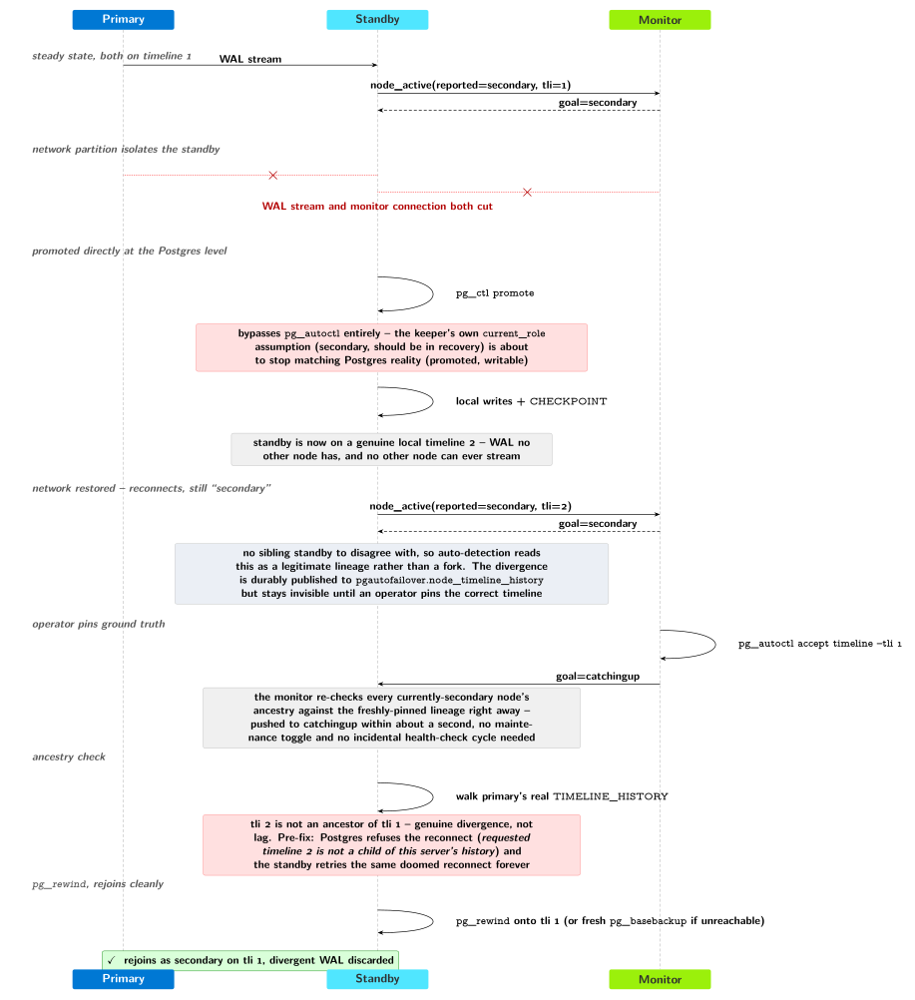
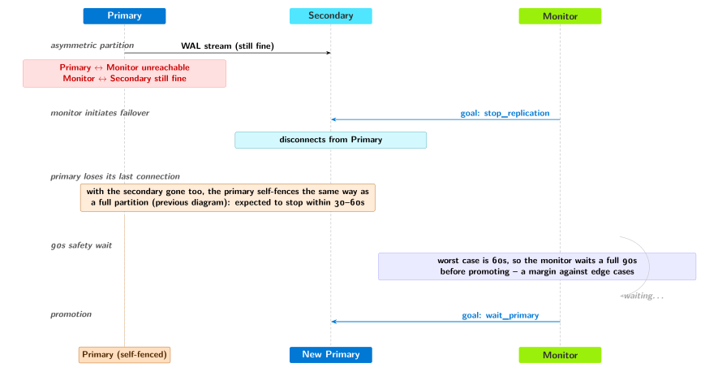

.. _fault_tolerance:

Failover and Fault Tolerance
============================

At the heart of the pg_auto_failover implementation is a State Machine. The
state machine is driven by the monitor, and its transitions are implemented
in the keeper service, which then reports success to the monitor.

The keeper is allowed to retry transitions as many times as needed until
they succeed, and reports also failures to reach the assigned state to the
monitor node. The monitor also implements frequent health-checks targeting
the registered PostgreSQL nodes.

When the monitor detects something is not as expected, it takes action by
assigning a new goal state to the keeper, that is responsible for
implementing the transition to this new state, and then reporting.

Unhealthy Nodes
---------------

The pg_auto_failover monitor is responsible for running regular health-checks with
every PostgreSQL node it manages. A health-check is successful when it is
able to connect to the PostgreSQL node using the PostgreSQL protocol
(libpq), imitating the ``pg_isready`` command.

How frequent those health checks are (5s by default), the PostgreSQL
connection timeout in use (5s by default), and how many times to retry in
case of a failure before marking the node unhealthy (2 by default) are GUC
variables that you can set on the Monitor node itself. Remember, the monitor
is implemented as a PostgreSQL extension, so the setup is a set of
PostgreSQL configuration settings::

   SELECT name, setting
     FROM pg_settings
    WHERE name ~ 'pgautofailover\.health';
                   name                   | setting
 -----------------------------------------+---------
  pgautofailover.health_check_max_retries | 2
  pgautofailover.health_check_period      | 5000
  pgautofailover.health_check_retry_delay | 2000
  pgautofailover.health_check_timeout     | 5000
 (4 rows)

The pg_auto_failover keeper also reports if PostgreSQL is running as expected. This
is useful for situations where the PostgreSQL server / OS is running fine
and the keeper (``pg_autoctl run``) is still active, but PostgreSQL has failed.
Situations might include *File System is Full* on the WAL disk, some file
system level corruption, missing files, etc.

A node is only ever considered unhealthy from the combination of these two
independent signals, not from either alone:

- the monitor's own direct health checks (the periodic libpq connection
  above), and
- what the node's own keeper last reported through the node-active
  protocol -- either that it has stopped reporting at all, or that it is
  still reporting but says its local PostgreSQL is not running.

A node whose keeper is still actively reporting ``pgIsRunning = true`` is
never marked unhealthy on the strength of a failed direct health check
alone -- that combination just means the monitor's own connection is
having trouble, while the node itself is telling a different story, so the
monitor keeps trusting the node's own report. Conversely, a keeper that
reports ``pgIsRunning = false`` marks its node unhealthy immediately,
whether or not the direct health check is currently failing too.

Here's what happens to your PostgreSQL service in case of any single-node
failure is observed:

  - Primary node is monitored unhealthy

    When the primary node is unhealthy, and only when the secondary node is
    itself in good health, then the primary node is asked to transition to
    the DRAINING state, and the attached secondary is asked to transition
    to the state PREPARE_PROMOTION. In this state, the secondary is asked to
    catch-up with the WAL traffic from the primary, and then report
    success.

    The monitor then continues orchestrating the promotion of the standby: it
    stops the primary (implementing STONITH in order to prevent any data
    loss), and promotes the secondary into being a primary now.

    Depending on the exact situation that triggered the primary unhealthy,
    it's possible that the secondary fails to catch-up with WAL from it, in
    that case after the PREPARE\_PROMOTION\_CATCHUP\_TIMEOUT the standby
    reports success anyway, and the failover sequence continues from the
    monitor.

    .. figure:: ./tikz/seq-primary-unhealthy.svg
       :alt: Sequence diagram of the monitor failing over to the secondary after the primary's keeper reports Postgres down, and the resulting draining/catch-up/STONITH/promote sequence

       Unhealthy from the keeper's own report (Postgres down, keeper still
       reporting), then draining, catch-up, STONITH, promote

  - Secondary node is monitored unhealthy

    When the secondary node is unhealthy, the monitor assigns to it the
    state CATCHINGUP, and assigns the state WAIT\_PRIMARY to the primary
    node. When implementing the transition from PRIMARY to WAIT\_PRIMARY,
    the keeper disables synchronous replication.

    When the keeper reports an acceptable WAL difference in the two nodes
    again, then the replication is upgraded back to being synchronous. While
    a secondary node is not in the SECONDARY state, secondary promotion is
    disabled.

  - Monitor node has failed

    Then the primary and secondary node just work as if you didn't have setup
    pg_auto_failover in the first place, as the keeper fails to report local state
    from the nodes. Also, health checks are not performed. It means that no
    automated failover may happen, even if needed.

    pg_auto_failover's design target is to handle any **one** node failure.
    Losing the monitor, by itself, isn't a problem: the primary and
    secondary keep working, unattended, for as long as it takes to bring
    the monitor back. But that node is now down, and while it's down the
    formation has no automated protection left. If a second node then also
    fails before the monitor is restored — the primary, say, while the
    monitor is still out — that's two node failures out of three at the
    same time, and pg_auto_failover has no automated repair for that: there
    is no third, healthy node left for the monitor to orchestrate a
    failover to even once it does come back. Restoring the monitor quickly
    is what keeps a single further failure from turning into exactly that
    situation.

    .. figure:: ./tikz/seq-monitor-failed.svg
       :alt: Sequence diagram showing that primary/secondary roles and application read-write access are unaffected while the monitor is down, only automated failover is unavailable

       No monitor, no automated failover -- but roles and application
       traffic are entirely unaffected

.. _network_partitions:

Network Partitions
------------------

Adding to those simple situations, pg_auto_failover is also resilient to Network
Partitions. Here's the list of situation that have an impact to pg_auto_failover
behavior, and the actions taken to ensure High Availability of your
PostgreSQL service:

  - Primary can't connect to Monitor

    Then it could be that either the primary is alone on its side of a
    network split, or that the monitor has failed. The keeper decides
    depending on whether the secondary node is still connected to the
    replication slot, and if we have a secondary, continues to serve
    PostgreSQL queries.

    Otherwise, when the secondary isn't connected, and after the
    NETWORK\_PARTITION\_TIMEOUT has elapsed, the primary considers it might
    be alone in a network partition: that's a potential split brain situation
    and with only one way to prevent it. The primary stops, and reports a new
    state of DEMOTE\_TIMEOUT.

    The network\_partition\_timeout can be setup in the keeper's
    configuration and defaults to 20s.

    .. figure:: ./tikz/seq-primary-self-fence.svg
       :alt: Sequence diagram of a primary self-fencing to demote_timeout after losing contact with both the monitor and the secondary

       The primary self-fences rather than risk a split brain

  - Monitor can't connect to Primary

    Once all the retries have been done and the timeouts are elapsed, then
    the primary node is considered unhealthy, and the monitor begins the
    failover routine. This routine has several steps, each of them allows to
    control our expectations and step back if needed.

    For the failover to happen, the secondary node needs to be healthy and
    caught-up with the primary. Only if we timeout while waiting for the WAL
    delta to resorb (30s by default) then the secondary can be promoted with
    uncertainty about the data durability in the group.

    .. figure:: ./tikz/seq-monitor-cant-reach-primary.svg
       :alt: Sequence diagram of the monitor failing over to the secondary after losing contact with the primary

       The monitor promotes the secondary and fences the old primary

  - Monitor can't connect to Secondary

    As soon as the secondary is considered unhealthy then the monitor
    changes the replication setting to asynchronous on the primary, by
    assigning it the WAIT\_PRIMARY state. Also the secondary is assigned the
    state CATCHINGUP, which means it can't be promoted in case of primary
    failure.

    As the monitor tracks the WAL delta between the two servers, and they
    both report it independently, the standby is eligible to promotion again
    as soon as it's caught-up with the primary again, and at this time it is
    assigned the SECONDARY state, and the replication will be switched back to
    synchronous.

    .. figure:: ./tikz/seq-secondary-unhealthy.svg
       :alt: Sequence diagram of the fallback to asynchronous replication and back

       Falling back to asynchronous replication and resynchronizing

.. _timeline_forks:

Timeline Forks
--------------

A different kind of failure doesn't come from a node being unreachable, but
from a node whose local WAL has genuinely diverged from the rest of the
group. This happens when a standby is written to, or promoted, outside of
``pg_autoctl``'s control — a manual intervention during an incident, a
monitoring bug elsewhere, a previous split-brain — and generates local WAL
that no other node in the group has, on a branch of history the primary
never took.

Ordinary streaming replication can never resolve this: it's not lag, it's
divergence. Postgres itself refuses the reconnect (``requested timeline N
is not a child of this server's history``).

pg_auto_failover detects and resolves this automatically in the common
case: before trusting a bare timeline-number comparison, a standby
reconnecting to a (possibly new) primary walks the primary's real
timeline history to tell "still catching up" apart from "diverged onto a
dead branch," and runs ``pg_rewind`` in either direction as needed (falling
back to a fresh ``pg_basebackup`` if ``pg_rewind`` itself can't connect).
See the ``Catchingup`` section of :ref:`failover_state_machine` for where
this check runs.

The monitor doesn't wait for that reconnect to notice, either. It applies
the same ancestry check to every node currently reported as a healthy
secondary, and as soon as one is found not to be an ancestor of the group's
reference lineage, it is pushed to ``catchingup`` right away — typically
within about a second, on that node's very next report — rather than
waiting for an incidental health-check cycle or an operator-forced resync
to reveal the problem (see the ``Report_LSN`` section of
:ref:`failover_state_machine` for where the election applies this same
ancestry filter, and this section's own diagram below for the monitor-side
push).

The reference lineage itself is either pinned explicitly, or auto-detected
as the branch containing the highest reported timeline. Auto-detection only
excludes a candidate when a genuinely *competing* branch is reported by
someone else — two nodes each diverging from the same point onto two
different timelines — in which case the loser is caught and rewound with no
operator action at all. It doesn't help when there's no sibling to disagree
with the diverged node: in a two-node formation, or whenever every
surviving node happens to already be on the same diverged branch, the fork
reads as clean and an operator decision is needed. Use
:ref:`pg_autoctl_show_timeline` to see the group's known timeline history
and each node's status against it, and :ref:`pg_autoctl_accept_timeline` to
pin the correct lineage explicitly — once pinned, the same immediate,
automatic push applies. See :ref:`resolving_timeline_fork` for the full
walkthrough.

   A standby forks out-of-band; once the mismatch is visible to the
   monitor, it is pushed to catchingup and rewound within about a second

.. _archiving_fault_tolerance:

Archiving Nodes and Disaster Recovery
--------------------------------------

On-top of the Service Availability a database system needs Data
Availability, and it is expected to survive some data loss scenarios that
are not covered with the previous sections about fault tolerance.

Typically, an erroneous ``DELETE`` without a ``WHERE`` clause, or a ``DROP
TABLE`` that happened on the wrong server, by mistake or because of a
security exploit of some sorts.

.. note::

   Always make sure to have a separate role for the normal application
   activities that is separate from the database owner, and use yet another
   specific role for database schema upgrade, or migrations.

   This alone avoids most of the security risk surface.

While the previous sections concerns keeping the PostgreSQL *service*
available thanks to being able to failover from a primary node to its
secondary within seconds of a failure, an **archiver** addresses a different
failure mode entirely: either the loss of multiple (all) nodes at the same
time, or a data loss that happens while the service is running fine.

See also :ref:`archiving_architecture` for more details about the archiving
support in pg_auto_failover.

When an archiver is enabled on a pg_auto_failover architecture in
production, the following operations are covered:

  - Point in Time Recovery can be driven on transient nodes created from the
    archives.

  - Disaster Recovery can be implemented by copying the data recovered in a
    transient PITR node up to the current primary, a manual operation, or by
    reifying the transient PITR node into its own new group in the
    formation, allowing to redeploy a new cluster from a selected position
    in the WAL history.

  - Archiving nodes may paritipate in the replication quorum, and as they
    only implement ``pg_receivewal`` without maintaining a full PGDATA
    directory, there is no crash recovery happening on the WAL stream -- it
    is often the case that an archiving node would be the first to report
    LSN progress.

  - Taking base backup happens on the primary node by default (a live source
    setting) and can also be setup as a replay source, meaning that a new
    node is created from the latest base backup and instructed to replay all
    the WAL that have been archived since this base backup, up to the
    current moment in time. The replay source can in turn be setup as a
    volatile or a persistent node.

  - It is possible to maintain standby servers that only connect to the
    archive, because we have added a way to serve the archives using the
    Postgres protocol replication. Such a standby would be named a WARM
    standby, even though it can be using WAL streaming, with a cascading hop
    in the archives.

How archiving nodes participate in failover
^^^^^^^^^^^^^^^^^^^^^^^^^^^^^^^^^^^^^^^^^^^^

Archiving nodes are health-checked and report state through the node-active
protocol exactly like a primary or secondary, and the monitor tracks their
``archiving`` state the same way it tracks ``primary``/``secondary`` --
but they are never assigned a ``candidate-priority``-driven role and never
considered for promotion, since there is no data directory to promote.
When the group's primary changes -- whether through an ordinary failover or
an operator-driven switchover -- an archiver notices its `pg_receivewal`
connection has gone stale, stops it, and re-points at the new primary
automatically; see the ``Archiving`` state's transitions in
:ref:`failover_state_machine` for the exact FSM edges involved. From the
perspective of the rest of this page's failover sequences, an archiver is
simply along for the ride: it never blocks a promotion, and it never needs
one of its own.

Failure handling and network partition detection
------------------------------------------------

If a node cannot communicate to the monitor, either because the monitor is
down or because there is a problem with the network, it will simply remain
in the same state until the monitor comes back.

If there is a network partition, it might be that the monitor and secondary
can still communicate and the monitor decides to promote the secondary since
the primary is no longer responsive. Meanwhile, the primary is still
up-and-running on the other side of the network partition. If a primary
cannot communicate to the monitor it starts checking whether the secondary
is still connected. In PostgreSQL, the secondary connection automatically
times out after 30 seconds. If last contact with the monitor and the last
time a connection from the secondary was observed are both more than 30
seconds in the past, the primary concludes it is on the losing side of a
network partition and shuts itself down. It may be that the secondary and
the monitor were actually down and the primary was the only node that was
alive, but we currently do not have a way to distinguish such a situation.
As with consensus algorithms, availability can only be correctly preserved
if at least 2 out of 3 nodes are up.

In asymmetric network partitions, the primary might still be able to talk to
the secondary, while unable to talk to the monitor. During failover, the
monitor therefore assigns the secondary the `stop_replication` state, which
will cause it to disconnect from the primary. After that, the primary is
expected to shut down after at least 30 and at most 60 seconds. To factor in
worst-case scenarios, the monitor waits for 90 seconds before promoting the
secondary to become the new primary.

   Asymmetric partition: the monitor's 90s safety wait before promoting

See also
--------

- :ref:`testing_pgaftest` — explore these scenarios interactively with
  ``pgaftest tmux``
- :ref:`reporting_bugs`
