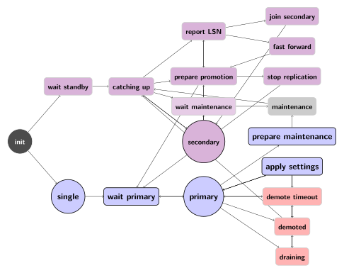

pg_auto_failover State Machine
==============================

The following diagram shows the pg_auto_failover State Machine. It's missing
links to the ``single`` state, which can always been reached when removing
all the other nodes.

   pg_auto_failover Finite State Machine diagram

Failover logic
--------------

This section needs to be expanded further, but below is the failover state
machine for each node that is implemented by the monitor:

.. figure:: ./fsm/node-state-machine.png
   :scale: 30%
   :alt: Node state machine

   Node state machine

Since the state machines of the data nodes always move in tandem, a pair
(group) of data nodes also implicitly has the following state machine:

.. figure:: ./fsm/group-state-machine.png
   :scale: 40%
   :alt: Group state machine

   Group state machine

.. raw:: latex

    \newpage

.. _state_machine_diagram:

pg_auto_failover keeper's State Machine
---------------------------------------

When built in TEST mode, it is then possible to use the following command to
get a visual representation of the Keeper's Finite State Machine::

  $ PG_AUTOCTL_DEBUG=1 pg_autoctl do fsm gv | dot -Tsvg > fsm.svg

The `dot` program is part of the Graphviz suite and produces the following
output:

.. figure:: ./fsm.png
   :scale: 35%
   :alt: Keeper state machine

   Keeper State Machine
