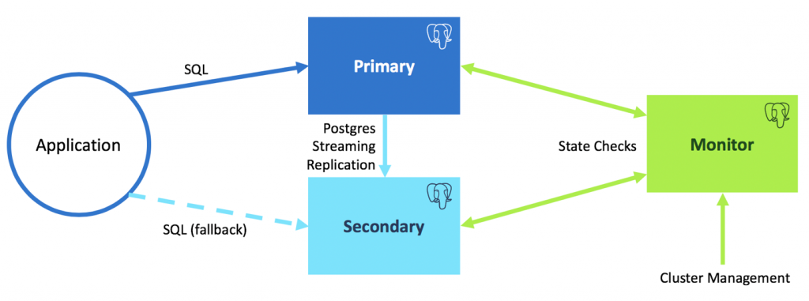

Introduction to pg_auto_failover
================================

pg_auto_failover is an extension for PostgreSQL that monitors and manages failover
for a postgres clusters. It is optimised for simplicity and correctness.

   pg_auto_failover Architecture for a standalone PostgreSQL service

pg_auto_failover implements Business Continuity for your PostgreSQL
services. pg_auto_failover implements a single PostgreSQL service using multiple
nodes with automated failover, and automates PostgreSQL maintenance
operations in a way that guarantees availability of the service to its users
and applications.

To that end, pg_auto_failover uses three nodes (machines, servers) per PostgreSQL
service:

  - a PostgreSQL primary node,
  - a PostgreSQL secondary node, using Synchronous Hot Standby,
  - a pg_auto_failover Monitor node that acts both as a witness and an orchestrator.

The pg_auto_failover Monitor implements a state machine and relies on in-core
PostgreSQL facilities to deliver HA. For example. when the *secondary* node
is detected to be unavailable, or when its lag is reported above a defined
threshold (the default is 1 WAL files, or 16MB, see the
`pgautofailover.promote_wal_log_threshold` GUC on the pg_auto_failover monitor), then the
Monitor removes it from the `synchronous_standby_names` setting on the
*primary* node. Until the *secondary* is back to being monitored healthy,
failover and switchover operations are not allowed, preventing data loss.
