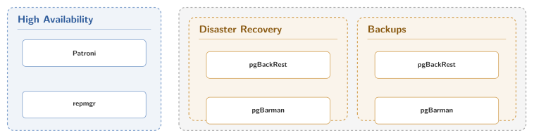
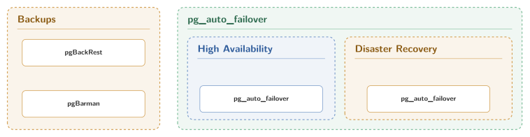
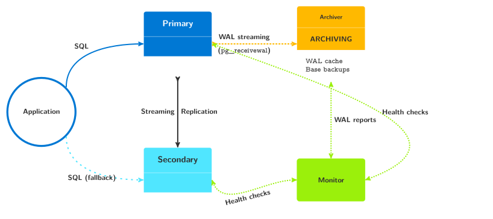
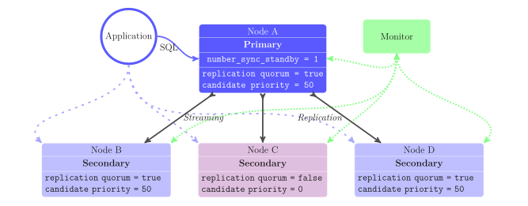
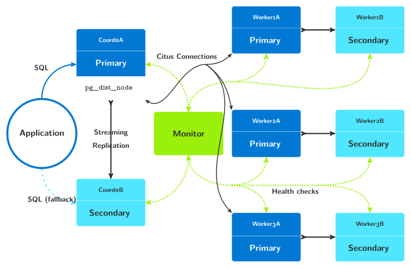

Introduction to pg_auto_failover
================================

pg_auto_failover is a complete system for operating PostgreSQL in
production, not just an extension. Its ``pg_autoctl`` process runs as its
own pid 1, supervising the Postgres ``postmaster`` underneath it the way
an init system supervises everything else running on a machine; a
dedicated monitor node coordinates state across every node in the
cluster. Together they provide full cluster management with a dynamic
topology: nodes can be added, removed, and reconfigured while the cluster
keeps serving production traffic, whether driven by an operator's own
commands or automatically by the monitor's own health checks. Automated
failover and full high availability are one deliberate configuration
choice this system supports, not the only thing it does. Two modes of
operation are available side by side: the traditional command-driven CLI
(``pg_autoctl create ...``, ``pg_autoctl set ...``), and a specification-
file-driven mode, where a single ``node.ini`` file describes a node's own
desired configuration and ``pg_autoctl node run`` continuously reconciles
reality to match it.

.. _ha_dr_backups:

High Availability and Disaster Recovery: One System
------------------------------------------------------

   A typical setup reaches for a product per box: Patroni or repmgr for
   High Availability, pgBackRest or pgBarman for Disaster Recovery and
   Backups

   With pg_auto_failover, High Availability and Disaster Recovery collapse
   into one system; Backups remains its own concern

Most PostgreSQL setups treat these as two separate problems, solved by two
separate products: an *HA tool* — Patroni, repmgr — watches the live
cluster and promotes a standby when the primary goes away, and a *backup
tool* — pgBackRest, pgBarman — usually entirely disconnected from the
first, periodically archives WAL and base backups somewhere safe, reached
for only once disaster strikes and someone needs to restore to a point in
time. Running both means learning two tools, trusting two different
failure domains, and, very often, discovering only during a real incident
that they were never actually exercised together.

pg_auto_failover starts from a different question. The goal was never
"have an HA tool" — it was always "don't lose the business's data, and
keep serving it," and high availability and disaster recovery are two
sides of that same problem, best solved by one system designed around it
rather than by gluing together two tools each designed in isolation. The
same monitor that orchestrates failover also tracks every archiver's
captured WAL and base backups; the same WAL stream and base backups a
failover election already depends on to guarantee no data loss are what
disaster recovery, including point-in-time recovery, is built on. High
Availability and Disaster Recovery come from a single package, with a
single control plane, rather than from two independently-operated systems
an incident is the first time anyone actually tested together. Backups —
in the narrower sense of long-term retention, cataloguing, and cloud
storage tiers — remain their own concern, typically still handled by a
dedicated tool like pgBackRest or pgBarman.

Single Standby Architecture
---------------------------

.. figure:: ./tikz/arch-single-standby.svg
   :alt: pg_auto_failover Architecture with a primary and a standby node

   pg_auto_failover architecture with a primary and a standby node

pg_auto_failover implements Business Continuity for your PostgreSQL
services. pg_auto_failover implements a single PostgreSQL service using
multiple nodes with automated failover, and automates PostgreSQL maintenance
operations in a way that guarantees availability of the service to its users
and applications.

To that end, pg_auto_failover uses three nodes (machines, servers) per PostgreSQL
service:

  - a PostgreSQL primary node,
  - a PostgreSQL secondary node, using Synchronous Hot Standby,
  - a pg_auto_failover Monitor node that acts both as a witness and an orchestrator.

The pg_auto_failover Monitor implements a state machine and relies on
in-core PostgreSQL facilities to deliver HA. For example. when the
*secondary* node is detected to be unavailable, or when its lag is reported
above a defined threshold (the default is 1 WAL files, or 16MB, see the
`pgautofailover.promote_wal_log_threshold` GUC on the pg_auto_failover
monitor), then the Monitor removes it from the `synchronous_standby_names`
setting on the *primary* node. Until the *secondary* is back to being
monitored healthy, failover and switchover operations are not allowed,
preventing data loss.

.. _archiving_architecture:

Archiving & Disaster Recovery Architecture
-------------------------------------------

   pg_auto_failover architecture with a primary, a standby, and an archiver

An **archiver** is a separate physical entity, added on top of any of the
architectures on this page — it applies just as well to the single-standby
setup above as it does to a multi-standby fleet, since it addresses a
different concern: disaster recovery, independent of how many nodes
currently participate in the failover quorum.

Unlike a standby, an archiver holds no copy of the primary's data directory
and never takes writes or reads for the application. It runs its own
`pg_receivewal`__ continuously against the group's current primary,
capturing every WAL segment into a local cache the moment it's generated,
and periodically produces full base backups from that cache. Both are
reported back to the pg_auto_failover Monitor, the same way a standby
reports its own replication state — so the Monitor can tell an operator,
or a client library, when a given segment has landed durably on enough
archivers to be considered safe (``archiver_quorum``), and where the most
recent base backup lives.

__ https://www.postgresql.org/docs/current/app-pgreceivewal.html

The pg_auto_failover Monitor tracks an archiver's participation in a group
as its own node, in the ``archiving`` **archiving node** state — reported
and monitored the same way ``primary``/``secondary`` are, but never a
candidate for promotion or failover: an archiving node holds no
`PGDATA`__ of its own, so there is nothing to promote it *to*.

__ https://www.postgresql.org/docs/current/app-initdb.html

Because the archiver keeps a complete, continuously updated copy of the
group's WAL stream and periodic base backups independent of any single
standby, it serves two purposes beyond ordinary high availability: a new
node can be provisioned straight from an archiver's cache instead of
placing extra load on a live primary or secondary, and a group that has
lost every other node still has everything needed to rebuild from scratch,
as long as the archiver itself survived.

Multiple Standby Architecture
-----------------------------

.. figure:: ./tikz/arch-multi-standby.svg
   :alt: pg_auto_failover Architecture for a standalone PostgreSQL service

   pg_auto_failover architecture with a primary and two standby nodes

In the pictured architecture, pg_auto_failover implements Business Continuity
and data availability by implementing a single PostgreSQL service using
multiple with automated failover and data redundancy. Even after losing any
Postgres node in a production system, this architecture maintains two copies of
the data on two different nodes.

When using more than one standby, different architectures can be achieved
with pg_auto_failover, depending on the objectives and trade-offs needed for
your production setup.

Multiple Standbys Architecture with 3 standby nodes, one async
--------------------------------------------------------------

   pg_auto_failover architecture with a primary and three standby nodes

When setting the three parameters above, it's possible to design very
different Postgres architectures for your production needs.

In this case, the system is setup with two standby nodes participating in
the replication quorum, allowing for ``number_sync_standbys = 1``. The
system always maintains a minimum of two copies of the data set: one on the
primary, another one on either node B or node C. Whenever we lose one
of those nodes, we can hold to this guarantee of two copies of the data set.

Adding to that, we have the standby server D which has been set up to not
participate in the replication quorum. Node D will not be found in the
``synchronous_standby_names`` list of nodes. Also, node D is set up in a way to
never be a candidate for failover, with ``candidate-priority = 0``.

This architecture would fit a situation where nodes A, B, and C are deployed
in the same data center or availability zone, and node D in another. Those
three nodes are set up to support the main production traffic and implement
high availability of both the Postgres service and the data set.

Node D might be set up for Business Continuity in case the first data center
is lost, or maybe for reporting the need for deployment on another
application domain.

Citus Architecture
------------------

   pg_auto_failover architecture with a Citus formation

pg_auto_failover implements Business Continuity for your Citus services.
pg_auto_failover implements a single Citus formation service using multiple
Citus nodes with automated failover, and automates PostgreSQL maintenance
operations in a way that guarantees availability of the service to its users
and applications.

In that case, pg_auto_failover knows how to orchestrate a Citus coordinator
failover and a Citus worker failover. A Citus worker failover can be
achieved with a very minimal downtime to the application, where during a
short time window SQL writes may error out.

In this figure we see a single standby node for each Citus node, coordinator
and workers. It is possible to implement more standby nodes, and even
read-only nodes for load balancing, see :ref:`citus_secondaries`.
