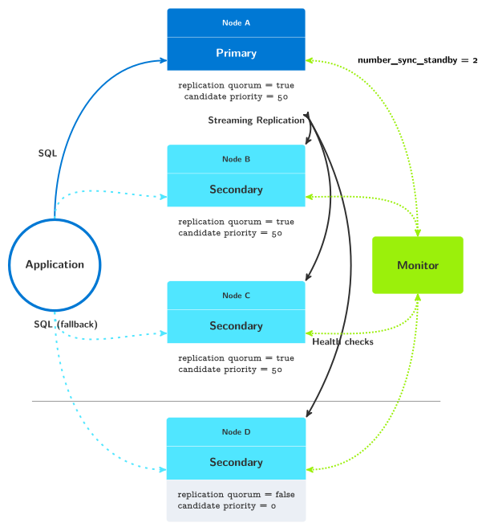

Introduction to pg_auto_failover
================================

pg_auto_failover is an extension for PostgreSQL that monitors and manages failover
for a postgres clusters. It is optimised for simplicity and correctness.

Single Standby Architecture
---------------------------

.. figure:: ./tikz/arch-single-standby.svg
   :alt: pg_auto_failover Architecture with a primary and a standby node

   pg_auto_failover architecture with a primary and a standby node

pg_auto_failover implements Business Continuity for your PostgreSQL
services. pg_auto_failover implements a single PostgreSQL service using multiple
nodes with automated failover, and automates PostgreSQL maintenance
operations in a way that guarantees availability of the service to its users
and applications.

To that end, pg_auto_failover uses three nodes (machines, servers) per PostgreSQL
service:

  - a PostgreSQL primary node,
  - a PostgreSQL secondary node, using Synchronous Hot Standby,
  - a pg_auto_failover Monitor node that acts both as a witness and an orchestrator.

The pg_auto_failover Monitor implements a state machine and relies on in-core
PostgreSQL facilities to deliver HA. For example. when the *secondary* node
is detected to be unavailable, or when its lag is reported above a defined
threshold (the default is 1 WAL files, or 16MB, see the
`pgautofailover.promote_wal_log_threshold` GUC on the pg_auto_failover monitor), then the
Monitor removes it from the `synchronous_standby_names` setting on the
*primary* node. Until the *secondary* is back to being monitored healthy,
failover and switchover operations are not allowed, preventing data loss.

Multiple Standbys Architecture
------------------------------

.. figure:: ./tikz/arch-multi-standby.svg
   :alt: pg_auto_failover Architecture for a standalone PostgreSQL service

   pg_auto_failover architecture with a primary and two standby nodes

In that architecture pg_auto_failover implements Business Continuity and
data availability at the same time, by implementing a single PostgreSQL
service using multiple with automated failover and data redundancy. Even
after losing any Postgres node in your production system, this architecture
maintains two copies of the data on two different nodes.

When using more than one standby, different architectures can be achieved
with pg_auto_failover, depending on the objectives and trade-offs needed for
your production setup.

Postgres Architecture Set-Up
----------------------------

The entire flexibility of pg_auto_failover can be leverage with the
following three replication parameters.

number_sync_standbys
^^^^^^^^^^^^^^^^^^^^

This parameter is used by Postgres in the `synchronous_standby_names`__
parameter: ``number_sync_standby`` is the number of synchronous standbys
that transactions need to wait for replies from.

__ https://www.postgresql.org/docs/current/runtime-config-replication.html#GUC-SYNCHRONOUS-STANDBY-NAMES

This parameter can be set at the *formation* level in pg_auto_failover,
meaning that it applies to the current primary and follow a failover to
apply to any new primary that might replace the current one.

The default value in pg_auto_failover is zero. When set to zero, the
Postgres parameter ``synchronous_standby_names`` can be set to either
``'*'`` or to ``''``:

  - ``synchronous_standby_names = '*'`` means that any standby may
    participate in the replication quorum for transactions with
    ``synchronous_commit`` set to ``on`` or higher values.

    pg_autofailover uses ``synchronous_standby_names = '*'`` when there's at
	least one standby that is known to be healthy.

  - ``synchronous_standby_names = ''`` (empty string) disables synchrous
    commit and makes all your commits asynchronous, meaning that transaction
    commits will not wait for replication. In other words, a single copy of
    your production data is maintained when ``synchronous_standby_names`` is
    set that way.

    pg_autofailover uses ``synchronous_standby_names = ''`` only when the
	``number_sync_standbys`` is set to zero and there's no standby node
	known healthy by the monitor.

In order to set ``number_sync_standbys`` to a non-zero value,
pg_auto_failover requires that at least ``number_sync_standbys + 1`` standby
nodes be registered in the system.

When the first standby node is added to the pg_auto_failover monitor, the
only acceptable value for ``number_sync_standbys`` is zero. When a second
standby is added that participates in the replication quorum, then
``number_sync_standbys`` is automatically set to one.

The command ``pg_autoctl set formation number-sync-standbys`` can be used to
change the value of this parameter in a formation, even when all the nodes
are already running in production. The pg_auto_failover monitor then sets a
transition for the primary to update its local value of
``synchronous_standby_names``.

replication-quorum
^^^^^^^^^^^^^^^^^^

blah blah blah

candidate-priority
^^^^^^^^^^^^^^^^^^

such wow

Multiple Standbys Architecture with 3 standby nodes, one async
--------------------------------------------------------------

   pg_auto_failover architecture with a primary and three standby nodes

When setting the three parameters above, it's possible to design very
different Postgres architectures for your production needs.

In this case, the system is setup with two standby nodes participating in
the replication quorum, allowing for ``number_sync_standbys = 1``. The
system always maintain a minimum of two copies of the data set, one on the
primary, another one on one on either node B or node D. Whenever we lose one
of those nodes, we can hold to this guarantee of two copies of the data set.

Adding to that, we have the standby server C which has been setup to not
participate in the replication quorum. Node C will not be found in the
``synchronous_standby_names`` list of nodes. Also, node C is setup in a way
to never be a candidate for failover, with ``candidate-priority = 0``.

This architecture would fit a situation with nodes A, B, and D are deployed
in the same data center or availability zone and node C in another one.
Those three nodes are setup to support the main production traffic and
implement high availability of both the Postgres service and the data set.

Node C might be setup for Business Continuity in case the first data center
is lost, or maybe for reporting needs deployed on another application
domain.
