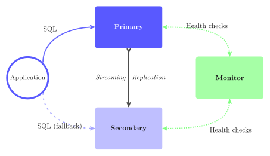
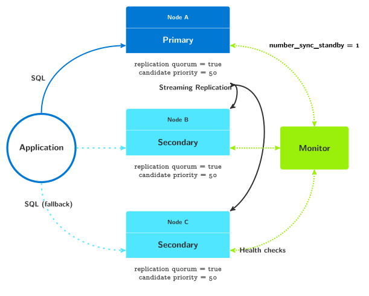

.. _tutorial:

Tutorial
========

In this guide we’ll create a Postgres setup with two nodes, a primary and a
standby. Then we'll add a second standby node. We’ll simulate failure in the
Postgres nodes and see how the system continues to function.

This tutorial uses `docker compose`__ in order to separate the architecture
design from some of the implementation details. This allows reasoning at
the architecture level within this tutorial, and better see which software
component needs to be deployed and run on which node.

__ https://docs.docker.com/compose/

The setup provided in this tutorial is good for replaying at home in the
lab. It is not intended to be production ready though. In particular, no
attention have been spent on volume management. After all, this is a
tutorial: the goal is to walk through the first steps of using
pg_auto_failover to implement Postgres automated failover.

Pre-requisites
--------------

When using `docker compose` we describe a list of services, each service may
run on one or more nodes, and each service just runs a single isolated
process in a container.

Within the context of a tutorial, or even a development environment, this
matches very well to provisioning separate physical machines on-prem, or
Virtual Machines either on-prem on in a Cloud service.

The docker image used in this tutorial is named `pg_auto_failover:tutorial`.
It can be built locally when using the attached :download:`Dockerfile
<tutorial/Dockerfile>` found within the GitHub repository for
pg_auto_failover.

To build the image, either use the provided Makefile and run ``make build``,
or run the docker build command directly:

::

   $ git clone https://github.com/citusdata/pg_auto_failover
   $ cd pg_auto_failover/docs/tutorial
   $ docker compose build

Postgres failover with two nodes
--------------------------------

Using docker compose makes it easy enough to create an architecture that
looks like the following diagram:

   pg_auto_failover architecture with a primary and a standby node

Such an architecture provides failover capabilities, though it does not
provide with High Availability of both the Postgres service and the data.
See the :ref:`multi_node_architecture` chapter of our docs to understand
more about this.

To create a cluster we use the following docker compose definition:

.. literalinclude:: tutorial/docker-compose.yml
   :language: yaml
   :linenos:

To run the full Citus cluster with HA from this definition, we can use the
following command:

::

   $ docker compose up app monitor node1 node2

The command above starts the services up. The first service is the monitor
and is created with the command ``pg_autoctl create monitor``. The options
for this command are exposed in the environment, and could have been
specified on the command line too:

::

   $ pg_autoctl create postgres --ssl-self-signed --auth trust --pg-hba-lan --run

While the Postgres nodes are being provisionned by docker compose, you can
run the following command and have a dynamic dashboard to follow what's
happening. The following command is like ``top`` for pg_auto_failover::

  $ docker compose exec monitor pg_autoctl watch

After a little while, you can run the :ref:`pg_autoctl_show_state` command
and see a stable result:

.. code-block:: bash

   $ docker compose exec monitor pg_autoctl show state

    Name |  Node |  Host:Port |       TLI: LSN |   Connection |      Reported State |      Assigned State
   ------+-------+------------+----------------+--------------+---------------------+--------------------
   node2 |     1 | node2:5432 |   1: 0/3000148 |   read-write |             primary |             primary
   node1 |     2 | node1:5432 |   1: 0/3000148 |    read-only |           secondary |           secondary

We can review the available Postgres URIs with the
:ref:`pg_autoctl_show_uri` command::

  $ docker compose exec monitor pg_autoctl show uri
           Type |    Name | Connection String
   -------------+---------+-------------------------------
        monitor | monitor | postgres://autoctl_node@58053a02af03:5432/pg_auto_failover?sslmode=require
      formation | default | postgres://node2:5432,node1:5432/tutorial?target_session_attrs=read-write&sslmode=require

Add application data
--------------------

Let's create a database schema with a single table, and some data in there.

::

   $ docker compose exec app psql

.. code-block:: sql

  -- in psql

  CREATE TABLE companies
  (
    id         bigserial PRIMARY KEY,
    name       text NOT NULL,
    image_url  text,
    created_at timestamp without time zone NOT NULL,
    updated_at timestamp without time zone NOT NULL
  );

Next download and ingest some sample data, still from within our psql
session:

::

   \copy companies from program 'curl -o- https://examples.citusdata.com/mt_ref_arch/companies.csv' with csv
   ( COPY 75 )

Our first failover
------------------

When using pg_auto_failover, it is possible (and easy) to trigger a failover
without having to orchestrate an incident, or power down the current
primary.

::

   $ docker compose exec monitor pg_autoctl perform switchover
   14:57:16 992 INFO  Waiting 60 secs for a notification with state "primary" in formation "default" and group 0
   14:57:16 992 INFO  Listening monitor notifications about state changes in formation "default" and group 0
   14:57:16 992 INFO  Following table displays times when notifications are received
       Time |  Name |  Node |  Host:Port |       Current State |      Assigned State
   ---------+-------+-------+------------+---------------------+--------------------
   14:57:16 | node2 |     1 | node2:5432 |             primary |            draining
   14:57:16 | node1 |     2 | node1:5432 |           secondary |   prepare_promotion
   14:57:16 | node1 |     2 | node1:5432 |   prepare_promotion |   prepare_promotion
   14:57:16 | node1 |     2 | node1:5432 |   prepare_promotion |    stop_replication
   14:57:16 | node2 |     1 | node2:5432 |             primary |      demote_timeout
   14:57:17 | node2 |     1 | node2:5432 |            draining |      demote_timeout
   14:57:17 | node2 |     1 | node2:5432 |      demote_timeout |      demote_timeout
   14:57:19 | node1 |     2 | node1:5432 |    stop_replication |    stop_replication
   14:57:19 | node1 |     2 | node1:5432 |    stop_replication |        wait_primary
   14:57:19 | node2 |     1 | node2:5432 |      demote_timeout |             demoted
   14:57:19 | node2 |     1 | node2:5432 |             demoted |             demoted
   14:57:19 | node1 |     2 | node1:5432 |        wait_primary |        wait_primary
   14:57:19 | node2 |     1 | node2:5432 |             demoted |          catchingup
   14:57:26 | node2 |     1 | node2:5432 |             demoted |          catchingup
   14:57:38 | node2 |     1 | node2:5432 |             demoted |          catchingup
   14:57:39 | node2 |     1 | node2:5432 |          catchingup |          catchingup
   14:57:39 | node2 |     1 | node2:5432 |          catchingup |           secondary
   14:57:39 | node2 |     1 | node2:5432 |           secondary |           secondary
   14:57:40 | node1 |     2 | node1:5432 |        wait_primary |             primary
   14:57:40 | node1 |     2 | node1:5432 |             primary |             primary

The new state after the failover looks like the following:

::

   $ docker compose exec monitor pg_autoctl show state
    Name |  Node |  Host:Port |       TLI: LSN |   Connection |      Reported State |      Assigned State
   ------+-------+------------+----------------+--------------+---------------------+--------------------
   node2 |     1 | node2:5432 |   2: 0/5002698 |    read-only |           secondary |           secondary
   node1 |     2 | node1:5432 |   2: 0/5002698 |   read-write |             primary |             primary

And we can verify that we still have the data available::

  docker compose exec app psql -c "select count(*) from companies"
    count
   -------
       75
   (1 row)

Multiple Standbys Architectures
-------------------------------

The ``docker-compose.yml`` file comes with a third node that you can bring
up to obtain the following architecture:

   pg_auto_failover architecture with a primary and two standby nodes

Adding a second standby node
^^^^^^^^^^^^^^^^^^^^^^^^^^^^

To run a second standby node, or a third Postgres node, simply run the
following command:

::

   $ docker compose up -d node3

We can see the resulting replication settings with the following command:

::

   $ docker compose exec monitor pg_autoctl show settings

     Context |    Name |                   Setting | Value
   ----------+---------+---------------------------+-------------------------------------------------------------
   formation | default |      number_sync_standbys | 1
     primary |   node1 | synchronous_standby_names | 'ANY 1 (pgautofailover_standby_1, pgautofailover_standby_3)'
        node |   node2 |        candidate priority | 50
        node |   node1 |        candidate priority | 50
        node |   node3 |        candidate priority | 50
        node |   node2 |        replication quorum | true
        node |   node1 |        replication quorum | true
        node |   node3 |        replication quorum | true

Editing the replication settings while in production
^^^^^^^^^^^^^^^^^^^^^^^^^^^^^^^^^^^^^^^^^^^^^^^^^^^^

It's then possible to change the production architecture obtained with
playing with the :ref:`architecture_setup` commands. Specifically, try the
following command to change the candidate_priority of the node3 to zero, in
order for it to never be a candidate for failover:

::

   $ docker compose exec node3 pg_autoctl set candidate-priority 0 --name node3

To see the replication settings for all the nodes, the following command can
be useful, and is described in more details in the :ref:`architecture_setup`
section.

::

   $ docker compose exec monitor pg_autoctl show settings

     Context |    Name |                   Setting | Value
   ----------+---------+---------------------------+-------------------------------------------------------------
   formation | default |      number_sync_standbys | 1
     primary |   node1 | synchronous_standby_names | 'ANY 1 (pgautofailover_standby_1, pgautofailover_standby_3)'
        node |   node2 |        candidate priority | 50
        node |   node1 |        candidate priority | 50
        node |   node3 |        candidate priority | 0
        node |   node2 |        replication quorum | true
        node |   node1 |        replication quorum | true
        node |   node3 |        replication quorum | true

Then in a separate terminal (but in the same directory, because of the way
docker compose works with projects), you can run the following watch
command:

::

   $ docker compose exec monitor pg_autoctl watch

And in the main terminal, while the watch command output is visible, you can
run a switchover operation:

::

   $ docker compose exec monitor pg_autoctl perform switchover

Getting familiar with those commands one of you next steps. The manual has
coverage for them in the following links:

 * :ref:`pg_autoctl_watch`
 * :ref:`pg_autoctl_show_state`
 * :ref:`pg_autoctl_show_settings`
 * :ref:`pg_autoctl_set_node_candidate_priority`

Cleanup
-------

To dispose of the entire tutorial environment, just use the following command:

::

   $ docker compose down

Next steps
----------

As mentioned in the first section of this tutorial, the way we use
docker compose here is not meant to be production ready. It's useful to
understand and play with a distributed system such as Postgres multiple
nodes system and failovers.

See the command :ref:`pg_autoctl_do_tmux_compose_session` for more details
about how to run a docker compose test environment with docker compose,
including external volumes for each node.

See also the complete :ref:`azure_tutorial` for a guide on how-to provision
an Azure network and then Azure VMs with pg_auto_failover, including systemd
coverage and a failover triggered by stopping a full VM.
