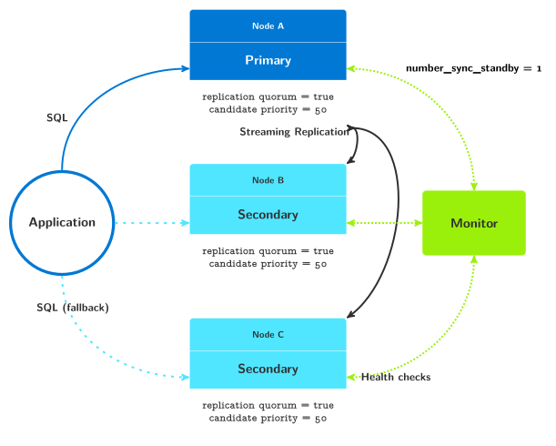

.. _tutorial:

Tutorial
========

In this guide we’ll create a Postgres setup with two nodes, a primary and a
standby. Then we'll add a second standby node. We’ll simulate failure in the
Postgres nodes and see how the system continues to function.

This tutorial uses `docker compose`__ in order to separate the architecture
design from some of the implementation details. This allows reasoning at
the architecture level within this tutorial, and better see which software
component needs to be deployed and run on which node.

__ https://docs.docker.com/compose/

The setup provided in this tutorial is good for replaying at home in the
lab. It is not intended to be production ready though. In particular, no
attention have been spent on volume management. After all, this is a
tutorial: the goal is to walk through the first steps of using
pg_auto_failover to implement Postgres automated failover.

Pre-requisites
--------------

When using `docker compose` we describe a list of services, each service may
run on one or more nodes, and each service just runs a single isolated
process in a container.

Within the context of a tutorial, or even a development environment, this
matches very well to provisioning separate physical machines on-prem, or
Virtual Machines either on-prem on in a Cloud service.

The docker image used in this tutorial is named `pg_auto_failover:tutorial`.
It can be built locally when using the attached :download:`Dockerfile
<tutorial/Dockerfile>` found within the GitHub repository for
pg_auto_failover.

To build the image, either use the provided Makefile and run ``make build``,
or run the docker build command directly:

::

   $ git clone https://github.com/hapostgres/pg_auto_failover
   $ cd pg_auto_failover/docs/tutorial
   $ docker compose build

Postgres failover with two nodes
--------------------------------

Using docker compose makes it easy enough to create an architecture that
looks like the following diagram:

.. figure:: ./tikz/arch-single-standby.svg
   :alt: pg_auto_failover Architecture with a primary and a standby node

   pg_auto_failover architecture with a primary and a standby node

Such an architecture provides failover capabilities, though it does not
provide with High Availability of both the Postgres service and the data.
See the :ref:`multi_node_architecture` chapter of our docs to understand
more about this.

Each node in the cluster is described by a small ``pg_autoctl_node.ini``
file that is bind-mounted into its container.  There are two files:

.. literalinclude:: tutorial/ini/monitor.ini
   :language: ini
   :caption: tutorial/ini/monitor.ini

.. literalinclude:: tutorial/ini/postgres.ini
   :language: ini
   :caption: tutorial/ini/postgres.ini

The monitor file sets ``kind = monitor``; it has no ``[monitor]`` section
because the monitor is not itself a client of a monitor.  The postgres file
is shared by every data node — the node's ``name`` and ``hostname`` are
omitted, so they default to the container hostname set by Docker Compose
(``node1``, ``node2``, ``node3``).

The docker compose definition that assembles these pieces is:

.. literalinclude:: tutorial/docker-compose.yml
   :language: yaml
   :linenos:

Every service runs the same entry-point — ``pg_autoctl node run`` — with a
different ini file bind-mounted at ``/etc/pgaf/node.ini``.  On first start
the command creates the Postgres cluster and registers the node; on
subsequent starts it picks up the existing cluster and runs the supervisor.
Either way the container never needs updating to change node configuration:
edit the ini file and restart.

To start the two-node cluster run:

::

   $ docker compose up app monitor node1 node2

While the nodes are being provisioned you can run the following command and
have a dynamic dashboard to follow what's happening. The following command
is like ``top`` for pg_auto_failover::

  $ docker compose exec monitor pg_autoctl watch

After a little while, you can run the :ref:`pg_autoctl_show_state` command
and see a stable result:

.. code-block:: bash

   $ docker compose exec monitor pg_autoctl show state

    Name |  Node |  Host:Port |       TLI: LSN |   Connection |      Reported State |      Assigned State
   ------+-------+------------+----------------+--------------+---------------------+--------------------
   node2 |     1 | node2:5432 |   1: 0/3000148 |   read-write |             primary |             primary
   node1 |     2 | node1:5432 |   1: 0/3000148 |    read-only |           secondary |           secondary

We can review the available Postgres URIs with the
:ref:`pg_autoctl_show_uri` command::

  $ docker compose exec monitor pg_autoctl show uri
           Type |    Name | Connection String
   -------------+---------+-------------------------------
        monitor | monitor | postgres://autoctl_node@58053a02af03:5432/pg_auto_failover?sslmode=require
      formation | default | postgres://node2:5432,node1:5432/tutorial?target_session_attrs=read-write&sslmode=require

Add application data
--------------------

Let's create a database schema with a single table, and some data in there.

::

   $ docker compose exec app psql

.. code-block:: sql

  -- in psql

  CREATE TABLE companies
  (
    id         bigserial PRIMARY KEY,
    name       text NOT NULL,
    image_url  text,
    created_at timestamp without time zone NOT NULL,
    updated_at timestamp without time zone NOT NULL
  );

Next download and ingest some sample data, still from within our psql
session:

::

   \copy companies from program 'curl -o- https://examples.citusdata.com/mt_ref_arch/companies.csv' with csv
   ( COPY 75 )

Our first failover
------------------

When using pg_auto_failover, it is possible (and easy) to trigger a failover
without having to orchestrate an incident, or power down the current
primary.

::

   $ docker compose exec monitor pg_autoctl perform switchover
   14:57:16 992 INFO  Waiting 60 secs for a notification with state "primary" in formation "default" and group 0
   14:57:16 992 INFO  Listening monitor notifications about state changes in formation "default" and group 0
   14:57:16 992 INFO  Following table displays times when notifications are received
       Time |  Name |  Node |  Host:Port |       Current State |      Assigned State
   ---------+-------+-------+------------+---------------------+--------------------
   14:57:16 | node2 |     1 | node2:5432 |             primary |            draining
   14:57:16 | node1 |     2 | node1:5432 |           secondary |   prepare_promotion
   14:57:16 | node1 |     2 | node1:5432 |   prepare_promotion |   prepare_promotion
   14:57:16 | node1 |     2 | node1:5432 |   prepare_promotion |    stop_replication
   14:57:16 | node2 |     1 | node2:5432 |             primary |      demote_timeout
   14:57:17 | node2 |     1 | node2:5432 |            draining |      demote_timeout
   14:57:17 | node2 |     1 | node2:5432 |      demote_timeout |      demote_timeout
   14:57:19 | node1 |     2 | node1:5432 |    stop_replication |    stop_replication
   14:57:19 | node1 |     2 | node1:5432 |    stop_replication |        wait_primary
   14:57:19 | node2 |     1 | node2:5432 |      demote_timeout |             demoted
   14:57:19 | node2 |     1 | node2:5432 |             demoted |             demoted
   14:57:19 | node1 |     2 | node1:5432 |        wait_primary |        wait_primary
   14:57:19 | node2 |     1 | node2:5432 |             demoted |          catchingup
   14:57:26 | node2 |     1 | node2:5432 |             demoted |          catchingup
   14:57:38 | node2 |     1 | node2:5432 |             demoted |          catchingup
   14:57:39 | node2 |     1 | node2:5432 |          catchingup |          catchingup
   14:57:39 | node2 |     1 | node2:5432 |          catchingup |           secondary
   14:57:39 | node2 |     1 | node2:5432 |           secondary |           secondary
   14:57:40 | node1 |     2 | node1:5432 |        wait_primary |             primary
   14:57:40 | node1 |     2 | node1:5432 |             primary |             primary

The new state after the failover looks like the following:

::

   $ docker compose exec monitor pg_autoctl show state
    Name |  Node |  Host:Port |       TLI: LSN |   Connection |      Reported State |      Assigned State
   ------+-------+------------+----------------+--------------+---------------------+--------------------
   node2 |     1 | node2:5432 |   2: 0/5002698 |    read-only |           secondary |           secondary
   node1 |     2 | node1:5432 |   2: 0/5002698 |   read-write |             primary |             primary

And we can verify that we still have the data available::

  docker compose exec app psql -c "select count(*) from companies"
    count
   -------
       75
   (1 row)

Multiple Standbys Architectures
-------------------------------

The ``docker-compose.yml`` file comes with a third node that you can bring
up to obtain the following architecture:

   pg_auto_failover architecture with a primary and two standby nodes

Adding a second standby node
^^^^^^^^^^^^^^^^^^^^^^^^^^^^

To run a second standby node, or a third Postgres node, simply run the
following command:

::

   $ docker compose up -d node3

We can see the resulting replication settings with the following command:

::

   $ docker compose exec monitor pg_autoctl show settings

     Context |    Name |                   Setting | Value
   ----------+---------+---------------------------+-------------------------------------------------------------
   formation | default |      number_sync_standbys | 1
     primary |   node1 | synchronous_standby_names | 'ANY 1 (pgautofailover_standby_1, pgautofailover_standby_3)'
        node |   node2 |        candidate priority | 50
        node |   node1 |        candidate priority | 50
        node |   node3 |        candidate priority | 50
        node |   node2 |        replication quorum | true
        node |   node1 |        replication quorum | true
        node |   node3 |        replication quorum | true

Editing the replication settings while in production
^^^^^^^^^^^^^^^^^^^^^^^^^^^^^^^^^^^^^^^^^^^^^^^^^^^^

Because node3 uses the same ``postgres.ini`` as node1 and node2, its
``candidate_priority`` starts at ``50``.  To make node3 a read-only standby
that is never promoted there are two ways to proceed.

**Direct command** — takes effect immediately on the running cluster::

   $ docker compose exec node3 pg_autoctl set node candidate-priority 0 --name node3

This reaches into the running supervisor and updates the setting on the
monitor in one step.  It is the fastest option when you need an immediate
change on a live cluster.

**Declarative ini file** — the persistent, version-controlled option.
Because node3 shares ``postgres.ini`` with the other two nodes, you first
create a dedicated ini file for it:

.. code-block:: ini

   # tutorial/ini/node3.ini
   [node]
   kind = postgres
   port = 5432

   [postgresql]
   pgdata = /var/lib/postgres/pgaf

   [monitor]
   pguri = postgresql://autoctl_node@monitor/pg_auto_failover

   [settings]
   candidate_priority = 0
   replication_quorum = true

   [options]
   ssl        = self-signed
   auth       = trust
   pg_hba_lan = true

Then update the ``node3`` service in ``docker-compose.yml`` to mount this
file instead of the shared one::

   node3:
     <<: *node
     hostname: node3
     volumes:
       - /var/lib/postgres
       - ./ini/node3.ini:/etc/pgaf/node.ini:ro

Changing the ``volumes:`` list requires recreating the container — Docker
cannot swap a bind mount into a running container.  Run::

   $ docker compose up -d node3

Docker Compose stops node3, recreates it with the new mount, and starts it
again.  ``pg_autoctl node run`` detects that the Postgres cluster already
exists inside the volume, reads ``node3.ini``, and calls ``pg_autoctl node
apply`` before exec'ing into the supervisor.  The apply step calls
``pg_autoctl set node candidate-priority 0``, registering the change on the
monitor.  node3 rejoins the formation as a secondary within a few seconds.

.. note::

   Once node3 has its own ini file mounted, any further edits to
   ``tutorial/ini/node3.ini`` on the host are picked up live by the running
   supervisor — Docker bind mounts reflect host-side writes immediately, and
   the supervisor's file watcher applies mutable fields (``candidate_priority``,
   ``replication_quorum``, ``ssl``) without restarting the container.

Verify with:

::

   $ docker compose exec monitor pg_autoctl show settings

     Context |    Name |                   Setting | Value
   ----------+---------+---------------------------+-------------------------------------------------------------
   formation | default |      number_sync_standbys | 1
     primary |   node1 | synchronous_standby_names | 'ANY 1 (pgautofailover_standby_1, pgautofailover_standby_3)'
        node |   node2 |        candidate priority | 50
        node |   node1 |        candidate priority | 50
        node |   node3 |        candidate priority | 0
        node |   node2 |        replication quorum | true
        node |   node1 |        replication quorum | true
        node |   node3 |        replication quorum | true

Then in a separate terminal (but in the same directory, because of the way
docker compose works with projects), you can run the following watch
command:

::

   $ docker compose exec monitor pg_autoctl watch

And in the main terminal, while the watch command output is visible, you can
run a switchover operation:

::

   $ docker compose exec monitor pg_autoctl perform switchover

Getting familiar with those commands one of you next steps. The manual has
coverage for them in the following links:

 * :ref:`pg_autoctl_watch`
 * :ref:`pg_autoctl_show_state`
 * :ref:`pg_autoctl_show_settings`
 * :ref:`pg_autoctl_set_node_candidate_priority`

Cleanup
-------

To dispose of the entire tutorial environment, just use the following command:

::

   $ docker compose down

.. _tutorial_pgaftest:

Alternative: interactive cluster with pgaftest
----------------------------------------------

The same two-node cluster from this tutorial can be started with a single
``pgaftest`` command, without writing any compose files or ini files by hand.
``pgaftest`` generates both from the spec file, starts the cluster, and opens
a tmux session so you can explore it immediately.

The following spec file describes the tutorial topology:

.. literalinclude:: tutorial/interactive_tutorial.pgaf
   :language: text
   :caption: docs/tutorial/interactive_tutorial.pgaf

Start it with:

::

   $ pgaftest setup docs/tutorial/interactive_tutorial.pgaf --tmux

Three tmux panes open as soon as the cluster is healthy:

- **top** — ``docker compose logs -f`` (live container output)
- **middle** — ``pg_autoctl watch`` state dashboard
- **bottom** — interactive ``bash`` in ``node1``

From the bottom pane you can trigger a failover::

   pg_autoctl perform failover \
       --monitor postgresql://autoctl_node@monitor/pg_auto_failover

Watch the middle pane as the FSM transitions unfold in real time.  When you
are done, tear down the cluster from any shell::

   $ pgaftest down --work-dir /tmp/pgaftest/interactive_tutorial

For the full ``pgaftest`` reference see :ref:`pgaftest`.

Next steps
----------

The docker compose setup in this tutorial is a good playground for
understanding pg_auto_failover's behaviour.  For production container and
Kubernetes deployments, the same ``pg_autoctl node run`` entry-point scales
directly: store your ini files in a ConfigMap or alongside your Compose
file, bind-mount them, and live reconfiguration handles the rest.

See :ref:`pg_autoctl_node` for the full property reference and mutability
table, and the :ref:`container-and-kubernetes-deployments` section of the
Operations guide for production patterns.

